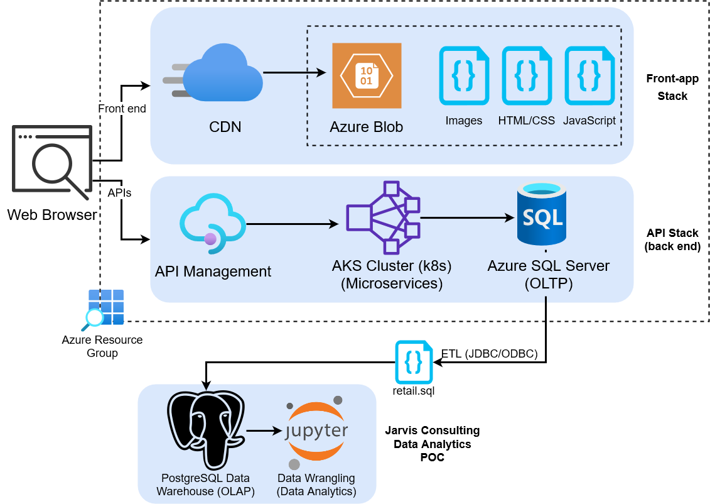

# Introduction
This project is a proof of concept data analysis for an online gift retailer situated in the UK, known as London Gift Shop (LGS). The purpose of the analysis was to better understand customer shopping behaviours, and improve the rapport between customers and the marketing department such that promotions and other forms of communication can better serve to increase the company's revenue. Data analytics were performed on the provided csv data file using Python Pandas. Preliminary analyses were performed with the help of a locally loaded data warehouse (PostgreSQL database), in order to get familiarized with the characteristics of the data. The main analysis was done in a Python Jupyter notebook, contained in this GitHub repository for reference.

 # Implementation
 ## Project Architecture
LGS has its own data warehouse, collecting all sorts of marketing data such as customer invoices. Their front end consists of a browser application, and data is initially dumped into an Azure Blob storage. Their back end consists of an AKS cluster, and an OLTP system (Azure SQL Server) for storing the processed data. Their data warehouse provided Jarvis with a SQL file containing transaction data between 01/12/2009 and 09/12/2011, and that was used for analytics in this project.
 
 

## Data Analytics and Wrangling
[Link to Jupyter Notebook](./python_data_wrangling/retail_data_analytics_wrangling.ipynb)

With the data gathered during the analysis, the marketing team at LGS can improve their strategy in a way that is more tailored to their customer types. In the analysis, customers were categorized based on their shopping habits using recency, frequency, and monetary (RFM) statistics. This categorization can tell the marketing team, for example, which customers need to be sent a promotion in order to prevent losing them (i.e., the "cannot lose" category of customers). Similarly, loyal customers can be prompted for their feedback, and many other similarly targeted marketing campaigns can aid LGS to attract new and existing customers alike, ultimately increasing their revenue.
 # Improvements and Further Exploration
1. Analyze more recent, and higher quantity of data from different data marts as well. For example, analyze feedback from customers to see what needs improvements.
2. Use linear regression or other predictive strategies to better understand shopping trends, allowing LGS to be prepared for otherwise unforeseen drops in sales.
3. Acquire the specific customer ids for each RFM segment such that the marketing team can directly address specific customers from each category.
