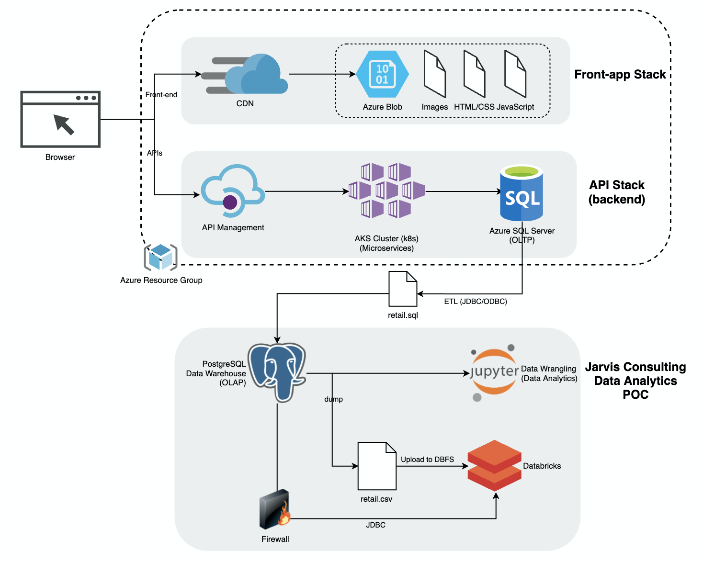
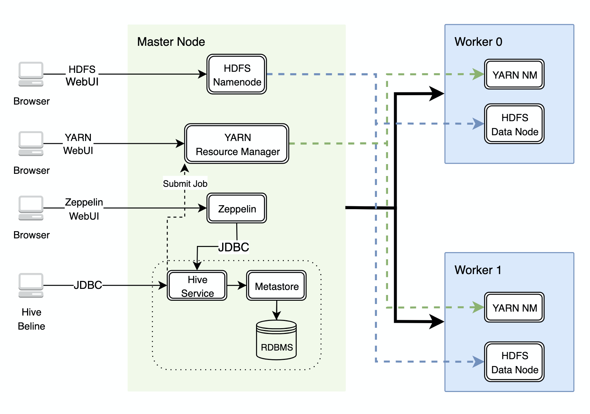

# Introduction
This project is a follow-up on the [Python Data Analytics project](https://github.com/jarviscanada/jarvis_data_eng_TomasRotbauer/tree/master/python_data_analytics) as well as the [Hadoop project](https://github.com/jarviscanada/jarvis_data_eng_TomasRotbauer/tree/develop/hadoop).
Basically, the London Gift Shop is an online retailer in the UK that has supplied Jarvis consulting with customer shopping data so that an RFM analysis could be performed
as a means of generating new marketing campaigns. The previous analysis was a success, but now LGS is seeking a big data analytics platform that can handle data larger 
than a single csv file. So, this project is a proof of concept based on similar data to that of the previous data analytics project,
but the analysis was migrated from Python Pandas to PySpark. The analysis was performed in an Azure Databricks notebook
and workspace, involving a small computer cluster (since the prupose was only to prove feasibility).

# Databricks and Spark Implementation

[Databricks Notebook](./notebook/Retail%20Data%20Analytics%20with%20PySpark.ipynb)
### Architecture Description
* Databricks: A Databricks workspace is an environment in which clusters are created, data is stored (via DBFS), and in which the server resources are housed. The Databricks notebooks are backed by clusters, or networked computers, that work together to process data.
* DBFS: Both Hadoop Distributed File System and DataBricks File system are distributed filesystems. HDFS is used by Hadoop, DBFS is used by Azure Databricks, which mainly uses Spark. Unlike HDFS which uses the nodes within the cluster for data storage, DBFS persists files to object storage, so you won’t lose data after you terminate a cluster.
* Hive Metastore: Metastore is the central repository for Hive metadata. Metastore is comprised of two comonents: a service and the backing store for data. Metadata is a database of namely table schema information.
* PySpark: PySpark is a Python distribution of Apache Spark. Apache Spark is a parallel data analytics engine that runs on top of clusters, much like Hadoop.
Spark is comprised of a driver node and executor nodes:
 * Driver: The computer within the cluster responsible for maintaining information about the Spark Application; responding to a user’s program or input; and analyzing, distributing, and scheduling work across the executors
 * Executors: responsible for actually executing the work that the driver assigns and reporting back to the driver on progress as well as the results themselves.

# Zeppelin and Spark Implementation
In this part of the project, the 2016 World Development Indicators big data file was revisited from the [Hadoop project](https://github.com/jarviscanada/jarvis_data_eng_TomasRotbauer/tree/develop/hadoop).
A couple queries were executed, only this time, Apache Spark was used instead of Hadoop. The GCP Dataproc cluster was reused, which is comprised of 1 master and 2 worker machines. Hardware includes 2 vCPUs, 12 GBs of RAM and 100 GB hard drives. The data was kept on the HDFS and metadata was referred to from Hive Metastore
Th conclusion was that Spark is generally faster than Hadoop.


Here is the notebook for reference:

# SparkSession

SparkSession is automatically created when you start up a Notebook (e.g. Zeppelin, Databricks)


```spark
//Scala SparkSession
spark
```

```spark.pyspark
#PySpark SparkSession
spark
```
# Show DataFrame

`df.show()` is the Spark native API that displays data but it's not pretty. 

`z.show(df)` is a Zeppelin build-in feature that allows you to show a df result in a pretty way
```spark.pyspark
#List all hive tables in a df
tables_df = spark.sql("show tables")
```
```spark.pyspark
tables_df.show()
```
+--------+--------------------+-----------+
|database|           tableName|isTemporary|
+--------+--------------------+-----------+
| default|     wdi_csv_parquet|      false|
| default|        wdi_csv_text|      false|
| default|              wdi_gs|      false|
| default|        wdi_gs_debug|      false|
| default|      wdi_opencsv_gs|      false|
| default|    wdi_opencsv_text|      false|
| default|wdi_opencsv_text_...|      false|
| default|wdi_opencsv_text_...|      false|
+--------+--------------------+-----------+


```spark.pyspark
z.show(tables_df)
```
|database|tableName|isTemporary|
|-|-|-|
|default|wdi_csv_parquet|false|
|default|wdi_csv_text|false|
|default|wdi_gs|false|
|default|wdi_gs_debug|false|
|default|wdi_opencsv_gs|false|
|default|wdi_opencsv_text|false|
|default|wdi_opencsv_text_partitions|false|
|default|wdi_opencsv_text_view|false|
# Spark SQL vs Dataframe

`%sql` is the Spark SQL interpreter

`%spark.pyspark` is the PySpark interpreter

`%spark` is the Spark Scala interpreter
```sql
select count(1) from wdi_csv_parquet
```
count(1)
21759408
```spark.pyspark
#Read Hive data to a df (this is lazy)
wdi_df = spark.sql("SELECT * from wdi_csv_parquet")
#Persist df in memory for fast futuer access
wdi_df = wdi_df.cache()
wdi_df.printSchema()

#Spark action is eager
z.show(wdi_df.count())
```
root
 |-- year: integer (nullable = true)
 |-- country_name: string (nullable = true)
 |-- country_code: string (nullable = true)
 |-- indicator_name: string (nullable = true)
 |-- indicator_code: string (nullable = true)
 |-- indicator_value: float (nullable = true)

21759408

# Show Historical GDP for Canada
```sql
SELECT year, indicator_value as GDP
FROM wdi_csv_parquet
WHERE indicator_code = 'NY.GDP.MKTP.KD.ZG' and country_name = 'Canada'
ORDER BY year

```
|year|GDP|
|-|-|
|1960|0.0|
|1961|3.1632917|
|1962|7.1167793|
|1963|5.181776|
|1964|6.6994567|
|1965|6.636545|
|1966|6.584965|
|1967|2.9153104|
|1968|5.295342|
|1969|5.2600007|
|1970|3.2556136|
|1971|4.1176577|
|1972|5.4458556|
|1973|6.964203|
|1974|3.6909876|
|1975|1.8229731|
|1976|5.1993027|
|1977|3.4582305|
|1978|3.9535913|
|1979|3.8049228|
|1980|2.162617|
|1981|3.5031195|
|1982|-3.202025|
|1983|2.5985727|
|1984|5.92535|
|1985|4.7340827|
|1986|2.1618156|
|1987|4.0964646|
|1988|4.429401|
|1989|2.323974|
|1990|0.15434603|
|1991|-2.1256921|
|1992|0.88297606|
|1993|2.6552358|
|1994|4.4934745|
|1995|2.6777084|
|1996|1.611048|
|1997|4.2798123|
|1998|3.8817592|
|1999|5.163211|
|2000|5.18269|
|2001|1.7708191|
|2002|3.0100162|
|2003|1.8022733|
|2004|3.085961|
|2005|3.2013822|
|2006|2.6234126|
|2007|2.0627477|
|2008|1.000361|
|2009|-2.9495876|
|2010|3.0835142|
|2011|3.141219|
|2012|1.7454723|
|2013|2.2180681|
|2014|2.4728925|
|2015|1.0782688|
|2016|0.0|
```spark.pyspark
from pyspark.sql.functions import col

wdi_canada_df = wdi_df.selectExpr("year", "indicator_value AS GDP")\
    .where(col("indicator_code") == "NY.GDP.MKTP.KD.ZG")\
    .where(col("country_name") == "Canada")\
    .orderBy("year")

#use z.show to display df result and draw a bar chart
z.show(wdi_canada_df)
```
|year|GDP|
|-|-|
|1960|0.0|
|1961|3.1632917|
|1962|7.1167793|
|1963|5.181776|
|1964|6.6994567|
|1965|6.636545|
|1966|6.584965|
|1967|2.9153104|
|1968|5.295342|
|1969|5.2600007|
|1970|3.2556136|
|1971|4.1176577|
|1972|5.4458556|
|1973|6.964203|
|1974|3.6909876|
|1975|1.8229731|
|1976|5.1993027|
|1977|3.4582305|
|1978|3.9535913|
|1979|3.8049228|
|1980|2.162617|
|1981|3.5031195|
|1982|-3.202025|
|1983|2.5985727|
|1984|5.92535|
|1985|4.7340827|
|1986|2.1618156|
|1987|4.0964646|
|1988|4.429401|
|1989|2.323974|
|1990|0.15434603|
|1991|-2.1256921|
|1992|0.88297606|
|1993|2.6552358|
|1994|4.4934745|
|1995|2.6777084|
|1996|1.611048|
|1997|4.2798123|
|1998|3.8817592|
|1999|5.163211|
|2000|5.18269|
|2001|1.7708191|
|2002|3.0100162|
|2003|1.8022733|
|2004|3.085961|
|2005|3.2013822|
|2006|2.6234126|
|2007|2.0627477|
|2008|1.000361|
|2009|-2.9495876|
|2010|3.0835142|
|2011|3.141219|
|2012|1.7454723|
|2013|2.2180681|
|2014|2.4728925|
|2015|1.0782688|
|2016|0.0|
# Show GDP for Each County and Sort By Year
```sql
SELECT country_name,
       year,
       indicator_code,
       indicator_value
FROM wdi_csv_parquet
WHERE indicator_code = 'NY.GDP.MKTP.KD.ZG'
DISTRIBUTE BY country_name
SORT BY country_name, year

```
|country_name|year|indicator_code|indicator_value|
|-|-|-|-|
|Afghanistan|1960|NY.GDP.MKTP.KD.ZG|0.0|
|Afghanistan|1961|NY.GDP.MKTP.KD.ZG|0.0|
|Afghanistan|1962|NY.GDP.MKTP.KD.ZG|0.0|
|Afghanistan|1963|NY.GDP.MKTP.KD.ZG|0.0|
|Afghanistan|1964|NY.GDP.MKTP.KD.ZG|0.0|
|Afghanistan|1965|NY.GDP.MKTP.KD.ZG|0.0|
|Afghanistan|1966|NY.GDP.MKTP.KD.ZG|0.0|
|Afghanistan|1967|NY.GDP.MKTP.KD.ZG|0.0|
|Afghanistan|1968|NY.GDP.MKTP.KD.ZG|0.0|
|Afghanistan|1969|NY.GDP.MKTP.KD.ZG|0.0|
|Afghanistan|1970|NY.GDP.MKTP.KD.ZG|0.0|
|Afghanistan|1971|NY.GDP.MKTP.KD.ZG|0.0|
|Afghanistan|1972|NY.GDP.MKTP.KD.ZG|0.0|
|Afghanistan|1973|NY.GDP.MKTP.KD.ZG|0.0|
|Afghanistan|1974|NY.GDP.MKTP.KD.ZG|0.0|
|Afghanistan|1975|NY.GDP.MKTP.KD.ZG|0.0|
|Afghanistan|1976|NY.GDP.MKTP.KD.ZG|0.0|
|Afghanistan|1977|NY.GDP.MKTP.KD.ZG|0.0|
|Afghanistan|1978|NY.GDP.MKTP.KD.ZG|0.0|
|Afghanistan|1979|NY.GDP.MKTP.KD.ZG|0.0|
|Afghanistan|1980|NY.GDP.MKTP.KD.ZG|0.0|
|Afghanistan|1981|NY.GDP.MKTP.KD.ZG|0.0|
|Afghanistan|1982|NY.GDP.MKTP.KD.ZG|0.0|
|Afghanistan|1983|NY.GDP.MKTP.KD.ZG|0.0|
|Afghanistan|1984|NY.GDP.MKTP.KD.ZG|0.0|
|Afghanistan|1985|NY.GDP.MKTP.KD.ZG|0.0|
|Afghanistan|1986|NY.GDP.MKTP.KD.ZG|0.0|
|Afghanistan|1987|NY.GDP.MKTP.KD.ZG|0.0|
|Afghanistan|1988|NY.GDP.MKTP.KD.ZG|0.0|
|Afghanistan|1989|NY.GDP.MKTP.KD.ZG|0.0|
|Afghanistan|1990|NY.GDP.MKTP.KD.ZG|0.0|
|Afghanistan|1991|NY.GDP.MKTP.KD.ZG|0.0|
|Afghanistan|1992|NY.GDP.MKTP.KD.ZG|0.0|
|Afghanistan|1993|NY.GDP.MKTP.KD.ZG|0.0|
|Afghanistan|1994|NY.GDP.MKTP.KD.ZG|0.0|
|Afghanistan|1995|NY.GDP.MKTP.KD.ZG|0.0|
|Afghanistan|1996|NY.GDP.MKTP.KD.ZG|0.0|
|Afghanistan|1997|NY.GDP.MKTP.KD.ZG|0.0|
|Afghanistan|1998|NY.GDP.MKTP.KD.ZG|0.0|
|Afghanistan|1999|NY.GDP.MKTP.KD.ZG|0.0|
|Afghanistan|2000|NY.GDP.MKTP.KD.ZG|0.0|
|Afghanistan|2001|NY.GDP.MKTP.KD.ZG|0.0|
|Afghanistan|2002|NY.GDP.MKTP.KD.ZG|0.0|
|Afghanistan|2003|NY.GDP.MKTP.KD.ZG|8.444163|
|Afghanistan|2004|NY.GDP.MKTP.KD.ZG|1.0555558|
|Afghanistan|2005|NY.GDP.MKTP.KD.ZG|11.17527|
|Afghanistan|2006|NY.GDP.MKTP.KD.ZG|5.5541377|
|Afghanistan|2007|NY.GDP.MKTP.KD.ZG|13.740205|
|Afghanistan|2008|NY.GDP.MKTP.KD.ZG|3.6113684|
|Afghanistan|2009|NY.GDP.MKTP.KD.ZG|21.020649|
|Afghanistan|2010|NY.GDP.MKTP.KD.ZG|8.4332905|
|Afghanistan|2011|NY.GDP.MKTP.KD.ZG|6.113685|
|Afghanistan|2012|NY.GDP.MKTP.KD.ZG|14.434741|
|Afghanistan|2013|NY.GDP.MKTP.KD.ZG|1.9591229|
|Afghanistan|2014|NY.GDP.MKTP.KD.ZG|1.3125309|
|Afghanistan|2015|NY.GDP.MKTP.KD.ZG|1.5199113|
|Afghanistan|2016|NY.GDP.MKTP.KD.ZG|0.0|
|Albania|1960|NY.GDP.MKTP.KD.ZG|0.0|
|Albania|1961|NY.GDP.MKTP.KD.ZG|0.0|
|Albania|1962|NY.GDP.MKTP.KD.ZG|0.0|
|Albania|1963|NY.GDP.MKTP.KD.ZG|0.0|
|Albania|1964|NY.GDP.MKTP.KD.ZG|0.0|
|Albania|1965|NY.GDP.MKTP.KD.ZG|0.0|
|Albania|1966|NY.GDP.MKTP.KD.ZG|0.0|
|Albania|1967|NY.GDP.MKTP.KD.ZG|0.0|
|Albania|1968|NY.GDP.MKTP.KD.ZG|0.0|
|Albania|1969|NY.GDP.MKTP.KD.ZG|0.0|
|Albania|1970|NY.GDP.MKTP.KD.ZG|0.0|
|Albania|1971|NY.GDP.MKTP.KD.ZG|0.0|
|Albania|1972|NY.GDP.MKTP.KD.ZG|0.0|
|Albania|1973|NY.GDP.MKTP.KD.ZG|0.0|
|Albania|1974|NY.GDP.MKTP.KD.ZG|0.0|
|Albania|1975|NY.GDP.MKTP.KD.ZG|0.0|
|Albania|1976|NY.GDP.MKTP.KD.ZG|0.0|
|Albania|1977|NY.GDP.MKTP.KD.ZG|0.0|
|Albania|1978|NY.GDP.MKTP.KD.ZG|0.0|
|Albania|1979|NY.GDP.MKTP.KD.ZG|0.0|
|Albania|1980|NY.GDP.MKTP.KD.ZG|0.0|
|Albania|1981|NY.GDP.MKTP.KD.ZG|5.745635|
|Albania|1982|NY.GDP.MKTP.KD.ZG|2.9485967|
|Albania|1983|NY.GDP.MKTP.KD.ZG|1.1049383|
|Albania|1984|NY.GDP.MKTP.KD.ZG|-1.2515967|
|Albania|1985|NY.GDP.MKTP.KD.ZG|1.7806439|
|Albania|1986|NY.GDP.MKTP.KD.ZG|5.6372433|
|Albania|1987|NY.GDP.MKTP.KD.ZG|-0.78784263|
|Albania|1988|NY.GDP.MKTP.KD.ZG|-1.4200397|
|Albania|1989|NY.GDP.MKTP.KD.ZG|9.836549|
|Albania|1990|NY.GDP.MKTP.KD.ZG|-9.57564|
|Albania|1991|NY.GDP.MKTP.KD.ZG|-29.588997|
|Albania|1992|NY.GDP.MKTP.KD.ZG|-7.2|
|Albania|1993|NY.GDP.MKTP.KD.ZG|9.6|
|Albania|1994|NY.GDP.MKTP.KD.ZG|8.3|
|Albania|1995|NY.GDP.MKTP.KD.ZG|13.3|
|Albania|1996|NY.GDP.MKTP.KD.ZG|9.1|
|Albania|1997|NY.GDP.MKTP.KD.ZG|-10.837855|
|Albania|1998|NY.GDP.MKTP.KD.ZG|9.008853|
|Albania|1999|NY.GDP.MKTP.KD.ZG|13.501173|
|Albania|2000|NY.GDP.MKTP.KD.ZG|6.6666207|
|Albania|2001|NY.GDP.MKTP.KD.ZG|7.9403315|
|Albania|2002|NY.GDP.MKTP.KD.ZG|4.231371|
|Albania|2003|NY.GDP.MKTP.KD.ZG|5.7734904|
|Albania|2004|NY.GDP.MKTP.KD.ZG|5.7095566|
|Albania|2005|NY.GDP.MKTP.KD.ZG|5.72082|
|Albania|2006|NY.GDP.MKTP.KD.ZG|5.4310126|
|Albania|2007|NY.GDP.MKTP.KD.ZG|5.9|
|Albania|2008|NY.GDP.MKTP.KD.ZG|7.53|
|Albania|2009|NY.GDP.MKTP.KD.ZG|3.35|
|Albania|2010|NY.GDP.MKTP.KD.ZG|3.71|
|Albania|2011|NY.GDP.MKTP.KD.ZG|2.55|
|Albania|2012|NY.GDP.MKTP.KD.ZG|1.42|
|Albania|2013|NY.GDP.MKTP.KD.ZG|1.11|
|Albania|2014|NY.GDP.MKTP.KD.ZG|2.0|
|Albania|2015|NY.GDP.MKTP.KD.ZG|2.56|
|Albania|2016|NY.GDP.MKTP.KD.ZG|0.0|
|Algeria|1960|NY.GDP.MKTP.KD.ZG|0.0|
|Algeria|1961|NY.GDP.MKTP.KD.ZG|-13.605441|
|Algeria|1962|NY.GDP.MKTP.KD.ZG|-19.685041|
|Algeria|1963|NY.GDP.MKTP.KD.ZG|34.31373|
|Algeria|1964|NY.GDP.MKTP.KD.ZG|5.839413|
|Algeria|1965|NY.GDP.MKTP.KD.ZG|6.206898|
|Algeria|1966|NY.GDP.MKTP.KD.ZG|-4.8049707|
|Algeria|1967|NY.GDP.MKTP.KD.ZG|9.452963|
|Algeria|1968|NY.GDP.MKTP.KD.ZG|10.796239|
|Algeria|1969|NY.GDP.MKTP.KD.ZG|8.43328|
|Algeria|1970|NY.GDP.MKTP.KD.ZG|8.862658|
|Algeria|1971|NY.GDP.MKTP.KD.ZG|-11.331719|
|Algeria|1972|NY.GDP.MKTP.KD.ZG|27.42397|
|Algeria|1973|NY.GDP.MKTP.KD.ZG|3.8131764|
|Algeria|1974|NY.GDP.MKTP.KD.ZG|7.494918|
|Algeria|1975|NY.GDP.MKTP.KD.ZG|5.0453415|
|Algeria|1976|NY.GDP.MKTP.KD.ZG|8.386757|
|Algeria|1977|NY.GDP.MKTP.KD.ZG|5.258586|
|Algeria|1978|NY.GDP.MKTP.KD.ZG|9.214836|
|Algeria|1979|NY.GDP.MKTP.KD.ZG|7.4778266|
|Algeria|1980|NY.GDP.MKTP.KD.ZG|0.790607|
|Algeria|1981|NY.GDP.MKTP.KD.ZG|2.9999962|
|Algeria|1982|NY.GDP.MKTP.KD.ZG|6.400004|
|Algeria|1983|NY.GDP.MKTP.KD.ZG|5.400003|
|Algeria|1984|NY.GDP.MKTP.KD.ZG|5.5999966|
|Algeria|1985|NY.GDP.MKTP.KD.ZG|3.6999972|
|Algeria|1986|NY.GDP.MKTP.KD.ZG|0.400001|
|Algeria|1987|NY.GDP.MKTP.KD.ZG|-0.69999754|
|Algeria|1988|NY.GDP.MKTP.KD.ZG|-1.0000055|
|Algeria|1989|NY.GDP.MKTP.KD.ZG|4.400002|
|Algeria|1990|NY.GDP.MKTP.KD.ZG|0.8000006|
|Algeria|1991|NY.GDP.MKTP.KD.ZG|-1.2000006|
|Algeria|1992|NY.GDP.MKTP.KD.ZG|1.8000023|
|Algeria|1993|NY.GDP.MKTP.KD.ZG|-2.1000009|
|Algeria|1994|NY.GDP.MKTP.KD.ZG|-0.8999965|
|Algeria|1995|NY.GDP.MKTP.KD.ZG|3.7999947|
|Algeria|1996|NY.GDP.MKTP.KD.ZG|4.0999985|
|Algeria|1997|NY.GDP.MKTP.KD.ZG|1.0999999|
|Algeria|1998|NY.GDP.MKTP.KD.ZG|5.1000037|
|Algeria|1999|NY.GDP.MKTP.KD.ZG|3.2000015|
|Algeria|2000|NY.GDP.MKTP.KD.ZG|3.8|
|Algeria|2001|NY.GDP.MKTP.KD.ZG|3.0|
|Algeria|2002|NY.GDP.MKTP.KD.ZG|5.6|
|Algeria|2003|NY.GDP.MKTP.KD.ZG|7.2|
|Algeria|2004|NY.GDP.MKTP.KD.ZG|4.3|
|Algeria|2005|NY.GDP.MKTP.KD.ZG|5.9|
|Algeria|2006|NY.GDP.MKTP.KD.ZG|1.7|
|Algeria|2007|NY.GDP.MKTP.KD.ZG|3.4|
|Algeria|2008|NY.GDP.MKTP.KD.ZG|2.4|
|Algeria|2009|NY.GDP.MKTP.KD.ZG|1.6|
|Algeria|2010|NY.GDP.MKTP.KD.ZG|3.6|
|Algeria|2011|NY.GDP.MKTP.KD.ZG|2.9|
|Algeria|2012|NY.GDP.MKTP.KD.ZG|3.4|
|Algeria|2013|NY.GDP.MKTP.KD.ZG|2.8|
|Algeria|2014|NY.GDP.MKTP.KD.ZG|3.8|
|Algeria|2015|NY.GDP.MKTP.KD.ZG|3.9|
|Algeria|2016|NY.GDP.MKTP.KD.ZG|0.0|
|American Samoa|1960|NY.GDP.MKTP.KD.ZG|0.0|
|American Samoa|1961|NY.GDP.MKTP.KD.ZG|0.0|
|American Samoa|1962|NY.GDP.MKTP.KD.ZG|0.0|
|American Samoa|1963|NY.GDP.MKTP.KD.ZG|0.0|
|American Samoa|1964|NY.GDP.MKTP.KD.ZG|0.0|
|American Samoa|1965|NY.GDP.MKTP.KD.ZG|0.0|
|American Samoa|1966|NY.GDP.MKTP.KD.ZG|0.0|
|American Samoa|1967|NY.GDP.MKTP.KD.ZG|0.0|
|American Samoa|1968|NY.GDP.MKTP.KD.ZG|0.0|
|American Samoa|1969|NY.GDP.MKTP.KD.ZG|0.0|
|American Samoa|1970|NY.GDP.MKTP.KD.ZG|0.0|
|American Samoa|1971|NY.GDP.MKTP.KD.ZG|0.0|
|American Samoa|1972|NY.GDP.MKTP.KD.ZG|0.0|
|American Samoa|1973|NY.GDP.MKTP.KD.ZG|0.0|
|American Samoa|1974|NY.GDP.MKTP.KD.ZG|0.0|
|American Samoa|1975|NY.GDP.MKTP.KD.ZG|0.0|
|American Samoa|1976|NY.GDP.MKTP.KD.ZG|0.0|
|American Samoa|1977|NY.GDP.MKTP.KD.ZG|0.0|
|American Samoa|1978|NY.GDP.MKTP.KD.ZG|0.0|
|American Samoa|1979|NY.GDP.MKTP.KD.ZG|0.0|
|American Samoa|1980|NY.GDP.MKTP.KD.ZG|0.0|
|American Samoa|1981|NY.GDP.MKTP.KD.ZG|0.0|
|American Samoa|1982|NY.GDP.MKTP.KD.ZG|0.0|
|American Samoa|1983|NY.GDP.MKTP.KD.ZG|0.0|
|American Samoa|1984|NY.GDP.MKTP.KD.ZG|0.0|
|American Samoa|1985|NY.GDP.MKTP.KD.ZG|0.0|
|American Samoa|1986|NY.GDP.MKTP.KD.ZG|0.0|
|American Samoa|1987|NY.GDP.MKTP.KD.ZG|0.0|
|American Samoa|1988|NY.GDP.MKTP.KD.ZG|0.0|
|American Samoa|1989|NY.GDP.MKTP.KD.ZG|0.0|
|American Samoa|1990|NY.GDP.MKTP.KD.ZG|0.0|
|American Samoa|1991|NY.GDP.MKTP.KD.ZG|0.0|
|American Samoa|1992|NY.GDP.MKTP.KD.ZG|0.0|
|American Samoa|1993|NY.GDP.MKTP.KD.ZG|0.0|
|American Samoa|1994|NY.GDP.MKTP.KD.ZG|0.0|
|American Samoa|1995|NY.GDP.MKTP.KD.ZG|0.0|
|American Samoa|1996|NY.GDP.MKTP.KD.ZG|0.0|
|American Samoa|1997|NY.GDP.MKTP.KD.ZG|0.0|
|American Samoa|1998|NY.GDP.MKTP.KD.ZG|0.0|
|American Samoa|1999|NY.GDP.MKTP.KD.ZG|0.0|
|American Samoa|2000|NY.GDP.MKTP.KD.ZG|0.0|
|American Samoa|2001|NY.GDP.MKTP.KD.ZG|0.0|
|American Samoa|2002|NY.GDP.MKTP.KD.ZG|0.0|
|American Samoa|2003|NY.GDP.MKTP.KD.ZG|0.0|
|American Samoa|2004|NY.GDP.MKTP.KD.ZG|0.0|
|American Samoa|2005|NY.GDP.MKTP.KD.ZG|0.0|
|American Samoa|2006|NY.GDP.MKTP.KD.ZG|0.0|
|American Samoa|2007|NY.GDP.MKTP.KD.ZG|0.0|
|American Samoa|2008|NY.GDP.MKTP.KD.ZG|0.0|
|American Samoa|2009|NY.GDP.MKTP.KD.ZG|0.0|
|American Samoa|2010|NY.GDP.MKTP.KD.ZG|0.0|
|American Samoa|2011|NY.GDP.MKTP.KD.ZG|0.0|
|American Samoa|2012|NY.GDP.MKTP.KD.ZG|0.0|
|American Samoa|2013|NY.GDP.MKTP.KD.ZG|0.0|
|American Samoa|2014|NY.GDP.MKTP.KD.ZG|0.0|
|American Samoa|2015|NY.GDP.MKTP.KD.ZG|0.0|
|American Samoa|2016|NY.GDP.MKTP.KD.ZG|0.0|
|Andorra|1960|NY.GDP.MKTP.KD.ZG|0.0|
|Andorra|1961|NY.GDP.MKTP.KD.ZG|0.0|
|Andorra|1962|NY.GDP.MKTP.KD.ZG|0.0|
|Andorra|1963|NY.GDP.MKTP.KD.ZG|0.0|
|Andorra|1964|NY.GDP.MKTP.KD.ZG|0.0|
|Andorra|1965|NY.GDP.MKTP.KD.ZG|0.0|
|Andorra|1966|NY.GDP.MKTP.KD.ZG|0.0|
|Andorra|1967|NY.GDP.MKTP.KD.ZG|0.0|
|Andorra|1968|NY.GDP.MKTP.KD.ZG|0.0|
|Andorra|1969|NY.GDP.MKTP.KD.ZG|0.0|
|Andorra|1970|NY.GDP.MKTP.KD.ZG|0.0|
|Andorra|1971|NY.GDP.MKTP.KD.ZG|4.6494737|
|Andorra|1972|NY.GDP.MKTP.KD.ZG|8.149746|
|Andorra|1973|NY.GDP.MKTP.KD.ZG|7.7884655|
|Andorra|1974|NY.GDP.MKTP.KD.ZG|5.618786|
|Andorra|1975|NY.GDP.MKTP.KD.ZG|0.54220325|
|Andorra|1976|NY.GDP.MKTP.KD.ZG|3.3037915|
|Andorra|1977|NY.GDP.MKTP.KD.ZG|2.8385744|
|Andorra|1978|NY.GDP.MKTP.KD.ZG|1.4630034|
|Andorra|1979|NY.GDP.MKTP.KD.ZG|0.041546516|
|Andorra|1980|NY.GDP.MKTP.KD.ZG|2.208728|
|Andorra|1981|NY.GDP.MKTP.KD.ZG|-0.1324687|
|Andorra|1982|NY.GDP.MKTP.KD.ZG|1.2464617|
|Andorra|1983|NY.GDP.MKTP.KD.ZG|1.7701159|
|Andorra|1984|NY.GDP.MKTP.KD.ZG|1.7846875|
|Andorra|1985|NY.GDP.MKTP.KD.ZG|2.321436|
|Andorra|1986|NY.GDP.MKTP.KD.ZG|3.2533216|
|Andorra|1987|NY.GDP.MKTP.KD.ZG|5.5471225|
|Andorra|1988|NY.GDP.MKTP.KD.ZG|5.094324|
|Andorra|1989|NY.GDP.MKTP.KD.ZG|4.82703|
|Andorra|1990|NY.GDP.MKTP.KD.ZG|3.7813935|
|Andorra|1991|NY.GDP.MKTP.KD.ZG|2.5460007|
|Andorra|1992|NY.GDP.MKTP.KD.ZG|0.9292154|
|Andorra|1993|NY.GDP.MKTP.KD.ZG|-1.0314918|
|Andorra|1994|NY.GDP.MKTP.KD.ZG|2.3831952|
|Andorra|1995|NY.GDP.MKTP.KD.ZG|2.757494|
|Andorra|1996|NY.GDP.MKTP.KD.ZG|4.649742|
|Andorra|1997|NY.GDP.MKTP.KD.ZG|9.067674|
|Andorra|1998|NY.GDP.MKTP.KD.ZG|3.194788|
|Andorra|1999|NY.GDP.MKTP.KD.ZG|4.099081|
|Andorra|2000|NY.GDP.MKTP.KD.ZG|1.1657871|
|Andorra|2001|NY.GDP.MKTP.KD.ZG|6.0667806|
|Andorra|2002|NY.GDP.MKTP.KD.ZG|6.426845|
|Andorra|2003|NY.GDP.MKTP.KD.ZG|12.02392|
|Andorra|2004|NY.GDP.MKTP.KD.ZG|8.069505|
|Andorra|2005|NY.GDP.MKTP.KD.ZG|7.8397045|
|Andorra|2006|NY.GDP.MKTP.KD.ZG|4.5853105|
|Andorra|2007|NY.GDP.MKTP.KD.ZG|0.07803938|
|Andorra|2008|NY.GDP.MKTP.KD.ZG|-8.594256|
|Andorra|2009|NY.GDP.MKTP.KD.ZG|-3.817986|
|Andorra|2010|NY.GDP.MKTP.KD.ZG|-5.347977|
|Andorra|2011|NY.GDP.MKTP.KD.ZG|-4.8026752|
|Andorra|2012|NY.GDP.MKTP.KD.ZG|-1.7600104|
|Andorra|2013|NY.GDP.MKTP.KD.ZG|-0.063514315|
|Andorra|2014|NY.GDP.MKTP.KD.ZG|0.0|
|Andorra|2015|NY.GDP.MKTP.KD.ZG|0.0|
|Andorra|2016|NY.GDP.MKTP.KD.ZG|0.0|
|Angola|1960|NY.GDP.MKTP.KD.ZG|0.0|
|Angola|1961|NY.GDP.MKTP.KD.ZG|0.0|
|Angola|1962|NY.GDP.MKTP.KD.ZG|0.0|
|Angola|1963|NY.GDP.MKTP.KD.ZG|0.0|
|Angola|1964|NY.GDP.MKTP.KD.ZG|0.0|
|Angola|1965|NY.GDP.MKTP.KD.ZG|0.0|
|Angola|1966|NY.GDP.MKTP.KD.ZG|0.0|
|Angola|1967|NY.GDP.MKTP.KD.ZG|0.0|
|Angola|1968|NY.GDP.MKTP.KD.ZG|0.0|
|Angola|1969|NY.GDP.MKTP.KD.ZG|0.0|
|Angola|1970|NY.GDP.MKTP.KD.ZG|0.0|
|Angola|1971|NY.GDP.MKTP.KD.ZG|0.0|
|Angola|1972|NY.GDP.MKTP.KD.ZG|0.0|
|Angola|1973|NY.GDP.MKTP.KD.ZG|0.0|
|Angola|1974|NY.GDP.MKTP.KD.ZG|0.0|
|Angola|1975|NY.GDP.MKTP.KD.ZG|0.0|
|Angola|1976|NY.GDP.MKTP.KD.ZG|0.0|
|Angola|1977|NY.GDP.MKTP.KD.ZG|0.0|
|Angola|1978|NY.GDP.MKTP.KD.ZG|0.0|
|Angola|1979|NY.GDP.MKTP.KD.ZG|0.0|
|Angola|1980|NY.GDP.MKTP.KD.ZG|0.0|
|Angola|1981|NY.GDP.MKTP.KD.ZG|0.0|
|Angola|1982|NY.GDP.MKTP.KD.ZG|0.0|
|Angola|1983|NY.GDP.MKTP.KD.ZG|0.0|
|Angola|1984|NY.GDP.MKTP.KD.ZG|0.0|
|Angola|1985|NY.GDP.MKTP.KD.ZG|0.0|
|Angola|1986|NY.GDP.MKTP.KD.ZG|2.8|
|Angola|1987|NY.GDP.MKTP.KD.ZG|7.9|
|Angola|1988|NY.GDP.MKTP.KD.ZG|5.6|
|Angola|1989|NY.GDP.MKTP.KD.ZG|0.4|
|Angola|1990|NY.GDP.MKTP.KD.ZG|-0.3|
|Angola|1991|NY.GDP.MKTP.KD.ZG|-1.2|
|Angola|1992|NY.GDP.MKTP.KD.ZG|-6.9|
|Angola|1993|NY.GDP.MKTP.KD.ZG|-24.7|
|Angola|1994|NY.GDP.MKTP.KD.ZG|3.5|
|Angola|1995|NY.GDP.MKTP.KD.ZG|10.4|
|Angola|1996|NY.GDP.MKTP.KD.ZG|11.2|
|Angola|1997|NY.GDP.MKTP.KD.ZG|7.9|
|Angola|1998|NY.GDP.MKTP.KD.ZG|6.804762|
|Angola|1999|NY.GDP.MKTP.KD.ZG|3.2397997|
|Angola|2000|NY.GDP.MKTP.KD.ZG|3.0120761|
|Angola|2001|NY.GDP.MKTP.KD.ZG|4.2209654|
|Angola|2002|NY.GDP.MKTP.KD.ZG|-6.9404616|
|Angola|2003|NY.GDP.MKTP.KD.ZG|5.2474947|
|Angola|2004|NY.GDP.MKTP.KD.ZG|10.879578|
|Angola|2005|NY.GDP.MKTP.KD.ZG|18.26145|
|Angola|2006|NY.GDP.MKTP.KD.ZG|20.735125|
|Angola|2007|NY.GDP.MKTP.KD.ZG|22.593054|
|Angola|2008|NY.GDP.MKTP.KD.ZG|13.817145|
|Angola|2009|NY.GDP.MKTP.KD.ZG|2.4128697|
|Angola|2010|NY.GDP.MKTP.KD.ZG|3.4076548|
|Angola|2011|NY.GDP.MKTP.KD.ZG|3.918597|
|Angola|2012|NY.GDP.MKTP.KD.ZG|5.1554403|
|Angola|2013|NY.GDP.MKTP.KD.ZG|6.8135858|
|Angola|2014|NY.GDP.MKTP.KD.ZG|4.804473|
|Angola|2015|NY.GDP.MKTP.KD.ZG|2.997704|
|Angola|2016|NY.GDP.MKTP.KD.ZG|0.0|
|Arab World|1960|NY.GDP.MKTP.KD.ZG|0.0|
|Arab World|1961|NY.GDP.MKTP.KD.ZG|0.0|
|Arab World|1962|NY.GDP.MKTP.KD.ZG|0.0|
|Arab World|1963|NY.GDP.MKTP.KD.ZG|0.0|
|Arab World|1964|NY.GDP.MKTP.KD.ZG|0.0|
|Arab World|1965|NY.GDP.MKTP.KD.ZG|0.0|
|Arab World|1966|NY.GDP.MKTP.KD.ZG|0.0|
|Arab World|1967|NY.GDP.MKTP.KD.ZG|0.0|
|Arab World|1968|NY.GDP.MKTP.KD.ZG|0.0|
|Arab World|1969|NY.GDP.MKTP.KD.ZG|0.0|
|Arab World|1970|NY.GDP.MKTP.KD.ZG|0.0|
|Arab World|1971|NY.GDP.MKTP.KD.ZG|0.0|
|Arab World|1972|NY.GDP.MKTP.KD.ZG|0.0|
|Arab World|1973|NY.GDP.MKTP.KD.ZG|0.0|
|Arab World|1974|NY.GDP.MKTP.KD.ZG|0.0|
|Arab World|1975|NY.GDP.MKTP.KD.ZG|0.0|
|Arab World|1976|NY.GDP.MKTP.KD.ZG|12.896334|
|Arab World|1977|NY.GDP.MKTP.KD.ZG|8.6488695|
|Arab World|1978|NY.GDP.MKTP.KD.ZG|1.9101285|
|Arab World|1979|NY.GDP.MKTP.KD.ZG|10.586778|
|Arab World|1980|NY.GDP.MKTP.KD.ZG|10.073857|
|Arab World|1981|NY.GDP.MKTP.KD.ZG|3.9770148|
|Arab World|1982|NY.GDP.MKTP.KD.ZG|-3.1105292|
|Arab World|1983|NY.GDP.MKTP.KD.ZG|-2.7864137|
|Arab World|1984|NY.GDP.MKTP.KD.ZG|1.705435|
|Arab World|1985|NY.GDP.MKTP.KD.ZG|-0.5320665|
|Arab World|1986|NY.GDP.MKTP.KD.ZG|0.46892256|
|Arab World|1987|NY.GDP.MKTP.KD.ZG|0.60470665|
|Arab World|1988|NY.GDP.MKTP.KD.ZG|3.778142|
|Arab World|1989|NY.GDP.MKTP.KD.ZG|2.42781|
|Arab World|1990|NY.GDP.MKTP.KD.ZG|10.7821245|
|Arab World|1991|NY.GDP.MKTP.KD.ZG|-1.1923307|
|Arab World|1992|NY.GDP.MKTP.KD.ZG|5.099041|
|Arab World|1993|NY.GDP.MKTP.KD.ZG|4.048358|
|Arab World|1994|NY.GDP.MKTP.KD.ZG|3.4376614|
|Arab World|1995|NY.GDP.MKTP.KD.ZG|2.9258623|
|Arab World|1996|NY.GDP.MKTP.KD.ZG|4.8582177|
|Arab World|1997|NY.GDP.MKTP.KD.ZG|4.8601813|
|Arab World|1998|NY.GDP.MKTP.KD.ZG|5.283303|
|Arab World|1999|NY.GDP.MKTP.KD.ZG|3.047916|
|Arab World|2000|NY.GDP.MKTP.KD.ZG|5.1323547|
|Arab World|2001|NY.GDP.MKTP.KD.ZG|2.2014143|
|Arab World|2002|NY.GDP.MKTP.KD.ZG|1.4985545|
|Arab World|2003|NY.GDP.MKTP.KD.ZG|4.233616|
|Arab World|2004|NY.GDP.MKTP.KD.ZG|9.738826|
|Arab World|2005|NY.GDP.MKTP.KD.ZG|6.1510425|
|Arab World|2006|NY.GDP.MKTP.KD.ZG|7.312091|
|Arab World|2007|NY.GDP.MKTP.KD.ZG|5.650084|
|Arab World|2008|NY.GDP.MKTP.KD.ZG|6.305507|
|Arab World|2009|NY.GDP.MKTP.KD.ZG|1.5152998|
|Arab World|2010|NY.GDP.MKTP.KD.ZG|4.615799|
|Arab World|2011|NY.GDP.MKTP.KD.ZG|3.3306744|
|Arab World|2012|NY.GDP.MKTP.KD.ZG|6.6410913|
|Arab World|2013|NY.GDP.MKTP.KD.ZG|2.9035792|
|Arab World|2014|NY.GDP.MKTP.KD.ZG|2.1411862|
|Arab World|2015|NY.GDP.MKTP.KD.ZG|2.9716482|
|Arab World|2016|NY.GDP.MKTP.KD.ZG|0.0|
|Argentina|1960|NY.GDP.MKTP.KD.ZG|0.0|
|Argentina|1961|NY.GDP.MKTP.KD.ZG|5.427843|
|Argentina|1962|NY.GDP.MKTP.KD.ZG|-0.8520215|
|Argentina|1963|NY.GDP.MKTP.KD.ZG|-5.308197|
|Argentina|1964|NY.GDP.MKTP.KD.ZG|10.130298|
|Argentina|1965|NY.GDP.MKTP.KD.ZG|10.569433|
|Argentina|1966|NY.GDP.MKTP.KD.ZG|-0.65972614|
|Argentina|1967|NY.GDP.MKTP.KD.ZG|3.1919966|
|Argentina|1968|NY.GDP.MKTP.KD.ZG|4.8225007|
|Argentina|1969|NY.GDP.MKTP.KD.ZG|9.679526|
|Argentina|1970|NY.GDP.MKTP.KD.ZG|3.0456433|
|Argentina|1971|NY.GDP.MKTP.KD.ZG|5.658131|
|Argentina|1972|NY.GDP.MKTP.KD.ZG|1.6284165|
|Argentina|1973|NY.GDP.MKTP.KD.ZG|2.811754|
|Argentina|1974|NY.GDP.MKTP.KD.ZG|5.5338044|
|Argentina|1975|NY.GDP.MKTP.KD.ZG|-0.028412104|
|Argentina|1976|NY.GDP.MKTP.KD.ZG|-2.0182514|
|Argentina|1977|NY.GDP.MKTP.KD.ZG|6.934148|
|Argentina|1978|NY.GDP.MKTP.KD.ZG|-4.506125|
|Argentina|1979|NY.GDP.MKTP.KD.ZG|10.222763|
|Argentina|1980|NY.GDP.MKTP.KD.ZG|4.1517625|
|Argentina|1981|NY.GDP.MKTP.KD.ZG|-5.689528|
|Argentina|1982|NY.GDP.MKTP.KD.ZG|-4.9571786|
|Argentina|1983|NY.GDP.MKTP.KD.ZG|3.8751235|
|Argentina|1984|NY.GDP.MKTP.KD.ZG|2.2117734|
|Argentina|1985|NY.GDP.MKTP.KD.ZG|-7.586677|
|Argentina|1986|NY.GDP.MKTP.KD.ZG|7.8757796|
|Argentina|1987|NY.GDP.MKTP.KD.ZG|2.9099932|
|Argentina|1988|NY.GDP.MKTP.KD.ZG|-2.5569048|
|Argentina|1989|NY.GDP.MKTP.KD.ZG|-7.4961896|
|Argentina|1990|NY.GDP.MKTP.KD.ZG|-2.3989592|
|Argentina|1991|NY.GDP.MKTP.KD.ZG|12.66971|
|Argentina|1992|NY.GDP.MKTP.KD.ZG|11.940775|
|Argentina|1993|NY.GDP.MKTP.KD.ZG|5.9069195|
|Argentina|1994|NY.GDP.MKTP.KD.ZG|5.8362007|
|Argentina|1995|NY.GDP.MKTP.KD.ZG|-2.8452096|
|Argentina|1996|NY.GDP.MKTP.KD.ZG|5.52669|
|Argentina|1997|NY.GDP.MKTP.KD.ZG|8.111047|
|Argentina|1998|NY.GDP.MKTP.KD.ZG|3.850179|
|Argentina|1999|NY.GDP.MKTP.KD.ZG|-3.385457|
|Argentina|2000|NY.GDP.MKTP.KD.ZG|-0.7889989|
|Argentina|2001|NY.GDP.MKTP.KD.ZG|-4.4088397|
|Argentina|2002|NY.GDP.MKTP.KD.ZG|-10.8944845|
|Argentina|2003|NY.GDP.MKTP.KD.ZG|8.837041|
|Argentina|2004|NY.GDP.MKTP.KD.ZG|9.029573|
|Argentina|2005|NY.GDP.MKTP.KD.ZG|8.889308|
|Argentina|2006|NY.GDP.MKTP.KD.ZG|8.142536|
|Argentina|2007|NY.GDP.MKTP.KD.ZG|9.015744|
|Argentina|2008|NY.GDP.MKTP.KD.ZG|4.0938616|
|Argentina|2009|NY.GDP.MKTP.KD.ZG|-6.0133553|
|Argentina|2010|NY.GDP.MKTP.KD.ZG|10.353567|
|Argentina|2011|NY.GDP.MKTP.KD.ZG|6.147486|
|Argentina|2012|NY.GDP.MKTP.KD.ZG|-1.0528744|
|Argentina|2013|NY.GDP.MKTP.KD.ZG|2.3024843|
|Argentina|2014|NY.GDP.MKTP.KD.ZG|-2.5584774|
|Argentina|2015|NY.GDP.MKTP.KD.ZG|2.372296|
|Argentina|2016|NY.GDP.MKTP.KD.ZG|0.0|
|Bangladesh|1960|NY.GDP.MKTP.KD.ZG|0.0|
|Bangladesh|1961|NY.GDP.MKTP.KD.ZG|6.058161|
|Bangladesh|1962|NY.GDP.MKTP.KD.ZG|5.453031|
|Bangladesh|1963|NY.GDP.MKTP.KD.ZG|-0.4558943|
|Bangladesh|1964|NY.GDP.MKTP.KD.ZG|10.952788|
|Bangladesh|1965|NY.GDP.MKTP.KD.ZG|1.6062583|
|Bangladesh|1966|NY.GDP.MKTP.KD.ZG|2.566812|
|Bangladesh|1967|NY.GDP.MKTP.KD.ZG|-1.8758639|
|Bangladesh|1968|NY.GDP.MKTP.KD.ZG|9.489454|
|Bangladesh|1969|NY.GDP.MKTP.KD.ZG|1.2208579|
|Bangladesh|1970|NY.GDP.MKTP.KD.ZG|5.619852|
|Bangladesh|1971|NY.GDP.MKTP.KD.ZG|-5.479483|
|Bangladesh|1972|NY.GDP.MKTP.KD.ZG|-13.973729|
|Bangladesh|1973|NY.GDP.MKTP.KD.ZG|3.3256803|
|Bangladesh|1974|NY.GDP.MKTP.KD.ZG|9.591956|
|Bangladesh|1975|NY.GDP.MKTP.KD.ZG|-4.088214|
|Bangladesh|1976|NY.GDP.MKTP.KD.ZG|5.661361|
|Bangladesh|1977|NY.GDP.MKTP.KD.ZG|2.6730561|
|Bangladesh|1978|NY.GDP.MKTP.KD.ZG|7.0738378|
|Bangladesh|1979|NY.GDP.MKTP.KD.ZG|4.801635|
|Bangladesh|1980|NY.GDP.MKTP.KD.ZG|0.81914186|
|Bangladesh|1981|NY.GDP.MKTP.KD.ZG|7.2339435|
|Bangladesh|1982|NY.GDP.MKTP.KD.ZG|2.134328|
|Bangladesh|1983|NY.GDP.MKTP.KD.ZG|3.8810463|
|Bangladesh|1984|NY.GDP.MKTP.KD.ZG|4.80331|
|Bangladesh|1985|NY.GDP.MKTP.KD.ZG|3.3420146|
|Bangladesh|1986|NY.GDP.MKTP.KD.ZG|4.1733828|
|Bangladesh|1987|NY.GDP.MKTP.KD.ZG|3.7724018|
|Bangladesh|1988|NY.GDP.MKTP.KD.ZG|2.416257|
|Bangladesh|1989|NY.GDP.MKTP.KD.ZG|2.8365822|
|Bangladesh|1990|NY.GDP.MKTP.KD.ZG|5.622258|
|Bangladesh|1991|NY.GDP.MKTP.KD.ZG|3.4852278|
|Bangladesh|1992|NY.GDP.MKTP.KD.ZG|5.4426856|
|Bangladesh|1993|NY.GDP.MKTP.KD.ZG|4.7115617|
|Bangladesh|1994|NY.GDP.MKTP.KD.ZG|3.8901265|
|Bangladesh|1995|NY.GDP.MKTP.KD.ZG|5.121278|
|Bangladesh|1996|NY.GDP.MKTP.KD.ZG|4.522919|
|Bangladesh|1997|NY.GDP.MKTP.KD.ZG|4.4898963|
|Bangladesh|1998|NY.GDP.MKTP.KD.ZG|5.1770267|
|Bangladesh|1999|NY.GDP.MKTP.KD.ZG|4.6701565|
|Bangladesh|2000|NY.GDP.MKTP.KD.ZG|5.293295|
|Bangladesh|2001|NY.GDP.MKTP.KD.ZG|5.0772877|
|Bangladesh|2002|NY.GDP.MKTP.KD.ZG|3.833124|
|Bangladesh|2003|NY.GDP.MKTP.KD.ZG|4.7395673|
|Bangladesh|2004|NY.GDP.MKTP.KD.ZG|5.239533|
|Bangladesh|2005|NY.GDP.MKTP.KD.ZG|6.535945|
|Bangladesh|2006|NY.GDP.MKTP.KD.ZG|6.6718683|
|Bangladesh|2007|NY.GDP.MKTP.KD.ZG|7.058636|
|Bangladesh|2008|NY.GDP.MKTP.KD.ZG|6.0137897|
|Bangladesh|2009|NY.GDP.MKTP.KD.ZG|5.045125|
|Bangladesh|2010|NY.GDP.MKTP.KD.ZG|5.571802|
|Bangladesh|2011|NY.GDP.MKTP.KD.ZG|6.464384|
|Bangladesh|2012|NY.GDP.MKTP.KD.ZG|6.5214353|
|Bangladesh|2013|NY.GDP.MKTP.KD.ZG|6.013596|
|Bangladesh|2014|NY.GDP.MKTP.KD.ZG|6.061093|
|Bangladesh|2015|NY.GDP.MKTP.KD.ZG|6.5526333|
|Bangladesh|2016|NY.GDP.MKTP.KD.ZG|0.0|
|Barbados|1960|NY.GDP.MKTP.KD.ZG|0.0|
|Barbados|1961|NY.GDP.MKTP.KD.ZG|0.0|
|Barbados|1962|NY.GDP.MKTP.KD.ZG|0.0|
|Barbados|1963|NY.GDP.MKTP.KD.ZG|0.0|
|Barbados|1964|NY.GDP.MKTP.KD.ZG|0.0|
|Barbados|1965|NY.GDP.MKTP.KD.ZG|0.0|
|Barbados|1966|NY.GDP.MKTP.KD.ZG|0.0|
|Barbados|1967|NY.GDP.MKTP.KD.ZG|0.0|
|Barbados|1968|NY.GDP.MKTP.KD.ZG|0.0|
|Barbados|1969|NY.GDP.MKTP.KD.ZG|0.0|
|Barbados|1970|NY.GDP.MKTP.KD.ZG|0.0|
|Barbados|1971|NY.GDP.MKTP.KD.ZG|0.0|
|Barbados|1972|NY.GDP.MKTP.KD.ZG|0.0|
|Barbados|1973|NY.GDP.MKTP.KD.ZG|0.0|
|Barbados|1974|NY.GDP.MKTP.KD.ZG|0.0|
|Barbados|1975|NY.GDP.MKTP.KD.ZG|0.0|
|Barbados|1976|NY.GDP.MKTP.KD.ZG|0.0|
|Barbados|1977|NY.GDP.MKTP.KD.ZG|0.0|
|Barbados|1978|NY.GDP.MKTP.KD.ZG|0.0|
|Barbados|1979|NY.GDP.MKTP.KD.ZG|0.0|
|Barbados|1980|NY.GDP.MKTP.KD.ZG|0.0|
|Barbados|1981|NY.GDP.MKTP.KD.ZG|-1.9826518|
|Barbados|1982|NY.GDP.MKTP.KD.ZG|-4.8040457|
|Barbados|1983|NY.GDP.MKTP.KD.ZG|0.3984064|
|Barbados|1984|NY.GDP.MKTP.KD.ZG|3.7037036|
|Barbados|1985|NY.GDP.MKTP.KD.ZG|1.0204082|
|Barbados|1986|NY.GDP.MKTP.KD.ZG|5.176768|
|Barbados|1987|NY.GDP.MKTP.KD.ZG|2.5210085|
|Barbados|1988|NY.GDP.MKTP.KD.ZG|3.5128806|
|Barbados|1989|NY.GDP.MKTP.KD.ZG|3.6199095|
|Barbados|1990|NY.GDP.MKTP.KD.ZG|-3.275109|
|Barbados|1991|NY.GDP.MKTP.KD.ZG|-3.9503386|
|Barbados|1992|NY.GDP.MKTP.KD.ZG|-5.640423|
|Barbados|1993|NY.GDP.MKTP.KD.ZG|0.747198|
|Barbados|1994|NY.GDP.MKTP.KD.ZG|1.9777503|
|Barbados|1995|NY.GDP.MKTP.KD.ZG|2.060606|
|Barbados|1996|NY.GDP.MKTP.KD.ZG|4.038005|
|Barbados|1997|NY.GDP.MKTP.KD.ZG|4.680365|
|Barbados|1998|NY.GDP.MKTP.KD.ZG|3.7077427|
|Barbados|1999|NY.GDP.MKTP.KD.ZG|0.3154574|
|Barbados|2000|NY.GDP.MKTP.KD.ZG|4.5073376|
|Barbados|2001|NY.GDP.MKTP.KD.ZG|-2.4072216|
|Barbados|2002|NY.GDP.MKTP.KD.ZG|0.8221994|
|Barbados|2003|NY.GDP.MKTP.KD.ZG|2.1406727|
|Barbados|2004|NY.GDP.MKTP.KD.ZG|1.3972056|
|Barbados|2005|NY.GDP.MKTP.KD.ZG|4.0354333|
|Barbados|2006|NY.GDP.MKTP.KD.ZG|5.6764426|
|Barbados|2007|NY.GDP.MKTP.KD.ZG|1.7009848|
|Barbados|2008|NY.GDP.MKTP.KD.ZG|0.44014084|
|Barbados|2009|NY.GDP.MKTP.KD.ZG|-4.0315514|
|Barbados|2010|NY.GDP.MKTP.KD.ZG|0.2739726|
|Barbados|2011|NY.GDP.MKTP.KD.ZG|0.72859746|
|Barbados|2012|NY.GDP.MKTP.KD.ZG|0.27124774|
|Barbados|2013|NY.GDP.MKTP.KD.ZG|0.0|
|Barbados|2014|NY.GDP.MKTP.KD.ZG|0.18034264|
|Barbados|2015|NY.GDP.MKTP.KD.ZG|0.990099|
|Barbados|2016|NY.GDP.MKTP.KD.ZG|0.0|
|Belarus|1960|NY.GDP.MKTP.KD.ZG|0.0|
|Belarus|1961|NY.GDP.MKTP.KD.ZG|0.0|
|Belarus|1962|NY.GDP.MKTP.KD.ZG|0.0|
|Belarus|1963|NY.GDP.MKTP.KD.ZG|0.0|
|Belarus|1964|NY.GDP.MKTP.KD.ZG|0.0|
|Belarus|1965|NY.GDP.MKTP.KD.ZG|0.0|
|Belarus|1966|NY.GDP.MKTP.KD.ZG|0.0|
|Belarus|1967|NY.GDP.MKTP.KD.ZG|0.0|
|Belarus|1968|NY.GDP.MKTP.KD.ZG|0.0|
|Belarus|1969|NY.GDP.MKTP.KD.ZG|0.0|
|Belarus|1970|NY.GDP.MKTP.KD.ZG|0.0|
|Belarus|1971|NY.GDP.MKTP.KD.ZG|0.0|
|Belarus|1972|NY.GDP.MKTP.KD.ZG|0.0|
|Belarus|1973|NY.GDP.MKTP.KD.ZG|0.0|
|Belarus|1974|NY.GDP.MKTP.KD.ZG|0.0|
|Belarus|1975|NY.GDP.MKTP.KD.ZG|0.0|
|Belarus|1976|NY.GDP.MKTP.KD.ZG|0.0|
|Belarus|1977|NY.GDP.MKTP.KD.ZG|0.0|
|Belarus|1978|NY.GDP.MKTP.KD.ZG|0.0|
|Belarus|1979|NY.GDP.MKTP.KD.ZG|0.0|
|Belarus|1980|NY.GDP.MKTP.KD.ZG|0.0|
|Belarus|1981|NY.GDP.MKTP.KD.ZG|0.0|
|Belarus|1982|NY.GDP.MKTP.KD.ZG|0.0|
|Belarus|1983|NY.GDP.MKTP.KD.ZG|0.0|
|Belarus|1984|NY.GDP.MKTP.KD.ZG|0.0|
|Belarus|1985|NY.GDP.MKTP.KD.ZG|0.0|
|Belarus|1986|NY.GDP.MKTP.KD.ZG|0.0|
|Belarus|1987|NY.GDP.MKTP.KD.ZG|0.0|
|Belarus|1988|NY.GDP.MKTP.KD.ZG|0.0|
|Belarus|1989|NY.GDP.MKTP.KD.ZG|0.0|
|Belarus|1990|NY.GDP.MKTP.KD.ZG|0.0|
|Belarus|1991|NY.GDP.MKTP.KD.ZG|-1.2|
|Belarus|1992|NY.GDP.MKTP.KD.ZG|-9.6|
|Belarus|1993|NY.GDP.MKTP.KD.ZG|-7.6|
|Belarus|1994|NY.GDP.MKTP.KD.ZG|-11.7|
|Belarus|1995|NY.GDP.MKTP.KD.ZG|-10.4|
|Belarus|1996|NY.GDP.MKTP.KD.ZG|2.8|
|Belarus|1997|NY.GDP.MKTP.KD.ZG|11.4|
|Belarus|1998|NY.GDP.MKTP.KD.ZG|8.4|
|Belarus|1999|NY.GDP.MKTP.KD.ZG|3.4|
|Belarus|2000|NY.GDP.MKTP.KD.ZG|5.8|
|Belarus|2001|NY.GDP.MKTP.KD.ZG|4.725306|
|Belarus|2002|NY.GDP.MKTP.KD.ZG|5.045267|
|Belarus|2003|NY.GDP.MKTP.KD.ZG|7.043193|
|Belarus|2004|NY.GDP.MKTP.KD.ZG|11.449743|
|Belarus|2005|NY.GDP.MKTP.KD.ZG|9.4|
|Belarus|2006|NY.GDP.MKTP.KD.ZG|10.0|
|Belarus|2007|NY.GDP.MKTP.KD.ZG|8.6|
|Belarus|2008|NY.GDP.MKTP.KD.ZG|10.2|
|Belarus|2009|NY.GDP.MKTP.KD.ZG|0.2|
|Belarus|2010|NY.GDP.MKTP.KD.ZG|7.7407813|
|Belarus|2011|NY.GDP.MKTP.KD.ZG|5.5437117|
|Belarus|2012|NY.GDP.MKTP.KD.ZG|1.7313912|
|Belarus|2013|NY.GDP.MKTP.KD.ZG|1.0736008|
|Belarus|2014|NY.GDP.MKTP.KD.ZG|1.723086|
|Belarus|2015|NY.GDP.MKTP.KD.ZG|-3.8876984|
|Belarus|2016|NY.GDP.MKTP.KD.ZG|0.0|
|Belgium|1960|NY.GDP.MKTP.KD.ZG|0.0|
|Belgium|1961|NY.GDP.MKTP.KD.ZG|4.978423|
|Belgium|1962|NY.GDP.MKTP.KD.ZG|5.2120037|
|Belgium|1963|NY.GDP.MKTP.KD.ZG|4.3515844|
|Belgium|1964|NY.GDP.MKTP.KD.ZG|6.9566846|
|Belgium|1965|NY.GDP.MKTP.KD.ZG|3.56066|
|Belgium|1966|NY.GDP.MKTP.KD.ZG|3.155895|
|Belgium|1967|NY.GDP.MKTP.KD.ZG|3.868147|
|Belgium|1968|NY.GDP.MKTP.KD.ZG|4.1941295|
|Belgium|1969|NY.GDP.MKTP.KD.ZG|6.6298|
|Belgium|1970|NY.GDP.MKTP.KD.ZG|5.957295|
|Belgium|1971|NY.GDP.MKTP.KD.ZG|3.9858274|
|Belgium|1972|NY.GDP.MKTP.KD.ZG|5.295604|
|Belgium|1973|NY.GDP.MKTP.KD.ZG|6.381702|
|Belgium|1974|NY.GDP.MKTP.KD.ZG|4.565258|
|Belgium|1975|NY.GDP.MKTP.KD.ZG|-1.9659417|
|Belgium|1976|NY.GDP.MKTP.KD.ZG|5.6527457|
|Belgium|1977|NY.GDP.MKTP.KD.ZG|0.6261548|
|Belgium|1978|NY.GDP.MKTP.KD.ZG|2.8418965|
|Belgium|1979|NY.GDP.MKTP.KD.ZG|2.341073|
|Belgium|1980|NY.GDP.MKTP.KD.ZG|4.444054|
|Belgium|1981|NY.GDP.MKTP.KD.ZG|-0.27928364|
|Belgium|1982|NY.GDP.MKTP.KD.ZG|0.5949869|
|Belgium|1983|NY.GDP.MKTP.KD.ZG|0.31184274|
|Belgium|1984|NY.GDP.MKTP.KD.ZG|2.4663827|
|Belgium|1985|NY.GDP.MKTP.KD.ZG|1.6517929|
|Belgium|1986|NY.GDP.MKTP.KD.ZG|1.8227621|
|Belgium|1987|NY.GDP.MKTP.KD.ZG|2.3066595|
|Belgium|1988|NY.GDP.MKTP.KD.ZG|4.723209|
|Belgium|1989|NY.GDP.MKTP.KD.ZG|3.4691668|
|Belgium|1990|NY.GDP.MKTP.KD.ZG|3.1374025|
|Belgium|1991|NY.GDP.MKTP.KD.ZG|1.8330743|
|Belgium|1992|NY.GDP.MKTP.KD.ZG|1.5306548|
|Belgium|1993|NY.GDP.MKTP.KD.ZG|-0.96187305|
|Belgium|1994|NY.GDP.MKTP.KD.ZG|3.2269714|
|Belgium|1995|NY.GDP.MKTP.KD.ZG|2.3847573|
|Belgium|1996|NY.GDP.MKTP.KD.ZG|1.593157|
|Belgium|1997|NY.GDP.MKTP.KD.ZG|3.7105496|
|Belgium|1998|NY.GDP.MKTP.KD.ZG|1.9754485|
|Belgium|1999|NY.GDP.MKTP.KD.ZG|3.56304|
|Belgium|2000|NY.GDP.MKTP.KD.ZG|3.6338172|
|Belgium|2001|NY.GDP.MKTP.KD.ZG|0.811464|
|Belgium|2002|NY.GDP.MKTP.KD.ZG|1.7804521|
|Belgium|2003|NY.GDP.MKTP.KD.ZG|0.77453613|
|Belgium|2004|NY.GDP.MKTP.KD.ZG|3.634801|
|Belgium|2005|NY.GDP.MKTP.KD.ZG|2.0942216|
|Belgium|2006|NY.GDP.MKTP.KD.ZG|2.4994645|
|Belgium|2007|NY.GDP.MKTP.KD.ZG|3.397472|
|Belgium|2008|NY.GDP.MKTP.KD.ZG|0.7471032|
|Belgium|2009|NY.GDP.MKTP.KD.ZG|-2.284879|
|Belgium|2010|NY.GDP.MKTP.KD.ZG|2.6948256|
|Belgium|2011|NY.GDP.MKTP.KD.ZG|1.7968379|
|Belgium|2012|NY.GDP.MKTP.KD.ZG|0.15865687|
|Belgium|2013|NY.GDP.MKTP.KD.ZG|0.0030560568|
|Belgium|2014|NY.GDP.MKTP.KD.ZG|1.2954733|
|Belgium|2015|NY.GDP.MKTP.KD.ZG|1.3739371|
|Belgium|2016|NY.GDP.MKTP.KD.ZG|0.0|
|Benin|1960|NY.GDP.MKTP.KD.ZG|0.0|
|Benin|1961|NY.GDP.MKTP.KD.ZG|3.1412804|
|Benin|1962|NY.GDP.MKTP.KD.ZG|-3.4264097|
|Benin|1963|NY.GDP.MKTP.KD.ZG|4.730028|
|Benin|1964|NY.GDP.MKTP.KD.ZG|6.650759|
|Benin|1965|NY.GDP.MKTP.KD.ZG|5.293863|
|Benin|1966|NY.GDP.MKTP.KD.ZG|3.5758626|
|Benin|1967|NY.GDP.MKTP.KD.ZG|1.0783987|
|Benin|1968|NY.GDP.MKTP.KD.ZG|3.8423357|
|Benin|1969|NY.GDP.MKTP.KD.ZG|2.877498|
|Benin|1970|NY.GDP.MKTP.KD.ZG|2.0977576|
|Benin|1971|NY.GDP.MKTP.KD.ZG|-1.4968418|
|Benin|1972|NY.GDP.MKTP.KD.ZG|6.4263678|
|Benin|1973|NY.GDP.MKTP.KD.ZG|3.7061653|
|Benin|1974|NY.GDP.MKTP.KD.ZG|3.339312|
|Benin|1975|NY.GDP.MKTP.KD.ZG|-4.895345|
|Benin|1976|NY.GDP.MKTP.KD.ZG|0.8843563|
|Benin|1977|NY.GDP.MKTP.KD.ZG|4.9836636|
|Benin|1978|NY.GDP.MKTP.KD.ZG|1.2550781|
|Benin|1979|NY.GDP.MKTP.KD.ZG|6.5357475|
|Benin|1980|NY.GDP.MKTP.KD.ZG|6.781764|
|Benin|1981|NY.GDP.MKTP.KD.ZG|9.954231|
|Benin|1982|NY.GDP.MKTP.KD.ZG|2.2350664|
|Benin|1983|NY.GDP.MKTP.KD.ZG|-4.3478227|
|Benin|1984|NY.GDP.MKTP.KD.ZG|7.9298396|
|Benin|1985|NY.GDP.MKTP.KD.ZG|7.530325|
|Benin|1986|NY.GDP.MKTP.KD.ZG|2.1711416|
|Benin|1987|NY.GDP.MKTP.KD.ZG|-1.500003|
|Benin|1988|NY.GDP.MKTP.KD.ZG|3.4052453|
|Benin|1989|NY.GDP.MKTP.KD.ZG|-2.8541605|
|Benin|1990|NY.GDP.MKTP.KD.ZG|8.976134|
|Benin|1991|NY.GDP.MKTP.KD.ZG|4.2257996|
|Benin|1992|NY.GDP.MKTP.KD.ZG|2.9577107|
|Benin|1993|NY.GDP.MKTP.KD.ZG|5.836172|
|Benin|1994|NY.GDP.MKTP.KD.ZG|2.0204005|
|Benin|1995|NY.GDP.MKTP.KD.ZG|6.0451984|
|Benin|1996|NY.GDP.MKTP.KD.ZG|4.324284|
|Benin|1997|NY.GDP.MKTP.KD.ZG|5.7346883|
|Benin|1998|NY.GDP.MKTP.KD.ZG|3.9610121|
|Benin|1999|NY.GDP.MKTP.KD.ZG|5.3414493|
|Benin|2000|NY.GDP.MKTP.KD.ZG|5.859992|
|Benin|2001|NY.GDP.MKTP.KD.ZG|5.330411|
|Benin|2002|NY.GDP.MKTP.KD.ZG|4.64447|
|Benin|2003|NY.GDP.MKTP.KD.ZG|3.4440448|
|Benin|2004|NY.GDP.MKTP.KD.ZG|4.429629|
|Benin|2005|NY.GDP.MKTP.KD.ZG|1.7115777|
|Benin|2006|NY.GDP.MKTP.KD.ZG|3.9470139|
|Benin|2007|NY.GDP.MKTP.KD.ZG|5.9865155|
|Benin|2008|NY.GDP.MKTP.KD.ZG|4.893394|
|Benin|2009|NY.GDP.MKTP.KD.ZG|2.319227|
|Benin|2010|NY.GDP.MKTP.KD.ZG|2.1168501|
|Benin|2011|NY.GDP.MKTP.KD.ZG|2.9627504|
|Benin|2012|NY.GDP.MKTP.KD.ZG|4.643023|
|Benin|2013|NY.GDP.MKTP.KD.ZG|6.878996|
|Benin|2014|NY.GDP.MKTP.KD.ZG|6.5414867|
|Benin|2015|NY.GDP.MKTP.KD.ZG|5.240447|
|Benin|2016|NY.GDP.MKTP.KD.ZG|0.0|
|Bhutan|1960|NY.GDP.MKTP.KD.ZG|0.0|
|Bhutan|1961|NY.GDP.MKTP.KD.ZG|0.0|
|Bhutan|1962|NY.GDP.MKTP.KD.ZG|0.0|
|Bhutan|1963|NY.GDP.MKTP.KD.ZG|0.0|
|Bhutan|1964|NY.GDP.MKTP.KD.ZG|0.0|
|Bhutan|1965|NY.GDP.MKTP.KD.ZG|0.0|
|Bhutan|1966|NY.GDP.MKTP.KD.ZG|0.0|
|Bhutan|1967|NY.GDP.MKTP.KD.ZG|0.0|
|Bhutan|1968|NY.GDP.MKTP.KD.ZG|0.0|
|Bhutan|1969|NY.GDP.MKTP.KD.ZG|0.0|
|Bhutan|1970|NY.GDP.MKTP.KD.ZG|0.0|
|Bhutan|1971|NY.GDP.MKTP.KD.ZG|0.0|
|Bhutan|1972|NY.GDP.MKTP.KD.ZG|0.0|
|Bhutan|1973|NY.GDP.MKTP.KD.ZG|0.0|
|Bhutan|1974|NY.GDP.MKTP.KD.ZG|0.0|
|Bhutan|1975|NY.GDP.MKTP.KD.ZG|0.0|
|Bhutan|1976|NY.GDP.MKTP.KD.ZG|0.0|
|Bhutan|1977|NY.GDP.MKTP.KD.ZG|0.0|
|Bhutan|1978|NY.GDP.MKTP.KD.ZG|0.0|
|Bhutan|1979|NY.GDP.MKTP.KD.ZG|0.0|
|Bhutan|1980|NY.GDP.MKTP.KD.ZG|0.0|
|Bhutan|1981|NY.GDP.MKTP.KD.ZG|13.907729|
|Bhutan|1982|NY.GDP.MKTP.KD.ZG|3.4139414|
|Bhutan|1983|NY.GDP.MKTP.KD.ZG|11.310714|
|Bhutan|1984|NY.GDP.MKTP.KD.ZG|4.4821053|
|Bhutan|1985|NY.GDP.MKTP.KD.ZG|4.211775|
|Bhutan|1986|NY.GDP.MKTP.KD.ZG|11.7305765|
|Bhutan|1987|NY.GDP.MKTP.KD.ZG|28.696266|
|Bhutan|1988|NY.GDP.MKTP.KD.ZG|4.98729|
|Bhutan|1989|NY.GDP.MKTP.KD.ZG|7.4326262|
|Bhutan|1990|NY.GDP.MKTP.KD.ZG|10.876434|
|Bhutan|1991|NY.GDP.MKTP.KD.ZG|-0.40787607|
|Bhutan|1992|NY.GDP.MKTP.KD.ZG|4.6008916|
|Bhutan|1993|NY.GDP.MKTP.KD.ZG|1.9863666|
|Bhutan|1994|NY.GDP.MKTP.KD.ZG|4.9515038|
|Bhutan|1995|NY.GDP.MKTP.KD.ZG|7.074117|
|Bhutan|1996|NY.GDP.MKTP.KD.ZG|5.5651727|
|Bhutan|1997|NY.GDP.MKTP.KD.ZG|5.3738384|
|Bhutan|1998|NY.GDP.MKTP.KD.ZG|5.914031|
|Bhutan|1999|NY.GDP.MKTP.KD.ZG|7.983972|
|Bhutan|2000|NY.GDP.MKTP.KD.ZG|6.9330244|
|Bhutan|2001|NY.GDP.MKTP.KD.ZG|8.2037735|
|Bhutan|2002|NY.GDP.MKTP.KD.ZG|10.72784|
|Bhutan|2003|NY.GDP.MKTP.KD.ZG|7.664334|
|Bhutan|2004|NY.GDP.MKTP.KD.ZG|5.896408|
|Bhutan|2005|NY.GDP.MKTP.KD.ZG|7.1225595|
|Bhutan|2006|NY.GDP.MKTP.KD.ZG|6.8493657|
|Bhutan|2007|NY.GDP.MKTP.KD.ZG|17.925825|
|Bhutan|2008|NY.GDP.MKTP.KD.ZG|4.7683544|
|Bhutan|2009|NY.GDP.MKTP.KD.ZG|6.6572237|
|Bhutan|2010|NY.GDP.MKTP.KD.ZG|11.730854|
|Bhutan|2011|NY.GDP.MKTP.KD.ZG|7.890914|
|Bhutan|2012|NY.GDP.MKTP.KD.ZG|5.0717096|
|Bhutan|2013|NY.GDP.MKTP.KD.ZG|2.1424966|
|Bhutan|2014|NY.GDP.MKTP.KD.ZG|5.4588175|
|Bhutan|2015|NY.GDP.MKTP.KD.ZG|3.2542548|
|Bhutan|2016|NY.GDP.MKTP.KD.ZG|0.0|
|Bolivia|1960|NY.GDP.MKTP.KD.ZG|0.0|
|Bolivia|1961|NY.GDP.MKTP.KD.ZG|2.0799837|
|Bolivia|1962|NY.GDP.MKTP.KD.ZG|5.5702252|
|Bolivia|1963|NY.GDP.MKTP.KD.ZG|6.4207015|
|Bolivia|1964|NY.GDP.MKTP.KD.ZG|4.7945595|
|Bolivia|1965|NY.GDP.MKTP.KD.ZG|5.6250176|
|Bolivia|1966|NY.GDP.MKTP.KD.ZG|6.497296|
|Bolivia|1967|NY.GDP.MKTP.KD.ZG|6.908868|
|Bolivia|1968|NY.GDP.MKTP.KD.ZG|-12.169028|
|Bolivia|1969|NY.GDP.MKTP.KD.ZG|3.0960135|
|Bolivia|1970|NY.GDP.MKTP.KD.ZG|-0.49482137|
|Bolivia|1971|NY.GDP.MKTP.KD.ZG|5.0633364|
|Bolivia|1972|NY.GDP.MKTP.KD.ZG|7.9674854|
|Bolivia|1973|NY.GDP.MKTP.KD.ZG|5.7391615|
|Bolivia|1974|NY.GDP.MKTP.KD.ZG|2.939568|
|Bolivia|1975|NY.GDP.MKTP.KD.ZG|7.3110175|
|Bolivia|1976|NY.GDP.MKTP.KD.ZG|4.6145673|
|Bolivia|1977|NY.GDP.MKTP.KD.ZG|4.971216|
|Bolivia|1978|NY.GDP.MKTP.KD.ZG|2.0526946|
|Bolivia|1979|NY.GDP.MKTP.KD.ZG|0.13334404|
|Bolivia|1980|NY.GDP.MKTP.KD.ZG|-1.3717734|
|Bolivia|1981|NY.GDP.MKTP.KD.ZG|0.27561674|
|Bolivia|1982|NY.GDP.MKTP.KD.ZG|-3.9387379|
|Bolivia|1983|NY.GDP.MKTP.KD.ZG|-4.042122|
|Bolivia|1984|NY.GDP.MKTP.KD.ZG|-0.20067175|
|Bolivia|1985|NY.GDP.MKTP.KD.ZG|-1.6763871|
|Bolivia|1986|NY.GDP.MKTP.KD.ZG|-2.5738773|
|Bolivia|1987|NY.GDP.MKTP.KD.ZG|2.4634793|
|Bolivia|1988|NY.GDP.MKTP.KD.ZG|2.9095054|
|Bolivia|1989|NY.GDP.MKTP.KD.ZG|3.7901285|
|Bolivia|1990|NY.GDP.MKTP.KD.ZG|4.635788|
|Bolivia|1991|NY.GDP.MKTP.KD.ZG|5.266522|
|Bolivia|1992|NY.GDP.MKTP.KD.ZG|1.6465|
|Bolivia|1993|NY.GDP.MKTP.KD.ZG|4.2692947|
|Bolivia|1994|NY.GDP.MKTP.KD.ZG|4.6672664|
|Bolivia|1995|NY.GDP.MKTP.KD.ZG|4.678277|
|Bolivia|1996|NY.GDP.MKTP.KD.ZG|4.3613405|
|Bolivia|1997|NY.GDP.MKTP.KD.ZG|4.954209|
|Bolivia|1998|NY.GDP.MKTP.KD.ZG|5.0293546|
|Bolivia|1999|NY.GDP.MKTP.KD.ZG|0.42688543|
|Bolivia|2000|NY.GDP.MKTP.KD.ZG|2.5078108|
|Bolivia|2001|NY.GDP.MKTP.KD.ZG|1.6837991|
|Bolivia|2002|NY.GDP.MKTP.KD.ZG|2.4855657|
|Bolivia|2003|NY.GDP.MKTP.KD.ZG|2.71134|
|Bolivia|2004|NY.GDP.MKTP.KD.ZG|4.1732955|
|Bolivia|2005|NY.GDP.MKTP.KD.ZG|4.421433|
|Bolivia|2006|NY.GDP.MKTP.KD.ZG|4.797009|
|Bolivia|2007|NY.GDP.MKTP.KD.ZG|4.564384|
|Bolivia|2008|NY.GDP.MKTP.KD.ZG|6.148497|
|Bolivia|2009|NY.GDP.MKTP.KD.ZG|3.3570013|
|Bolivia|2010|NY.GDP.MKTP.KD.ZG|4.1267223|
|Bolivia|2011|NY.GDP.MKTP.KD.ZG|5.2040925|
|Bolivia|2012|NY.GDP.MKTP.KD.ZG|5.122275|
|Bolivia|2013|NY.GDP.MKTP.KD.ZG|6.796012|
|Bolivia|2014|NY.GDP.MKTP.KD.ZG|5.46057|
|Bolivia|2015|NY.GDP.MKTP.KD.ZG|3.961728|
|Bolivia|2016|NY.GDP.MKTP.KD.ZG|0.0|
|British Virgin Islands|1960|NY.GDP.MKTP.KD.ZG|0.0|
|British Virgin Islands|1961|NY.GDP.MKTP.KD.ZG|0.0|
|British Virgin Islands|1962|NY.GDP.MKTP.KD.ZG|0.0|
|British Virgin Islands|1963|NY.GDP.MKTP.KD.ZG|0.0|
|British Virgin Islands|1964|NY.GDP.MKTP.KD.ZG|0.0|
|British Virgin Islands|1965|NY.GDP.MKTP.KD.ZG|0.0|
|British Virgin Islands|1966|NY.GDP.MKTP.KD.ZG|0.0|
|British Virgin Islands|1967|NY.GDP.MKTP.KD.ZG|0.0|
|British Virgin Islands|1968|NY.GDP.MKTP.KD.ZG|0.0|
|British Virgin Islands|1969|NY.GDP.MKTP.KD.ZG|0.0|
|British Virgin Islands|1970|NY.GDP.MKTP.KD.ZG|0.0|
|British Virgin Islands|1971|NY.GDP.MKTP.KD.ZG|0.0|
|British Virgin Islands|1972|NY.GDP.MKTP.KD.ZG|0.0|
|British Virgin Islands|1973|NY.GDP.MKTP.KD.ZG|0.0|
|British Virgin Islands|1974|NY.GDP.MKTP.KD.ZG|0.0|
|British Virgin Islands|1975|NY.GDP.MKTP.KD.ZG|0.0|
|British Virgin Islands|1976|NY.GDP.MKTP.KD.ZG|0.0|
|British Virgin Islands|1977|NY.GDP.MKTP.KD.ZG|0.0|
|British Virgin Islands|1978|NY.GDP.MKTP.KD.ZG|0.0|
|British Virgin Islands|1979|NY.GDP.MKTP.KD.ZG|0.0|
|British Virgin Islands|1980|NY.GDP.MKTP.KD.ZG|0.0|
|British Virgin Islands|1981|NY.GDP.MKTP.KD.ZG|0.0|
|British Virgin Islands|1982|NY.GDP.MKTP.KD.ZG|0.0|
|British Virgin Islands|1983|NY.GDP.MKTP.KD.ZG|0.0|
|British Virgin Islands|1984|NY.GDP.MKTP.KD.ZG|0.0|
|British Virgin Islands|1985|NY.GDP.MKTP.KD.ZG|0.0|
|British Virgin Islands|1986|NY.GDP.MKTP.KD.ZG|0.0|
|British Virgin Islands|1987|NY.GDP.MKTP.KD.ZG|0.0|
|British Virgin Islands|1988|NY.GDP.MKTP.KD.ZG|0.0|
|British Virgin Islands|1989|NY.GDP.MKTP.KD.ZG|0.0|
|British Virgin Islands|1990|NY.GDP.MKTP.KD.ZG|0.0|
|British Virgin Islands|1991|NY.GDP.MKTP.KD.ZG|0.0|
|British Virgin Islands|1992|NY.GDP.MKTP.KD.ZG|0.0|
|British Virgin Islands|1993|NY.GDP.MKTP.KD.ZG|0.0|
|British Virgin Islands|1994|NY.GDP.MKTP.KD.ZG|0.0|
|British Virgin Islands|1995|NY.GDP.MKTP.KD.ZG|0.0|
|British Virgin Islands|1996|NY.GDP.MKTP.KD.ZG|0.0|
|British Virgin Islands|1997|NY.GDP.MKTP.KD.ZG|0.0|
|British Virgin Islands|1998|NY.GDP.MKTP.KD.ZG|0.0|
|British Virgin Islands|1999|NY.GDP.MKTP.KD.ZG|0.0|
|British Virgin Islands|2000|NY.GDP.MKTP.KD.ZG|0.0|
|British Virgin Islands|2001|NY.GDP.MKTP.KD.ZG|0.0|
|British Virgin Islands|2002|NY.GDP.MKTP.KD.ZG|0.0|
|British Virgin Islands|2003|NY.GDP.MKTP.KD.ZG|0.0|
|British Virgin Islands|2004|NY.GDP.MKTP.KD.ZG|0.0|
|British Virgin Islands|2005|NY.GDP.MKTP.KD.ZG|0.0|
|British Virgin Islands|2006|NY.GDP.MKTP.KD.ZG|0.0|
|British Virgin Islands|2007|NY.GDP.MKTP.KD.ZG|0.0|
|British Virgin Islands|2008|NY.GDP.MKTP.KD.ZG|0.0|
|British Virgin Islands|2009|NY.GDP.MKTP.KD.ZG|0.0|
|British Virgin Islands|2010|NY.GDP.MKTP.KD.ZG|0.0|
|British Virgin Islands|2011|NY.GDP.MKTP.KD.ZG|0.0|
|British Virgin Islands|2012|NY.GDP.MKTP.KD.ZG|0.0|
|British Virgin Islands|2013|NY.GDP.MKTP.KD.ZG|0.0|
|British Virgin Islands|2014|NY.GDP.MKTP.KD.ZG|0.0|
|British Virgin Islands|2015|NY.GDP.MKTP.KD.ZG|0.0|
|British Virgin Islands|2016|NY.GDP.MKTP.KD.ZG|0.0|
|Brunei Darussalam|1960|NY.GDP.MKTP.KD.ZG|0.0|
|Brunei Darussalam|1961|NY.GDP.MKTP.KD.ZG|0.0|
|Brunei Darussalam|1962|NY.GDP.MKTP.KD.ZG|0.0|
|Brunei Darussalam|1963|NY.GDP.MKTP.KD.ZG|0.0|
|Brunei Darussalam|1964|NY.GDP.MKTP.KD.ZG|0.0|
|Brunei Darussalam|1965|NY.GDP.MKTP.KD.ZG|0.0|
|Brunei Darussalam|1966|NY.GDP.MKTP.KD.ZG|0.0|
|Brunei Darussalam|1967|NY.GDP.MKTP.KD.ZG|0.0|
|Brunei Darussalam|1968|NY.GDP.MKTP.KD.ZG|0.0|
|Brunei Darussalam|1969|NY.GDP.MKTP.KD.ZG|0.0|
|Brunei Darussalam|1970|NY.GDP.MKTP.KD.ZG|0.0|
|Brunei Darussalam|1971|NY.GDP.MKTP.KD.ZG|0.0|
|Brunei Darussalam|1972|NY.GDP.MKTP.KD.ZG|0.0|
|Brunei Darussalam|1973|NY.GDP.MKTP.KD.ZG|0.0|
|Brunei Darussalam|1974|NY.GDP.MKTP.KD.ZG|0.0|
|Brunei Darussalam|1975|NY.GDP.MKTP.KD.ZG|0.35546342|
|Brunei Darussalam|1976|NY.GDP.MKTP.KD.ZG|20.155394|
|Brunei Darussalam|1977|NY.GDP.MKTP.KD.ZG|10.9166975|
|Brunei Darussalam|1978|NY.GDP.MKTP.KD.ZG|6.775835|
|Brunei Darussalam|1979|NY.GDP.MKTP.KD.ZG|22.562428|
|Brunei Darussalam|1980|NY.GDP.MKTP.KD.ZG|-6.9967027|
|Brunei Darussalam|1981|NY.GDP.MKTP.KD.ZG|-19.826715|
|Brunei Darussalam|1982|NY.GDP.MKTP.KD.ZG|3.956655|
|Brunei Darussalam|1983|NY.GDP.MKTP.KD.ZG|0.5014656|
|Brunei Darussalam|1984|NY.GDP.MKTP.KD.ZG|0.599877|
|Brunei Darussalam|1985|NY.GDP.MKTP.KD.ZG|-1.4907492|
|Brunei Darussalam|1986|NY.GDP.MKTP.KD.ZG|-2.71547|
|Brunei Darussalam|1987|NY.GDP.MKTP.KD.ZG|2.0091298|
|Brunei Darussalam|1988|NY.GDP.MKTP.KD.ZG|1.0973668|
|Brunei Darussalam|1989|NY.GDP.MKTP.KD.ZG|-1.074178|
|Brunei Darussalam|1990|NY.GDP.MKTP.KD.ZG|1.0894203|
|Brunei Darussalam|1991|NY.GDP.MKTP.KD.ZG|3.1459413|
|Brunei Darussalam|1992|NY.GDP.MKTP.KD.ZG|4.7585807|
|Brunei Darussalam|1993|NY.GDP.MKTP.KD.ZG|0.3045733|
|Brunei Darussalam|1994|NY.GDP.MKTP.KD.ZG|3.1453974|
|Brunei Darussalam|1995|NY.GDP.MKTP.KD.ZG|4.4787073|
|Brunei Darussalam|1996|NY.GDP.MKTP.KD.ZG|2.878318|
|Brunei Darussalam|1997|NY.GDP.MKTP.KD.ZG|-1.4711717|
|Brunei Darussalam|1998|NY.GDP.MKTP.KD.ZG|-0.5585087|
|Brunei Darussalam|1999|NY.GDP.MKTP.KD.ZG|3.0521567|
|Brunei Darussalam|2000|NY.GDP.MKTP.KD.ZG|2.8494217|
|Brunei Darussalam|2001|NY.GDP.MKTP.KD.ZG|2.7440407|
|Brunei Darussalam|2002|NY.GDP.MKTP.KD.ZG|3.8720973|
|Brunei Darussalam|2003|NY.GDP.MKTP.KD.ZG|2.9039552|
|Brunei Darussalam|2004|NY.GDP.MKTP.KD.ZG|0.50431836|
|Brunei Darussalam|2005|NY.GDP.MKTP.KD.ZG|0.3875069|
|Brunei Darussalam|2006|NY.GDP.MKTP.KD.ZG|4.3977203|
|Brunei Darussalam|2007|NY.GDP.MKTP.KD.ZG|0.15458146|
|Brunei Darussalam|2008|NY.GDP.MKTP.KD.ZG|-1.9397146|
|Brunei Darussalam|2009|NY.GDP.MKTP.KD.ZG|-1.7645357|
|Brunei Darussalam|2010|NY.GDP.MKTP.KD.ZG|2.598966|
|Brunei Darussalam|2011|NY.GDP.MKTP.KD.ZG|3.4298184|
|Brunei Darussalam|2012|NY.GDP.MKTP.KD.ZG|0.94835466|
|Brunei Darussalam|2013|NY.GDP.MKTP.KD.ZG|-1.7519605|
|Brunei Darussalam|2014|NY.GDP.MKTP.KD.ZG|-2.34|
|Brunei Darussalam|2015|NY.GDP.MKTP.KD.ZG|-0.5|
|Brunei Darussalam|2016|NY.GDP.MKTP.KD.ZG|0.0|
|Burundi|1960|NY.GDP.MKTP.KD.ZG|0.0|
|Burundi|1961|NY.GDP.MKTP.KD.ZG|-13.746135|
|Burundi|1962|NY.GDP.MKTP.KD.ZG|9.063158|
|Burundi|1963|NY.GDP.MKTP.KD.ZG|4.1354074|
|Burundi|1964|NY.GDP.MKTP.KD.ZG|6.273038|
|Burundi|1965|NY.GDP.MKTP.KD.ZG|3.9672256|
|Burundi|1966|NY.GDP.MKTP.KD.ZG|4.612993|
|Burundi|1967|NY.GDP.MKTP.KD.ZG|13.821519|
|Burundi|1968|NY.GDP.MKTP.KD.ZG|-0.29788366|
|Burundi|1969|NY.GDP.MKTP.KD.ZG|-1.4595412|
|Burundi|1970|NY.GDP.MKTP.KD.ZG|21.32567|
|Burundi|1971|NY.GDP.MKTP.KD.ZG|2.7468288|
|Burundi|1972|NY.GDP.MKTP.KD.ZG|-6.403965|
|Burundi|1973|NY.GDP.MKTP.KD.ZG|6.8890505|
|Burundi|1974|NY.GDP.MKTP.KD.ZG|-0.72683954|
|Burundi|1975|NY.GDP.MKTP.KD.ZG|0.69792026|
|Burundi|1976|NY.GDP.MKTP.KD.ZG|7.942661|
|Burundi|1977|NY.GDP.MKTP.KD.ZG|11.469453|
|Burundi|1978|NY.GDP.MKTP.KD.ZG|-0.940576|
|Burundi|1979|NY.GDP.MKTP.KD.ZG|1.6649549|
|Burundi|1980|NY.GDP.MKTP.KD.ZG|0.9910557|
|Burundi|1981|NY.GDP.MKTP.KD.ZG|12.163276|
|Burundi|1982|NY.GDP.MKTP.KD.ZG|-1.0535998|
|Burundi|1983|NY.GDP.MKTP.KD.ZG|3.715327|
|Burundi|1984|NY.GDP.MKTP.KD.ZG|0.155544|
|Burundi|1985|NY.GDP.MKTP.KD.ZG|11.78318|
|Burundi|1986|NY.GDP.MKTP.KD.ZG|3.2501805|
|Burundi|1987|NY.GDP.MKTP.KD.ZG|5.503096|
|Burundi|1988|NY.GDP.MKTP.KD.ZG|5.0310245|
|Burundi|1989|NY.GDP.MKTP.KD.ZG|1.3495022|
|Burundi|1990|NY.GDP.MKTP.KD.ZG|3.4998221|
```spark.pyspark
from pyspark.sql.functions import col

gdp_df = wdi_df.select("country_name", "year", "indicator_code", "indicator_value")\
    .where(col("indicator_code") == "NY.GDP.MKTP.KD.ZG")\
    .repartition(col("country_name"))\
    .sort("country_name", "year")

z.show(gdp_df)

```
|country_name|year|indicator_code|indicator_value|
|-|-|-|-|
|Afghanistan|1960|NY.GDP.MKTP.KD.ZG|0.0|
|Afghanistan|1961|NY.GDP.MKTP.KD.ZG|0.0|
|Afghanistan|1962|NY.GDP.MKTP.KD.ZG|0.0|
|Afghanistan|1963|NY.GDP.MKTP.KD.ZG|0.0|
|Afghanistan|1964|NY.GDP.MKTP.KD.ZG|0.0|
|Afghanistan|1965|NY.GDP.MKTP.KD.ZG|0.0|
|Afghanistan|1966|NY.GDP.MKTP.KD.ZG|0.0|
|Afghanistan|1967|NY.GDP.MKTP.KD.ZG|0.0|
|Afghanistan|1968|NY.GDP.MKTP.KD.ZG|0.0|
|Afghanistan|1969|NY.GDP.MKTP.KD.ZG|0.0|
|Afghanistan|1970|NY.GDP.MKTP.KD.ZG|0.0|
|Afghanistan|1971|NY.GDP.MKTP.KD.ZG|0.0|
|Afghanistan|1972|NY.GDP.MKTP.KD.ZG|0.0|
|Afghanistan|1973|NY.GDP.MKTP.KD.ZG|0.0|
|Afghanistan|1974|NY.GDP.MKTP.KD.ZG|0.0|
|Afghanistan|1975|NY.GDP.MKTP.KD.ZG|0.0|
|Afghanistan|1976|NY.GDP.MKTP.KD.ZG|0.0|
|Afghanistan|1977|NY.GDP.MKTP.KD.ZG|0.0|
|Afghanistan|1978|NY.GDP.MKTP.KD.ZG|0.0|
|Afghanistan|1979|NY.GDP.MKTP.KD.ZG|0.0|
|Afghanistan|1980|NY.GDP.MKTP.KD.ZG|0.0|
|Afghanistan|1981|NY.GDP.MKTP.KD.ZG|0.0|
|Afghanistan|1982|NY.GDP.MKTP.KD.ZG|0.0|
|Afghanistan|1983|NY.GDP.MKTP.KD.ZG|0.0|
|Afghanistan|1984|NY.GDP.MKTP.KD.ZG|0.0|
|Afghanistan|1985|NY.GDP.MKTP.KD.ZG|0.0|
|Afghanistan|1986|NY.GDP.MKTP.KD.ZG|0.0|
|Afghanistan|1987|NY.GDP.MKTP.KD.ZG|0.0|
|Afghanistan|1988|NY.GDP.MKTP.KD.ZG|0.0|
|Afghanistan|1989|NY.GDP.MKTP.KD.ZG|0.0|
|Afghanistan|1990|NY.GDP.MKTP.KD.ZG|0.0|
|Afghanistan|1991|NY.GDP.MKTP.KD.ZG|0.0|
|Afghanistan|1992|NY.GDP.MKTP.KD.ZG|0.0|
|Afghanistan|1993|NY.GDP.MKTP.KD.ZG|0.0|
|Afghanistan|1994|NY.GDP.MKTP.KD.ZG|0.0|
|Afghanistan|1995|NY.GDP.MKTP.KD.ZG|0.0|
|Afghanistan|1996|NY.GDP.MKTP.KD.ZG|0.0|
|Afghanistan|1997|NY.GDP.MKTP.KD.ZG|0.0|
|Afghanistan|1998|NY.GDP.MKTP.KD.ZG|0.0|
|Afghanistan|1999|NY.GDP.MKTP.KD.ZG|0.0|
|Afghanistan|2000|NY.GDP.MKTP.KD.ZG|0.0|
|Afghanistan|2001|NY.GDP.MKTP.KD.ZG|0.0|
|Afghanistan|2002|NY.GDP.MKTP.KD.ZG|0.0|
|Afghanistan|2003|NY.GDP.MKTP.KD.ZG|8.444163|
|Afghanistan|2004|NY.GDP.MKTP.KD.ZG|1.0555558|
|Afghanistan|2005|NY.GDP.MKTP.KD.ZG|11.17527|
|Afghanistan|2006|NY.GDP.MKTP.KD.ZG|5.5541377|
|Afghanistan|2007|NY.GDP.MKTP.KD.ZG|13.740205|
|Afghanistan|2008|NY.GDP.MKTP.KD.ZG|3.6113684|
|Afghanistan|2009|NY.GDP.MKTP.KD.ZG|21.020649|
|Afghanistan|2010|NY.GDP.MKTP.KD.ZG|8.4332905|
|Afghanistan|2011|NY.GDP.MKTP.KD.ZG|6.113685|
|Afghanistan|2012|NY.GDP.MKTP.KD.ZG|14.434741|
|Afghanistan|2013|NY.GDP.MKTP.KD.ZG|1.9591229|
|Afghanistan|2014|NY.GDP.MKTP.KD.ZG|1.3125309|
|Afghanistan|2015|NY.GDP.MKTP.KD.ZG|1.5199113|
|Afghanistan|2016|NY.GDP.MKTP.KD.ZG|0.0|
|Albania|1960|NY.GDP.MKTP.KD.ZG|0.0|
|Albania|1961|NY.GDP.MKTP.KD.ZG|0.0|
|Albania|1962|NY.GDP.MKTP.KD.ZG|0.0|
|Albania|1963|NY.GDP.MKTP.KD.ZG|0.0|
|Albania|1964|NY.GDP.MKTP.KD.ZG|0.0|
|Albania|1965|NY.GDP.MKTP.KD.ZG|0.0|
|Albania|1966|NY.GDP.MKTP.KD.ZG|0.0|
|Albania|1967|NY.GDP.MKTP.KD.ZG|0.0|
|Albania|1968|NY.GDP.MKTP.KD.ZG|0.0|
|Albania|1969|NY.GDP.MKTP.KD.ZG|0.0|
|Albania|1970|NY.GDP.MKTP.KD.ZG|0.0|
|Albania|1971|NY.GDP.MKTP.KD.ZG|0.0|
|Albania|1972|NY.GDP.MKTP.KD.ZG|0.0|
|Albania|1973|NY.GDP.MKTP.KD.ZG|0.0|
|Albania|1974|NY.GDP.MKTP.KD.ZG|0.0|
|Albania|1975|NY.GDP.MKTP.KD.ZG|0.0|
|Albania|1976|NY.GDP.MKTP.KD.ZG|0.0|
|Albania|1977|NY.GDP.MKTP.KD.ZG|0.0|
|Albania|1978|NY.GDP.MKTP.KD.ZG|0.0|
|Albania|1979|NY.GDP.MKTP.KD.ZG|0.0|
|Albania|1980|NY.GDP.MKTP.KD.ZG|0.0|
|Albania|1981|NY.GDP.MKTP.KD.ZG|5.745635|
|Albania|1982|NY.GDP.MKTP.KD.ZG|2.9485967|
|Albania|1983|NY.GDP.MKTP.KD.ZG|1.1049383|
|Albania|1984|NY.GDP.MKTP.KD.ZG|-1.2515967|
|Albania|1985|NY.GDP.MKTP.KD.ZG|1.7806439|
|Albania|1986|NY.GDP.MKTP.KD.ZG|5.6372433|
|Albania|1987|NY.GDP.MKTP.KD.ZG|-0.78784263|
|Albania|1988|NY.GDP.MKTP.KD.ZG|-1.4200397|
|Albania|1989|NY.GDP.MKTP.KD.ZG|9.836549|
|Albania|1990|NY.GDP.MKTP.KD.ZG|-9.57564|
|Albania|1991|NY.GDP.MKTP.KD.ZG|-29.588997|
|Albania|1992|NY.GDP.MKTP.KD.ZG|-7.2|
|Albania|1993|NY.GDP.MKTP.KD.ZG|9.6|
|Albania|1994|NY.GDP.MKTP.KD.ZG|8.3|
|Albania|1995|NY.GDP.MKTP.KD.ZG|13.3|
|Albania|1996|NY.GDP.MKTP.KD.ZG|9.1|
|Albania|1997|NY.GDP.MKTP.KD.ZG|-10.837855|
|Albania|1998|NY.GDP.MKTP.KD.ZG|9.008853|
|Albania|1999|NY.GDP.MKTP.KD.ZG|13.501173|
|Albania|2000|NY.GDP.MKTP.KD.ZG|6.6666207|
|Albania|2001|NY.GDP.MKTP.KD.ZG|7.9403315|
|Albania|2002|NY.GDP.MKTP.KD.ZG|4.231371|
|Albania|2003|NY.GDP.MKTP.KD.ZG|5.7734904|
|Albania|2004|NY.GDP.MKTP.KD.ZG|5.7095566|
|Albania|2005|NY.GDP.MKTP.KD.ZG|5.72082|
|Albania|2006|NY.GDP.MKTP.KD.ZG|5.4310126|
|Albania|2007|NY.GDP.MKTP.KD.ZG|5.9|
|Albania|2008|NY.GDP.MKTP.KD.ZG|7.53|
|Albania|2009|NY.GDP.MKTP.KD.ZG|3.35|
|Albania|2010|NY.GDP.MKTP.KD.ZG|3.71|
|Albania|2011|NY.GDP.MKTP.KD.ZG|2.55|
|Albania|2012|NY.GDP.MKTP.KD.ZG|1.42|
|Albania|2013|NY.GDP.MKTP.KD.ZG|1.11|
|Albania|2014|NY.GDP.MKTP.KD.ZG|2.0|
|Albania|2015|NY.GDP.MKTP.KD.ZG|2.56|
|Albania|2016|NY.GDP.MKTP.KD.ZG|0.0|
|Algeria|1960|NY.GDP.MKTP.KD.ZG|0.0|
|Algeria|1961|NY.GDP.MKTP.KD.ZG|-13.605441|
|Algeria|1962|NY.GDP.MKTP.KD.ZG|-19.685041|
|Algeria|1963|NY.GDP.MKTP.KD.ZG|34.31373|
|Algeria|1964|NY.GDP.MKTP.KD.ZG|5.839413|
|Algeria|1965|NY.GDP.MKTP.KD.ZG|6.206898|
|Algeria|1966|NY.GDP.MKTP.KD.ZG|-4.8049707|
|Algeria|1967|NY.GDP.MKTP.KD.ZG|9.452963|
|Algeria|1968|NY.GDP.MKTP.KD.ZG|10.796239|
|Algeria|1969|NY.GDP.MKTP.KD.ZG|8.43328|
|Algeria|1970|NY.GDP.MKTP.KD.ZG|8.862658|
|Algeria|1971|NY.GDP.MKTP.KD.ZG|-11.331719|
|Algeria|1972|NY.GDP.MKTP.KD.ZG|27.42397|
|Algeria|1973|NY.GDP.MKTP.KD.ZG|3.8131764|
|Algeria|1974|NY.GDP.MKTP.KD.ZG|7.494918|
|Algeria|1975|NY.GDP.MKTP.KD.ZG|5.0453415|
|Algeria|1976|NY.GDP.MKTP.KD.ZG|8.386757|
|Algeria|1977|NY.GDP.MKTP.KD.ZG|5.258586|
|Algeria|1978|NY.GDP.MKTP.KD.ZG|9.214836|
|Algeria|1979|NY.GDP.MKTP.KD.ZG|7.4778266|
|Algeria|1980|NY.GDP.MKTP.KD.ZG|0.790607|
|Algeria|1981|NY.GDP.MKTP.KD.ZG|2.9999962|
|Algeria|1982|NY.GDP.MKTP.KD.ZG|6.400004|
|Algeria|1983|NY.GDP.MKTP.KD.ZG|5.400003|
|Algeria|1984|NY.GDP.MKTP.KD.ZG|5.5999966|
|Algeria|1985|NY.GDP.MKTP.KD.ZG|3.6999972|
|Algeria|1986|NY.GDP.MKTP.KD.ZG|0.400001|
|Algeria|1987|NY.GDP.MKTP.KD.ZG|-0.69999754|
|Algeria|1988|NY.GDP.MKTP.KD.ZG|-1.0000055|
|Algeria|1989|NY.GDP.MKTP.KD.ZG|4.400002|
|Algeria|1990|NY.GDP.MKTP.KD.ZG|0.8000006|
|Algeria|1991|NY.GDP.MKTP.KD.ZG|-1.2000006|
|Algeria|1992|NY.GDP.MKTP.KD.ZG|1.8000023|
|Algeria|1993|NY.GDP.MKTP.KD.ZG|-2.1000009|
|Algeria|1994|NY.GDP.MKTP.KD.ZG|-0.8999965|
|Algeria|1995|NY.GDP.MKTP.KD.ZG|3.7999947|
|Algeria|1996|NY.GDP.MKTP.KD.ZG|4.0999985|
|Algeria|1997|NY.GDP.MKTP.KD.ZG|1.0999999|
|Algeria|1998|NY.GDP.MKTP.KD.ZG|5.1000037|
|Algeria|1999|NY.GDP.MKTP.KD.ZG|3.2000015|
|Algeria|2000|NY.GDP.MKTP.KD.ZG|3.8|
|Algeria|2001|NY.GDP.MKTP.KD.ZG|3.0|
|Algeria|2002|NY.GDP.MKTP.KD.ZG|5.6|
|Algeria|2003|NY.GDP.MKTP.KD.ZG|7.2|
|Algeria|2004|NY.GDP.MKTP.KD.ZG|4.3|
|Algeria|2005|NY.GDP.MKTP.KD.ZG|5.9|
|Algeria|2006|NY.GDP.MKTP.KD.ZG|1.7|
|Algeria|2007|NY.GDP.MKTP.KD.ZG|3.4|
|Algeria|2008|NY.GDP.MKTP.KD.ZG|2.4|
|Algeria|2009|NY.GDP.MKTP.KD.ZG|1.6|
|Algeria|2010|NY.GDP.MKTP.KD.ZG|3.6|
|Algeria|2011|NY.GDP.MKTP.KD.ZG|2.9|
|Algeria|2012|NY.GDP.MKTP.KD.ZG|3.4|
|Algeria|2013|NY.GDP.MKTP.KD.ZG|2.8|
|Algeria|2014|NY.GDP.MKTP.KD.ZG|3.8|
|Algeria|2015|NY.GDP.MKTP.KD.ZG|3.9|
|Algeria|2016|NY.GDP.MKTP.KD.ZG|0.0|
|American Samoa|1960|NY.GDP.MKTP.KD.ZG|0.0|
|American Samoa|1961|NY.GDP.MKTP.KD.ZG|0.0|
|American Samoa|1962|NY.GDP.MKTP.KD.ZG|0.0|
|American Samoa|1963|NY.GDP.MKTP.KD.ZG|0.0|
|American Samoa|1964|NY.GDP.MKTP.KD.ZG|0.0|
|American Samoa|1965|NY.GDP.MKTP.KD.ZG|0.0|
|American Samoa|1966|NY.GDP.MKTP.KD.ZG|0.0|
|American Samoa|1967|NY.GDP.MKTP.KD.ZG|0.0|
|American Samoa|1968|NY.GDP.MKTP.KD.ZG|0.0|
|American Samoa|1969|NY.GDP.MKTP.KD.ZG|0.0|
|American Samoa|1970|NY.GDP.MKTP.KD.ZG|0.0|
|American Samoa|1971|NY.GDP.MKTP.KD.ZG|0.0|
|American Samoa|1972|NY.GDP.MKTP.KD.ZG|0.0|
|American Samoa|1973|NY.GDP.MKTP.KD.ZG|0.0|
|American Samoa|1974|NY.GDP.MKTP.KD.ZG|0.0|
|American Samoa|1975|NY.GDP.MKTP.KD.ZG|0.0|
|American Samoa|1976|NY.GDP.MKTP.KD.ZG|0.0|
|American Samoa|1977|NY.GDP.MKTP.KD.ZG|0.0|
|American Samoa|1978|NY.GDP.MKTP.KD.ZG|0.0|
|American Samoa|1979|NY.GDP.MKTP.KD.ZG|0.0|
|American Samoa|1980|NY.GDP.MKTP.KD.ZG|0.0|
|American Samoa|1981|NY.GDP.MKTP.KD.ZG|0.0|
|American Samoa|1982|NY.GDP.MKTP.KD.ZG|0.0|
|American Samoa|1983|NY.GDP.MKTP.KD.ZG|0.0|
|American Samoa|1984|NY.GDP.MKTP.KD.ZG|0.0|
|American Samoa|1985|NY.GDP.MKTP.KD.ZG|0.0|
|American Samoa|1986|NY.GDP.MKTP.KD.ZG|0.0|
|American Samoa|1987|NY.GDP.MKTP.KD.ZG|0.0|
|American Samoa|1988|NY.GDP.MKTP.KD.ZG|0.0|
|American Samoa|1989|NY.GDP.MKTP.KD.ZG|0.0|
|American Samoa|1990|NY.GDP.MKTP.KD.ZG|0.0|
|American Samoa|1991|NY.GDP.MKTP.KD.ZG|0.0|
|American Samoa|1992|NY.GDP.MKTP.KD.ZG|0.0|
|American Samoa|1993|NY.GDP.MKTP.KD.ZG|0.0|
|American Samoa|1994|NY.GDP.MKTP.KD.ZG|0.0|
|American Samoa|1995|NY.GDP.MKTP.KD.ZG|0.0|
|American Samoa|1996|NY.GDP.MKTP.KD.ZG|0.0|
|American Samoa|1997|NY.GDP.MKTP.KD.ZG|0.0|
|American Samoa|1998|NY.GDP.MKTP.KD.ZG|0.0|
|American Samoa|1999|NY.GDP.MKTP.KD.ZG|0.0|
|American Samoa|2000|NY.GDP.MKTP.KD.ZG|0.0|
|American Samoa|2001|NY.GDP.MKTP.KD.ZG|0.0|
|American Samoa|2002|NY.GDP.MKTP.KD.ZG|0.0|
|American Samoa|2003|NY.GDP.MKTP.KD.ZG|0.0|
|American Samoa|2004|NY.GDP.MKTP.KD.ZG|0.0|
|American Samoa|2005|NY.GDP.MKTP.KD.ZG|0.0|
|American Samoa|2006|NY.GDP.MKTP.KD.ZG|0.0|
|American Samoa|2007|NY.GDP.MKTP.KD.ZG|0.0|
|American Samoa|2008|NY.GDP.MKTP.KD.ZG|0.0|
|American Samoa|2009|NY.GDP.MKTP.KD.ZG|0.0|
|American Samoa|2010|NY.GDP.MKTP.KD.ZG|0.0|
|American Samoa|2011|NY.GDP.MKTP.KD.ZG|0.0|
|American Samoa|2012|NY.GDP.MKTP.KD.ZG|0.0|
|American Samoa|2013|NY.GDP.MKTP.KD.ZG|0.0|
|American Samoa|2014|NY.GDP.MKTP.KD.ZG|0.0|
|American Samoa|2015|NY.GDP.MKTP.KD.ZG|0.0|
|American Samoa|2016|NY.GDP.MKTP.KD.ZG|0.0|
|Andorra|1960|NY.GDP.MKTP.KD.ZG|0.0|
|Andorra|1961|NY.GDP.MKTP.KD.ZG|0.0|
|Andorra|1962|NY.GDP.MKTP.KD.ZG|0.0|
|Andorra|1963|NY.GDP.MKTP.KD.ZG|0.0|
|Andorra|1964|NY.GDP.MKTP.KD.ZG|0.0|
|Andorra|1965|NY.GDP.MKTP.KD.ZG|0.0|
|Andorra|1966|NY.GDP.MKTP.KD.ZG|0.0|
|Andorra|1967|NY.GDP.MKTP.KD.ZG|0.0|
|Andorra|1968|NY.GDP.MKTP.KD.ZG|0.0|
|Andorra|1969|NY.GDP.MKTP.KD.ZG|0.0|
|Andorra|1970|NY.GDP.MKTP.KD.ZG|0.0|
|Andorra|1971|NY.GDP.MKTP.KD.ZG|4.6494737|
|Andorra|1972|NY.GDP.MKTP.KD.ZG|8.149746|
|Andorra|1973|NY.GDP.MKTP.KD.ZG|7.7884655|
|Andorra|1974|NY.GDP.MKTP.KD.ZG|5.618786|
|Andorra|1975|NY.GDP.MKTP.KD.ZG|0.54220325|
|Andorra|1976|NY.GDP.MKTP.KD.ZG|3.3037915|
|Andorra|1977|NY.GDP.MKTP.KD.ZG|2.8385744|
|Andorra|1978|NY.GDP.MKTP.KD.ZG|1.4630034|
|Andorra|1979|NY.GDP.MKTP.KD.ZG|0.041546516|
|Andorra|1980|NY.GDP.MKTP.KD.ZG|2.208728|
|Andorra|1981|NY.GDP.MKTP.KD.ZG|-0.1324687|
|Andorra|1982|NY.GDP.MKTP.KD.ZG|1.2464617|
|Andorra|1983|NY.GDP.MKTP.KD.ZG|1.7701159|
|Andorra|1984|NY.GDP.MKTP.KD.ZG|1.7846875|
|Andorra|1985|NY.GDP.MKTP.KD.ZG|2.321436|
|Andorra|1986|NY.GDP.MKTP.KD.ZG|3.2533216|
|Andorra|1987|NY.GDP.MKTP.KD.ZG|5.5471225|
|Andorra|1988|NY.GDP.MKTP.KD.ZG|5.094324|
|Andorra|1989|NY.GDP.MKTP.KD.ZG|4.82703|
|Andorra|1990|NY.GDP.MKTP.KD.ZG|3.7813935|
|Andorra|1991|NY.GDP.MKTP.KD.ZG|2.5460007|
|Andorra|1992|NY.GDP.MKTP.KD.ZG|0.9292154|
|Andorra|1993|NY.GDP.MKTP.KD.ZG|-1.0314918|
|Andorra|1994|NY.GDP.MKTP.KD.ZG|2.3831952|
|Andorra|1995|NY.GDP.MKTP.KD.ZG|2.757494|
|Andorra|1996|NY.GDP.MKTP.KD.ZG|4.649742|
|Andorra|1997|NY.GDP.MKTP.KD.ZG|9.067674|
|Andorra|1998|NY.GDP.MKTP.KD.ZG|3.194788|
|Andorra|1999|NY.GDP.MKTP.KD.ZG|4.099081|
|Andorra|2000|NY.GDP.MKTP.KD.ZG|1.1657871|
|Andorra|2001|NY.GDP.MKTP.KD.ZG|6.0667806|
|Andorra|2002|NY.GDP.MKTP.KD.ZG|6.426845|
|Andorra|2003|NY.GDP.MKTP.KD.ZG|12.02392|
|Andorra|2004|NY.GDP.MKTP.KD.ZG|8.069505|
|Andorra|2005|NY.GDP.MKTP.KD.ZG|7.8397045|
|Andorra|2006|NY.GDP.MKTP.KD.ZG|4.5853105|
|Andorra|2007|NY.GDP.MKTP.KD.ZG|0.07803938|
|Andorra|2008|NY.GDP.MKTP.KD.ZG|-8.594256|
|Andorra|2009|NY.GDP.MKTP.KD.ZG|-3.817986|
|Andorra|2010|NY.GDP.MKTP.KD.ZG|-5.347977|
|Andorra|2011|NY.GDP.MKTP.KD.ZG|-4.8026752|
|Andorra|2012|NY.GDP.MKTP.KD.ZG|-1.7600104|
|Andorra|2013|NY.GDP.MKTP.KD.ZG|-0.063514315|
|Andorra|2014|NY.GDP.MKTP.KD.ZG|0.0|
|Andorra|2015|NY.GDP.MKTP.KD.ZG|0.0|
|Andorra|2016|NY.GDP.MKTP.KD.ZG|0.0|
|Angola|1960|NY.GDP.MKTP.KD.ZG|0.0|
|Angola|1961|NY.GDP.MKTP.KD.ZG|0.0|
|Angola|1962|NY.GDP.MKTP.KD.ZG|0.0|
|Angola|1963|NY.GDP.MKTP.KD.ZG|0.0|
|Angola|1964|NY.GDP.MKTP.KD.ZG|0.0|
|Angola|1965|NY.GDP.MKTP.KD.ZG|0.0|
|Angola|1966|NY.GDP.MKTP.KD.ZG|0.0|
|Angola|1967|NY.GDP.MKTP.KD.ZG|0.0|
|Angola|1968|NY.GDP.MKTP.KD.ZG|0.0|
|Angola|1969|NY.GDP.MKTP.KD.ZG|0.0|
|Angola|1970|NY.GDP.MKTP.KD.ZG|0.0|
|Angola|1971|NY.GDP.MKTP.KD.ZG|0.0|
|Angola|1972|NY.GDP.MKTP.KD.ZG|0.0|
|Angola|1973|NY.GDP.MKTP.KD.ZG|0.0|
|Angola|1974|NY.GDP.MKTP.KD.ZG|0.0|
|Angola|1975|NY.GDP.MKTP.KD.ZG|0.0|
|Angola|1976|NY.GDP.MKTP.KD.ZG|0.0|
|Angola|1977|NY.GDP.MKTP.KD.ZG|0.0|
|Angola|1978|NY.GDP.MKTP.KD.ZG|0.0|
|Angola|1979|NY.GDP.MKTP.KD.ZG|0.0|
|Angola|1980|NY.GDP.MKTP.KD.ZG|0.0|
|Angola|1981|NY.GDP.MKTP.KD.ZG|0.0|
|Angola|1982|NY.GDP.MKTP.KD.ZG|0.0|
|Angola|1983|NY.GDP.MKTP.KD.ZG|0.0|
|Angola|1984|NY.GDP.MKTP.KD.ZG|0.0|
|Angola|1985|NY.GDP.MKTP.KD.ZG|0.0|
|Angola|1986|NY.GDP.MKTP.KD.ZG|2.8|
|Angola|1987|NY.GDP.MKTP.KD.ZG|7.9|
|Angola|1988|NY.GDP.MKTP.KD.ZG|5.6|
|Angola|1989|NY.GDP.MKTP.KD.ZG|0.4|
|Angola|1990|NY.GDP.MKTP.KD.ZG|-0.3|
|Angola|1991|NY.GDP.MKTP.KD.ZG|-1.2|
|Angola|1992|NY.GDP.MKTP.KD.ZG|-6.9|
|Angola|1993|NY.GDP.MKTP.KD.ZG|-24.7|
|Angola|1994|NY.GDP.MKTP.KD.ZG|3.5|
|Angola|1995|NY.GDP.MKTP.KD.ZG|10.4|
|Angola|1996|NY.GDP.MKTP.KD.ZG|11.2|
|Angola|1997|NY.GDP.MKTP.KD.ZG|7.9|
|Angola|1998|NY.GDP.MKTP.KD.ZG|6.804762|
|Angola|1999|NY.GDP.MKTP.KD.ZG|3.2397997|
|Angola|2000|NY.GDP.MKTP.KD.ZG|3.0120761|
|Angola|2001|NY.GDP.MKTP.KD.ZG|4.2209654|
|Angola|2002|NY.GDP.MKTP.KD.ZG|-6.9404616|
|Angola|2003|NY.GDP.MKTP.KD.ZG|5.2474947|
|Angola|2004|NY.GDP.MKTP.KD.ZG|10.879578|
|Angola|2005|NY.GDP.MKTP.KD.ZG|18.26145|
|Angola|2006|NY.GDP.MKTP.KD.ZG|20.735125|
|Angola|2007|NY.GDP.MKTP.KD.ZG|22.593054|
|Angola|2008|NY.GDP.MKTP.KD.ZG|13.817145|
|Angola|2009|NY.GDP.MKTP.KD.ZG|2.4128697|
|Angola|2010|NY.GDP.MKTP.KD.ZG|3.4076548|
|Angola|2011|NY.GDP.MKTP.KD.ZG|3.918597|
|Angola|2012|NY.GDP.MKTP.KD.ZG|5.1554403|
|Angola|2013|NY.GDP.MKTP.KD.ZG|6.8135858|
|Angola|2014|NY.GDP.MKTP.KD.ZG|4.804473|
|Angola|2015|NY.GDP.MKTP.KD.ZG|2.997704|
|Angola|2016|NY.GDP.MKTP.KD.ZG|0.0|
|Antigua and Barbuda|1960|NY.GDP.MKTP.KD.ZG|0.0|
|Antigua and Barbuda|1961|NY.GDP.MKTP.KD.ZG|0.0|
|Antigua and Barbuda|1962|NY.GDP.MKTP.KD.ZG|0.0|
|Antigua and Barbuda|1963|NY.GDP.MKTP.KD.ZG|0.0|
|Antigua and Barbuda|1964|NY.GDP.MKTP.KD.ZG|0.0|
|Antigua and Barbuda|1965|NY.GDP.MKTP.KD.ZG|0.0|
|Antigua and Barbuda|1966|NY.GDP.MKTP.KD.ZG|0.0|
|Antigua and Barbuda|1967|NY.GDP.MKTP.KD.ZG|0.0|
|Antigua and Barbuda|1968|NY.GDP.MKTP.KD.ZG|0.0|
|Antigua and Barbuda|1969|NY.GDP.MKTP.KD.ZG|0.0|
|Antigua and Barbuda|1970|NY.GDP.MKTP.KD.ZG|0.0|
|Antigua and Barbuda|1971|NY.GDP.MKTP.KD.ZG|0.0|
|Antigua and Barbuda|1972|NY.GDP.MKTP.KD.ZG|0.0|
|Antigua and Barbuda|1973|NY.GDP.MKTP.KD.ZG|0.0|
|Antigua and Barbuda|1974|NY.GDP.MKTP.KD.ZG|0.0|
|Antigua and Barbuda|1975|NY.GDP.MKTP.KD.ZG|0.0|
|Antigua and Barbuda|1976|NY.GDP.MKTP.KD.ZG|0.0|
|Antigua and Barbuda|1977|NY.GDP.MKTP.KD.ZG|0.0|
|Antigua and Barbuda|1978|NY.GDP.MKTP.KD.ZG|4.1841235|
|Antigua and Barbuda|1979|NY.GDP.MKTP.KD.ZG|7.343571|
|Antigua and Barbuda|1980|NY.GDP.MKTP.KD.ZG|8.595064|
|Antigua and Barbuda|1981|NY.GDP.MKTP.KD.ZG|4.083719|
|Antigua and Barbuda|1982|NY.GDP.MKTP.KD.ZG|0.16730309|
|Antigua and Barbuda|1983|NY.GDP.MKTP.KD.ZG|4.6783895|
|Antigua and Barbuda|1984|NY.GDP.MKTP.KD.ZG|9.753615|
|Antigua and Barbuda|1985|NY.GDP.MKTP.KD.ZG|7.9903116|
|Antigua and Barbuda|1986|NY.GDP.MKTP.KD.ZG|12.719426|
|Antigua and Barbuda|1987|NY.GDP.MKTP.KD.ZG|8.263175|
|Antigua and Barbuda|1988|NY.GDP.MKTP.KD.ZG|5.4217997|
|Antigua and Barbuda|1989|NY.GDP.MKTP.KD.ZG|5.7728834|
|Antigua and Barbuda|1990|NY.GDP.MKTP.KD.ZG|2.545102|
|Antigua and Barbuda|1991|NY.GDP.MKTP.KD.ZG|2.036436|
|Antigua and Barbuda|1992|NY.GDP.MKTP.KD.ZG|0.8481879|
|Antigua and Barbuda|1993|NY.GDP.MKTP.KD.ZG|5.3901014|
|Antigua and Barbuda|1994|NY.GDP.MKTP.KD.ZG|6.327622|
|Antigua and Barbuda|1995|NY.GDP.MKTP.KD.ZG|-4.176819|
|Antigua and Barbuda|1996|NY.GDP.MKTP.KD.ZG|6.739561|
|Antigua and Barbuda|1997|NY.GDP.MKTP.KD.ZG|4.8858414|
|Antigua and Barbuda|1998|NY.GDP.MKTP.KD.ZG|4.407674|
|Antigua and Barbuda|1999|NY.GDP.MKTP.KD.ZG|4.1216044|
|Antigua and Barbuda|2000|NY.GDP.MKTP.KD.ZG|5.0417695|
|Antigua and Barbuda|2001|NY.GDP.MKTP.KD.ZG|-3.194242|
|Antigua and Barbuda|2002|NY.GDP.MKTP.KD.ZG|2.9242513|
|Antigua and Barbuda|2003|NY.GDP.MKTP.KD.ZG|5.9136314|
|Antigua and Barbuda|2004|NY.GDP.MKTP.KD.ZG|5.2864203|
|Antigua and Barbuda|2005|NY.GDP.MKTP.KD.ZG|6.0832286|
|Antigua and Barbuda|2006|NY.GDP.MKTP.KD.ZG|13.3764|
|Antigua and Barbuda|2007|NY.GDP.MKTP.KD.ZG|9.498944|
|Antigua and Barbuda|2008|NY.GDP.MKTP.KD.ZG|0.07111102|
|Antigua and Barbuda|2009|NY.GDP.MKTP.KD.ZG|-12.0360155|
|Antigua and Barbuda|2010|NY.GDP.MKTP.KD.ZG|-7.1429915|
|Antigua and Barbuda|2011|NY.GDP.MKTP.KD.ZG|-1.7934356|
|Antigua and Barbuda|2012|NY.GDP.MKTP.KD.ZG|4.0195417|
|Antigua and Barbuda|2013|NY.GDP.MKTP.KD.ZG|-0.34625992|
|Antigua and Barbuda|2014|NY.GDP.MKTP.KD.ZG|4.8219805|
|Antigua and Barbuda|2015|NY.GDP.MKTP.KD.ZG|3.6641207|
|Antigua and Barbuda|2016|NY.GDP.MKTP.KD.ZG|0.0|
|Arab World|1960|NY.GDP.MKTP.KD.ZG|0.0|
|Arab World|1961|NY.GDP.MKTP.KD.ZG|0.0|
|Arab World|1962|NY.GDP.MKTP.KD.ZG|0.0|
|Arab World|1963|NY.GDP.MKTP.KD.ZG|0.0|
|Arab World|1964|NY.GDP.MKTP.KD.ZG|0.0|
|Arab World|1965|NY.GDP.MKTP.KD.ZG|0.0|
|Arab World|1966|NY.GDP.MKTP.KD.ZG|0.0|
|Arab World|1967|NY.GDP.MKTP.KD.ZG|0.0|
|Arab World|1968|NY.GDP.MKTP.KD.ZG|0.0|
|Arab World|1969|NY.GDP.MKTP.KD.ZG|0.0|
|Arab World|1970|NY.GDP.MKTP.KD.ZG|0.0|
|Arab World|1971|NY.GDP.MKTP.KD.ZG|0.0|
|Arab World|1972|NY.GDP.MKTP.KD.ZG|0.0|
|Arab World|1973|NY.GDP.MKTP.KD.ZG|0.0|
|Arab World|1974|NY.GDP.MKTP.KD.ZG|0.0|
|Arab World|1975|NY.GDP.MKTP.KD.ZG|0.0|
|Arab World|1976|NY.GDP.MKTP.KD.ZG|12.896334|
|Arab World|1977|NY.GDP.MKTP.KD.ZG|8.6488695|
|Arab World|1978|NY.GDP.MKTP.KD.ZG|1.9101285|
|Arab World|1979|NY.GDP.MKTP.KD.ZG|10.586778|
|Arab World|1980|NY.GDP.MKTP.KD.ZG|10.073857|
|Arab World|1981|NY.GDP.MKTP.KD.ZG|3.9770148|
|Arab World|1982|NY.GDP.MKTP.KD.ZG|-3.1105292|
|Arab World|1983|NY.GDP.MKTP.KD.ZG|-2.7864137|
|Arab World|1984|NY.GDP.MKTP.KD.ZG|1.705435|
|Arab World|1985|NY.GDP.MKTP.KD.ZG|-0.5320665|
|Arab World|1986|NY.GDP.MKTP.KD.ZG|0.46892256|
|Arab World|1987|NY.GDP.MKTP.KD.ZG|0.60470665|
|Arab World|1988|NY.GDP.MKTP.KD.ZG|3.778142|
|Arab World|1989|NY.GDP.MKTP.KD.ZG|2.42781|
|Arab World|1990|NY.GDP.MKTP.KD.ZG|10.7821245|
|Arab World|1991|NY.GDP.MKTP.KD.ZG|-1.1923307|
|Arab World|1992|NY.GDP.MKTP.KD.ZG|5.099041|
|Arab World|1993|NY.GDP.MKTP.KD.ZG|4.048358|
|Arab World|1994|NY.GDP.MKTP.KD.ZG|3.4376614|
|Arab World|1995|NY.GDP.MKTP.KD.ZG|2.9258623|
|Arab World|1996|NY.GDP.MKTP.KD.ZG|4.8582177|
|Arab World|1997|NY.GDP.MKTP.KD.ZG|4.8601813|
|Arab World|1998|NY.GDP.MKTP.KD.ZG|5.283303|
|Arab World|1999|NY.GDP.MKTP.KD.ZG|3.047916|
|Arab World|2000|NY.GDP.MKTP.KD.ZG|5.1323547|
|Arab World|2001|NY.GDP.MKTP.KD.ZG|2.2014143|
|Arab World|2002|NY.GDP.MKTP.KD.ZG|1.4985545|
|Arab World|2003|NY.GDP.MKTP.KD.ZG|4.233616|
|Arab World|2004|NY.GDP.MKTP.KD.ZG|9.738826|
|Arab World|2005|NY.GDP.MKTP.KD.ZG|6.1510425|
|Arab World|2006|NY.GDP.MKTP.KD.ZG|7.312091|
|Arab World|2007|NY.GDP.MKTP.KD.ZG|5.650084|
|Arab World|2008|NY.GDP.MKTP.KD.ZG|6.305507|
|Arab World|2009|NY.GDP.MKTP.KD.ZG|1.5152998|
|Arab World|2010|NY.GDP.MKTP.KD.ZG|4.615799|
|Arab World|2011|NY.GDP.MKTP.KD.ZG|3.3306744|
|Arab World|2012|NY.GDP.MKTP.KD.ZG|6.6410913|
|Arab World|2013|NY.GDP.MKTP.KD.ZG|2.9035792|
|Arab World|2014|NY.GDP.MKTP.KD.ZG|2.1411862|
|Arab World|2015|NY.GDP.MKTP.KD.ZG|2.9716482|
|Arab World|2016|NY.GDP.MKTP.KD.ZG|0.0|
|Argentina|1960|NY.GDP.MKTP.KD.ZG|0.0|
|Argentina|1961|NY.GDP.MKTP.KD.ZG|5.427843|
|Argentina|1962|NY.GDP.MKTP.KD.ZG|-0.8520215|
|Argentina|1963|NY.GDP.MKTP.KD.ZG|-5.308197|
|Argentina|1964|NY.GDP.MKTP.KD.ZG|10.130298|
|Argentina|1965|NY.GDP.MKTP.KD.ZG|10.569433|
|Argentina|1966|NY.GDP.MKTP.KD.ZG|-0.65972614|
|Argentina|1967|NY.GDP.MKTP.KD.ZG|3.1919966|
|Argentina|1968|NY.GDP.MKTP.KD.ZG|4.8225007|
|Argentina|1969|NY.GDP.MKTP.KD.ZG|9.679526|
|Argentina|1970|NY.GDP.MKTP.KD.ZG|3.0456433|
|Argentina|1971|NY.GDP.MKTP.KD.ZG|5.658131|
|Argentina|1972|NY.GDP.MKTP.KD.ZG|1.6284165|
|Argentina|1973|NY.GDP.MKTP.KD.ZG|2.811754|
|Argentina|1974|NY.GDP.MKTP.KD.ZG|5.5338044|
|Argentina|1975|NY.GDP.MKTP.KD.ZG|-0.028412104|
|Argentina|1976|NY.GDP.MKTP.KD.ZG|-2.0182514|
|Argentina|1977|NY.GDP.MKTP.KD.ZG|6.934148|
|Argentina|1978|NY.GDP.MKTP.KD.ZG|-4.506125|
|Argentina|1979|NY.GDP.MKTP.KD.ZG|10.222763|
|Argentina|1980|NY.GDP.MKTP.KD.ZG|4.1517625|
|Argentina|1981|NY.GDP.MKTP.KD.ZG|-5.689528|
|Argentina|1982|NY.GDP.MKTP.KD.ZG|-4.9571786|
|Argentina|1983|NY.GDP.MKTP.KD.ZG|3.8751235|
|Argentina|1984|NY.GDP.MKTP.KD.ZG|2.2117734|
|Argentina|1985|NY.GDP.MKTP.KD.ZG|-7.586677|
|Argentina|1986|NY.GDP.MKTP.KD.ZG|7.8757796|
|Argentina|1987|NY.GDP.MKTP.KD.ZG|2.9099932|
|Argentina|1988|NY.GDP.MKTP.KD.ZG|-2.5569048|
|Argentina|1989|NY.GDP.MKTP.KD.ZG|-7.4961896|
|Argentina|1990|NY.GDP.MKTP.KD.ZG|-2.3989592|
|Argentina|1991|NY.GDP.MKTP.KD.ZG|12.66971|
|Argentina|1992|NY.GDP.MKTP.KD.ZG|11.940775|
|Argentina|1993|NY.GDP.MKTP.KD.ZG|5.9069195|
|Argentina|1994|NY.GDP.MKTP.KD.ZG|5.8362007|
|Argentina|1995|NY.GDP.MKTP.KD.ZG|-2.8452096|
|Argentina|1996|NY.GDP.MKTP.KD.ZG|5.52669|
|Argentina|1997|NY.GDP.MKTP.KD.ZG|8.111047|
|Argentina|1998|NY.GDP.MKTP.KD.ZG|3.850179|
|Argentina|1999|NY.GDP.MKTP.KD.ZG|-3.385457|
|Argentina|2000|NY.GDP.MKTP.KD.ZG|-0.7889989|
|Argentina|2001|NY.GDP.MKTP.KD.ZG|-4.4088397|
|Argentina|2002|NY.GDP.MKTP.KD.ZG|-10.8944845|
|Argentina|2003|NY.GDP.MKTP.KD.ZG|8.837041|
|Argentina|2004|NY.GDP.MKTP.KD.ZG|9.029573|
|Argentina|2005|NY.GDP.MKTP.KD.ZG|8.889308|
|Argentina|2006|NY.GDP.MKTP.KD.ZG|8.142536|
|Argentina|2007|NY.GDP.MKTP.KD.ZG|9.015744|
|Argentina|2008|NY.GDP.MKTP.KD.ZG|4.0938616|
|Argentina|2009|NY.GDP.MKTP.KD.ZG|-6.0133553|
|Argentina|2010|NY.GDP.MKTP.KD.ZG|10.353567|
|Argentina|2011|NY.GDP.MKTP.KD.ZG|6.147486|
|Argentina|2012|NY.GDP.MKTP.KD.ZG|-1.0528744|
|Argentina|2013|NY.GDP.MKTP.KD.ZG|2.3024843|
|Argentina|2014|NY.GDP.MKTP.KD.ZG|-2.5584774|
|Argentina|2015|NY.GDP.MKTP.KD.ZG|2.372296|
|Argentina|2016|NY.GDP.MKTP.KD.ZG|0.0|
|Armenia|1960|NY.GDP.MKTP.KD.ZG|0.0|
|Armenia|1961|NY.GDP.MKTP.KD.ZG|0.0|
|Armenia|1962|NY.GDP.MKTP.KD.ZG|0.0|
|Armenia|1963|NY.GDP.MKTP.KD.ZG|0.0|
|Armenia|1964|NY.GDP.MKTP.KD.ZG|0.0|
|Armenia|1965|NY.GDP.MKTP.KD.ZG|0.0|
|Armenia|1966|NY.GDP.MKTP.KD.ZG|0.0|
|Armenia|1967|NY.GDP.MKTP.KD.ZG|0.0|
|Armenia|1968|NY.GDP.MKTP.KD.ZG|0.0|
|Armenia|1969|NY.GDP.MKTP.KD.ZG|0.0|
|Armenia|1970|NY.GDP.MKTP.KD.ZG|0.0|
|Armenia|1971|NY.GDP.MKTP.KD.ZG|0.0|
|Armenia|1972|NY.GDP.MKTP.KD.ZG|0.0|
|Armenia|1973|NY.GDP.MKTP.KD.ZG|0.0|
|Armenia|1974|NY.GDP.MKTP.KD.ZG|0.0|
|Armenia|1975|NY.GDP.MKTP.KD.ZG|0.0|
|Armenia|1976|NY.GDP.MKTP.KD.ZG|0.0|
|Armenia|1977|NY.GDP.MKTP.KD.ZG|0.0|
|Armenia|1978|NY.GDP.MKTP.KD.ZG|0.0|
|Armenia|1979|NY.GDP.MKTP.KD.ZG|0.0|
|Armenia|1980|NY.GDP.MKTP.KD.ZG|0.0|
|Armenia|1981|NY.GDP.MKTP.KD.ZG|0.0|
|Armenia|1982|NY.GDP.MKTP.KD.ZG|0.0|
|Armenia|1983|NY.GDP.MKTP.KD.ZG|0.0|
|Armenia|1984|NY.GDP.MKTP.KD.ZG|0.0|
|Armenia|1985|NY.GDP.MKTP.KD.ZG|0.0|
|Armenia|1986|NY.GDP.MKTP.KD.ZG|0.0|
|Armenia|1987|NY.GDP.MKTP.KD.ZG|0.0|
|Armenia|1988|NY.GDP.MKTP.KD.ZG|0.0|
|Armenia|1989|NY.GDP.MKTP.KD.ZG|0.0|
|Armenia|1990|NY.GDP.MKTP.KD.ZG|0.0|
|Armenia|1991|NY.GDP.MKTP.KD.ZG|-11.699999|
|Armenia|1992|NY.GDP.MKTP.KD.ZG|-41.800003|
|Armenia|1993|NY.GDP.MKTP.KD.ZG|-8.799999|
|Armenia|1994|NY.GDP.MKTP.KD.ZG|5.400003|
|Armenia|1995|NY.GDP.MKTP.KD.ZG|6.899998|
|Armenia|1996|NY.GDP.MKTP.KD.ZG|5.865401|
|Armenia|1997|NY.GDP.MKTP.KD.ZG|3.3210797|
|Armenia|1998|NY.GDP.MKTP.KD.ZG|7.3|
|Armenia|1999|NY.GDP.MKTP.KD.ZG|3.3|
|Armenia|2000|NY.GDP.MKTP.KD.ZG|5.9|
|Armenia|2001|NY.GDP.MKTP.KD.ZG|9.556642|
|Armenia|2002|NY.GDP.MKTP.KD.ZG|13.1863|
|Armenia|2003|NY.GDP.MKTP.KD.ZG|14.040795|
|Armenia|2004|NY.GDP.MKTP.KD.ZG|10.467842|
|Armenia|2005|NY.GDP.MKTP.KD.ZG|13.865711|
|Armenia|2006|NY.GDP.MKTP.KD.ZG|13.198004|
|Armenia|2007|NY.GDP.MKTP.KD.ZG|13.749202|
|Armenia|2008|NY.GDP.MKTP.KD.ZG|6.9|
|Armenia|2009|NY.GDP.MKTP.KD.ZG|-14.149988|
|Armenia|2010|NY.GDP.MKTP.KD.ZG|2.2|
|Armenia|2011|NY.GDP.MKTP.KD.ZG|4.7|
|Armenia|2012|NY.GDP.MKTP.KD.ZG|7.2|
|Armenia|2013|NY.GDP.MKTP.KD.ZG|3.3|
|Armenia|2014|NY.GDP.MKTP.KD.ZG|3.5|
|Armenia|2015|NY.GDP.MKTP.KD.ZG|3.0|
|Armenia|2016|NY.GDP.MKTP.KD.ZG|0.0|
|Aruba|1960|NY.GDP.MKTP.KD.ZG|0.0|
|Aruba|1961|NY.GDP.MKTP.KD.ZG|0.0|
|Aruba|1962|NY.GDP.MKTP.KD.ZG|0.0|
|Aruba|1963|NY.GDP.MKTP.KD.ZG|0.0|
|Aruba|1964|NY.GDP.MKTP.KD.ZG|0.0|
|Aruba|1965|NY.GDP.MKTP.KD.ZG|0.0|
|Aruba|1966|NY.GDP.MKTP.KD.ZG|0.0|
|Aruba|1967|NY.GDP.MKTP.KD.ZG|0.0|
|Aruba|1968|NY.GDP.MKTP.KD.ZG|0.0|
|Aruba|1969|NY.GDP.MKTP.KD.ZG|0.0|
|Aruba|1970|NY.GDP.MKTP.KD.ZG|0.0|
|Aruba|1971|NY.GDP.MKTP.KD.ZG|0.0|
|Aruba|1972|NY.GDP.MKTP.KD.ZG|0.0|
|Aruba|1973|NY.GDP.MKTP.KD.ZG|0.0|
|Aruba|1974|NY.GDP.MKTP.KD.ZG|0.0|
|Aruba|1975|NY.GDP.MKTP.KD.ZG|0.0|
|Aruba|1976|NY.GDP.MKTP.KD.ZG|0.0|
|Aruba|1977|NY.GDP.MKTP.KD.ZG|0.0|
|Aruba|1978|NY.GDP.MKTP.KD.ZG|0.0|
|Aruba|1979|NY.GDP.MKTP.KD.ZG|0.0|
|Aruba|1980|NY.GDP.MKTP.KD.ZG|0.0|
|Aruba|1981|NY.GDP.MKTP.KD.ZG|0.0|
|Aruba|1982|NY.GDP.MKTP.KD.ZG|0.0|
|Aruba|1983|NY.GDP.MKTP.KD.ZG|0.0|
|Aruba|1984|NY.GDP.MKTP.KD.ZG|0.0|
|Aruba|1985|NY.GDP.MKTP.KD.ZG|0.0|
|Aruba|1986|NY.GDP.MKTP.KD.ZG|0.0|
|Aruba|1987|NY.GDP.MKTP.KD.ZG|0.0|
|Aruba|1988|NY.GDP.MKTP.KD.ZG|0.0|
|Aruba|1989|NY.GDP.MKTP.KD.ZG|0.0|
|Aruba|1990|NY.GDP.MKTP.KD.ZG|0.0|
|Aruba|1991|NY.GDP.MKTP.KD.ZG|0.0|
|Aruba|1992|NY.GDP.MKTP.KD.ZG|0.0|
|Aruba|1993|NY.GDP.MKTP.KD.ZG|0.0|
|Aruba|1994|NY.GDP.MKTP.KD.ZG|0.0|
|Aruba|1995|NY.GDP.MKTP.KD.ZG|1.245086|
|Aruba|1996|NY.GDP.MKTP.KD.ZG|7.8144317|
|Aruba|1997|NY.GDP.MKTP.KD.ZG|6.6666217|
|Aruba|1998|NY.GDP.MKTP.KD.ZG|1.1544694|
|Aruba|1999|NY.GDP.MKTP.KD.ZG|4.514062|
|Aruba|2000|NY.GDP.MKTP.KD.ZG|-0.3646958|
|Aruba|2001|NY.GDP.MKTP.KD.ZG|-2.1644595|
|Aruba|2002|NY.GDP.MKTP.KD.ZG|0.46528986|
|Aruba|2003|NY.GDP.MKTP.KD.ZG|7.5194726|
|Aruba|2004|NY.GDP.MKTP.KD.ZG|1.1766905|
|Aruba|2005|NY.GDP.MKTP.KD.ZG|0.38039097|
|Aruba|2006|NY.GDP.MKTP.KD.ZG|2.3551195|
|Aruba|2007|NY.GDP.MKTP.KD.ZG|-3.6546261|
|Aruba|2008|NY.GDP.MKTP.KD.ZG|-6.881302|
|Aruba|2009|NY.GDP.MKTP.KD.ZG|-5.653502|
|Aruba|2010|NY.GDP.MKTP.KD.ZG|0.0|
|Aruba|2011|NY.GDP.MKTP.KD.ZG|0.0|
|Aruba|2012|NY.GDP.MKTP.KD.ZG|0.0|
|Aruba|2013|NY.GDP.MKTP.KD.ZG|0.0|
|Aruba|2014|NY.GDP.MKTP.KD.ZG|0.0|
|Aruba|2015|NY.GDP.MKTP.KD.ZG|0.0|
|Aruba|2016|NY.GDP.MKTP.KD.ZG|0.0|
|Australia|1960|NY.GDP.MKTP.KD.ZG|0.0|
|Australia|1961|NY.GDP.MKTP.KD.ZG|2.475929|
|Australia|1962|NY.GDP.MKTP.KD.ZG|1.3275752|
|Australia|1963|NY.GDP.MKTP.KD.ZG|6.2124443|
|Australia|1964|NY.GDP.MKTP.KD.ZG|6.9761553|
|Australia|1965|NY.GDP.MKTP.KD.ZG|5.9800196|
|Australia|1966|NY.GDP.MKTP.KD.ZG|2.3651931|
|Australia|1967|NY.GDP.MKTP.KD.ZG|6.2970557|
|Australia|1968|NY.GDP.MKTP.KD.ZG|5.092821|
|Australia|1969|NY.GDP.MKTP.KD.ZG|7.0497117|
|Australia|1970|NY.GDP.MKTP.KD.ZG|7.1668916|
|Australia|1971|NY.GDP.MKTP.KD.ZG|4.009153|
|Australia|1972|NY.GDP.MKTP.KD.ZG|3.910861|
|Australia|1973|NY.GDP.MKTP.KD.ZG|2.5986423|
|Australia|1974|NY.GDP.MKTP.KD.ZG|4.096861|
|Australia|1975|NY.GDP.MKTP.KD.ZG|1.338249|
|Australia|1976|NY.GDP.MKTP.KD.ZG|2.5896633|
|Australia|1977|NY.GDP.MKTP.KD.ZG|3.6072783|
|Australia|1978|NY.GDP.MKTP.KD.ZG|0.8969749|
|Australia|1979|NY.GDP.MKTP.KD.ZG|4.052844|
|Australia|1980|NY.GDP.MKTP.KD.ZG|3.0513911|
|Australia|1981|NY.GDP.MKTP.KD.ZG|3.3581433|
|Australia|1982|NY.GDP.MKTP.KD.ZG|3.321296|
|Australia|1983|NY.GDP.MKTP.KD.ZG|-2.2306|
|Australia|1984|NY.GDP.MKTP.KD.ZG|4.6271334|
|Australia|1985|NY.GDP.MKTP.KD.ZG|5.2494807|
|Australia|1986|NY.GDP.MKTP.KD.ZG|4.1015277|
|Australia|1987|NY.GDP.MKTP.KD.ZG|2.5744927|
|Australia|1988|NY.GDP.MKTP.KD.ZG|5.769038|
|Australia|1989|NY.GDP.MKTP.KD.ZG|3.8787|
|Australia|1990|NY.GDP.MKTP.KD.ZG|3.529135|
|Australia|1991|NY.GDP.MKTP.KD.ZG|-0.3798834|
|Australia|1992|NY.GDP.MKTP.KD.ZG|0.39900702|
|Australia|1993|NY.GDP.MKTP.KD.ZG|4.060135|
|Australia|1994|NY.GDP.MKTP.KD.ZG|4.0379467|
|Australia|1995|NY.GDP.MKTP.KD.ZG|3.8790405|
|Australia|1996|NY.GDP.MKTP.KD.ZG|3.9491408|
|Australia|1997|NY.GDP.MKTP.KD.ZG|3.947342|
|Australia|1998|NY.GDP.MKTP.KD.ZG|4.4382434|
|Australia|1999|NY.GDP.MKTP.KD.ZG|5.0070963|
|Australia|2000|NY.GDP.MKTP.KD.ZG|3.8686576|
|Australia|2001|NY.GDP.MKTP.KD.ZG|1.9293869|
|Australia|2002|NY.GDP.MKTP.KD.ZG|3.8566868|
|Australia|2003|NY.GDP.MKTP.KD.ZG|3.0707986|
|Australia|2004|NY.GDP.MKTP.KD.ZG|4.1493745|
|Australia|2005|NY.GDP.MKTP.KD.ZG|3.2066424|
|Australia|2006|NY.GDP.MKTP.KD.ZG|2.9828703|
|Australia|2007|NY.GDP.MKTP.KD.ZG|3.7576578|
|Australia|2008|NY.GDP.MKTP.KD.ZG|3.7066996|
|Australia|2009|NY.GDP.MKTP.KD.ZG|1.8196783|
|Australia|2010|NY.GDP.MKTP.KD.ZG|2.018182|
|Australia|2011|NY.GDP.MKTP.KD.ZG|2.3795614|
|Australia|2012|NY.GDP.MKTP.KD.ZG|3.6327202|
|Australia|2013|NY.GDP.MKTP.KD.ZG|2.4400492|
|Australia|2014|NY.GDP.MKTP.KD.ZG|2.4998512|
|Australia|2015|NY.GDP.MKTP.KD.ZG|2.2578251|
|Australia|2016|NY.GDP.MKTP.KD.ZG|0.0|
|Austria|1960|NY.GDP.MKTP.KD.ZG|0.0|
|Austria|1961|NY.GDP.MKTP.KD.ZG|5.537979|
|Austria|1962|NY.GDP.MKTP.KD.ZG|2.6486752|
|Austria|1963|NY.GDP.MKTP.KD.ZG|4.1382675|
|Austria|1964|NY.GDP.MKTP.KD.ZG|6.124354|
|Austria|1965|NY.GDP.MKTP.KD.ZG|3.480175|
|Austria|1966|NY.GDP.MKTP.KD.ZG|5.6428614|
|Austria|1967|NY.GDP.MKTP.KD.ZG|3.0080478|
|Austria|1968|NY.GDP.MKTP.KD.ZG|4.472313|
|Austria|1969|NY.GDP.MKTP.KD.ZG|6.275867|
|Austria|1970|NY.GDP.MKTP.KD.ZG|5.5460286|
|Austria|1971|NY.GDP.MKTP.KD.ZG|5.114969|
|Austria|1972|NY.GDP.MKTP.KD.ZG|6.207861|
|Austria|1973|NY.GDP.MKTP.KD.ZG|4.890435|
|Austria|1974|NY.GDP.MKTP.KD.ZG|3.9421382|
|Austria|1975|NY.GDP.MKTP.KD.ZG|-0.36373568|
|Austria|1976|NY.GDP.MKTP.KD.ZG|4.5784454|
|Austria|1977|NY.GDP.MKTP.KD.ZG|5.079981|
|Austria|1978|NY.GDP.MKTP.KD.ZG|-0.21065353|
|Austria|1979|NY.GDP.MKTP.KD.ZG|5.3567|
|Austria|1980|NY.GDP.MKTP.KD.ZG|1.7314854|
|Austria|1981|NY.GDP.MKTP.KD.ZG|-0.14429447|
|Austria|1982|NY.GDP.MKTP.KD.ZG|2.0112543|
|Austria|1983|NY.GDP.MKTP.KD.ZG|2.973088|
|Austria|1984|NY.GDP.MKTP.KD.ZG|0.051275253|
|Austria|1985|NY.GDP.MKTP.KD.ZG|2.4986784|
|Austria|1986|NY.GDP.MKTP.KD.ZG|2.3013928|
|Austria|1987|NY.GDP.MKTP.KD.ZG|1.357168|
|Austria|1988|NY.GDP.MKTP.KD.ZG|3.2958803|
|Austria|1989|NY.GDP.MKTP.KD.ZG|3.8870747|
|Austria|1990|NY.GDP.MKTP.KD.ZG|4.3456416|
|Austria|1991|NY.GDP.MKTP.KD.ZG|3.4416275|
|Austria|1992|NY.GDP.MKTP.KD.ZG|2.0935247|
|Austria|1993|NY.GDP.MKTP.KD.ZG|0.52680945|
|Austria|1994|NY.GDP.MKTP.KD.ZG|2.4021187|
|Austria|1995|NY.GDP.MKTP.KD.ZG|2.6679838|
|Austria|1996|NY.GDP.MKTP.KD.ZG|2.3983142|
|Austria|1997|NY.GDP.MKTP.KD.ZG|2.2050197|
|Austria|1998|NY.GDP.MKTP.KD.ZG|3.5599668|
|Austria|1999|NY.GDP.MKTP.KD.ZG|3.5899878|
|Austria|2000|NY.GDP.MKTP.KD.ZG|3.3684077|
|Austria|2001|NY.GDP.MKTP.KD.ZG|1.3505161|
|Austria|2002|NY.GDP.MKTP.KD.ZG|1.655855|
|Austria|2003|NY.GDP.MKTP.KD.ZG|0.75615656|
|Austria|2004|NY.GDP.MKTP.KD.ZG|2.705743|
|Austria|2005|NY.GDP.MKTP.KD.ZG|2.1406827|
|Austria|2006|NY.GDP.MKTP.KD.ZG|3.3508313|
|Austria|2007|NY.GDP.MKTP.KD.ZG|3.6215105|
|Austria|2008|NY.GDP.MKTP.KD.ZG|1.5472639|
|Austria|2009|NY.GDP.MKTP.KD.ZG|-3.7990751|
|Austria|2010|NY.GDP.MKTP.KD.ZG|1.928673|
|Austria|2011|NY.GDP.MKTP.KD.ZG|2.8079998|
|Austria|2012|NY.GDP.MKTP.KD.ZG|0.7573143|
|Austria|2013|NY.GDP.MKTP.KD.ZG|0.32125083|
|Austria|2014|NY.GDP.MKTP.KD.ZG|0.35347107|
|Austria|2015|NY.GDP.MKTP.KD.ZG|0.862105|
|Austria|2016|NY.GDP.MKTP.KD.ZG|0.0|
|Azerbaijan|1960|NY.GDP.MKTP.KD.ZG|0.0|
|Azerbaijan|1961|NY.GDP.MKTP.KD.ZG|0.0|
|Azerbaijan|1962|NY.GDP.MKTP.KD.ZG|0.0|
|Azerbaijan|1963|NY.GDP.MKTP.KD.ZG|0.0|
|Azerbaijan|1964|NY.GDP.MKTP.KD.ZG|0.0|
|Azerbaijan|1965|NY.GDP.MKTP.KD.ZG|0.0|
|Azerbaijan|1966|NY.GDP.MKTP.KD.ZG|0.0|
|Azerbaijan|1967|NY.GDP.MKTP.KD.ZG|0.0|
|Azerbaijan|1968|NY.GDP.MKTP.KD.ZG|0.0|
|Azerbaijan|1969|NY.GDP.MKTP.KD.ZG|0.0|
|Azerbaijan|1970|NY.GDP.MKTP.KD.ZG|0.0|
|Azerbaijan|1971|NY.GDP.MKTP.KD.ZG|0.0|
|Azerbaijan|1972|NY.GDP.MKTP.KD.ZG|0.0|
|Azerbaijan|1973|NY.GDP.MKTP.KD.ZG|0.0|
|Azerbaijan|1974|NY.GDP.MKTP.KD.ZG|0.0|
|Azerbaijan|1975|NY.GDP.MKTP.KD.ZG|0.0|
|Azerbaijan|1976|NY.GDP.MKTP.KD.ZG|0.0|
|Azerbaijan|1977|NY.GDP.MKTP.KD.ZG|0.0|
|Azerbaijan|1978|NY.GDP.MKTP.KD.ZG|0.0|
|Azerbaijan|1979|NY.GDP.MKTP.KD.ZG|0.0|
|Azerbaijan|1980|NY.GDP.MKTP.KD.ZG|0.0|
|Azerbaijan|1981|NY.GDP.MKTP.KD.ZG|0.0|
|Azerbaijan|1982|NY.GDP.MKTP.KD.ZG|0.0|
|Azerbaijan|1983|NY.GDP.MKTP.KD.ZG|0.0|
|Azerbaijan|1984|NY.GDP.MKTP.KD.ZG|0.0|
|Azerbaijan|1985|NY.GDP.MKTP.KD.ZG|0.0|
|Azerbaijan|1986|NY.GDP.MKTP.KD.ZG|0.0|
|Azerbaijan|1987|NY.GDP.MKTP.KD.ZG|0.0|
|Azerbaijan|1988|NY.GDP.MKTP.KD.ZG|0.0|
|Azerbaijan|1989|NY.GDP.MKTP.KD.ZG|0.0|
|Azerbaijan|1990|NY.GDP.MKTP.KD.ZG|0.0|
|Azerbaijan|1991|NY.GDP.MKTP.KD.ZG|-0.7|
|Azerbaijan|1992|NY.GDP.MKTP.KD.ZG|-22.6|
|Azerbaijan|1993|NY.GDP.MKTP.KD.ZG|-23.1|
|Azerbaijan|1994|NY.GDP.MKTP.KD.ZG|-19.7|
|Azerbaijan|1995|NY.GDP.MKTP.KD.ZG|-11.800001|
|Azerbaijan|1996|NY.GDP.MKTP.KD.ZG|1.3000002|
|Azerbaijan|1997|NY.GDP.MKTP.KD.ZG|5.8000007|
|Azerbaijan|1998|NY.GDP.MKTP.KD.ZG|10.0|
|Azerbaijan|1999|NY.GDP.MKTP.KD.ZG|7.4000006|
|Azerbaijan|2000|NY.GDP.MKTP.KD.ZG|11.099999|
|Azerbaijan|2001|NY.GDP.MKTP.KD.ZG|9.9|
|Azerbaijan|2002|NY.GDP.MKTP.KD.ZG|10.599999|
|Azerbaijan|2003|NY.GDP.MKTP.KD.ZG|11.2|
|Azerbaijan|2004|NY.GDP.MKTP.KD.ZG|10.200001|
|Azerbaijan|2005|NY.GDP.MKTP.KD.ZG|26.400002|
|Azerbaijan|2006|NY.GDP.MKTP.KD.ZG|34.5|
|Azerbaijan|2007|NY.GDP.MKTP.KD.ZG|25.049|
|Azerbaijan|2008|NY.GDP.MKTP.KD.ZG|10.772421|
|Azerbaijan|2009|NY.GDP.MKTP.KD.ZG|9.410654|
|Azerbaijan|2010|NY.GDP.MKTP.KD.ZG|4.854339|
|Azerbaijan|2011|NY.GDP.MKTP.KD.ZG|0.06592277|
|Azerbaijan|2012|NY.GDP.MKTP.KD.ZG|2.2000003|
|Azerbaijan|2013|NY.GDP.MKTP.KD.ZG|5.7966785|
|Azerbaijan|2014|NY.GDP.MKTP.KD.ZG|2.0|
|Azerbaijan|2015|NY.GDP.MKTP.KD.ZG|1.1|
|Azerbaijan|2016|NY.GDP.MKTP.KD.ZG|0.0|
|Bahamas, The|1960|NY.GDP.MKTP.KD.ZG|0.0|
|Bahamas, The|1961|NY.GDP.MKTP.KD.ZG|10.667097|
|Bahamas, The|1962|NY.GDP.MKTP.KD.ZG|10.451972|
|Bahamas, The|1963|NY.GDP.MKTP.KD.ZG|10.5240555|
|Bahamas, The|1964|NY.GDP.MKTP.KD.ZG|10.501567|
|Bahamas, The|1965|NY.GDP.MKTP.KD.ZG|10.425596|
|Bahamas, The|1966|NY.GDP.MKTP.KD.ZG|9.071929|
|Bahamas, The|1967|NY.GDP.MKTP.KD.ZG|9.598114|
|Bahamas, The|1968|NY.GDP.MKTP.KD.ZG|8.421763|
|Bahamas, The|1969|NY.GDP.MKTP.KD.ZG|8.981663|
|Bahamas, The|1970|NY.GDP.MKTP.KD.ZG|-5.6496496|
|Bahamas, The|1971|NY.GDP.MKTP.KD.ZG|1.6265087|
|Bahamas, The|1972|NY.GDP.MKTP.KD.ZG|-3.497336|
|Bahamas, The|1973|NY.GDP.MKTP.KD.ZG|7.567569|
|Bahamas, The|1974|NY.GDP.MKTP.KD.ZG|-16.754229|
|Bahamas, The|1975|NY.GDP.MKTP.KD.ZG|-14.803126|
|Bahamas, The|1976|NY.GDP.MKTP.KD.ZG|5.185185|
|Bahamas, The|1977|NY.GDP.MKTP.KD.ZG|9.154929|
|Bahamas, The|1978|NY.GDP.MKTP.KD.ZG|14.179521|
|Bahamas, The|1979|NY.GDP.MKTP.KD.ZG|26.139296|
|Bahamas, The|1980|NY.GDP.MKTP.KD.ZG|6.4952817|
|Bahamas, The|1981|NY.GDP.MKTP.KD.ZG|-9.226405|
|Bahamas, The|1982|NY.GDP.MKTP.KD.ZG|6.698898|
|Bahamas, The|1983|NY.GDP.MKTP.KD.ZG|3.5970519|
|Bahamas, The|1984|NY.GDP.MKTP.KD.ZG|14.171148|
|Bahamas, The|1985|NY.GDP.MKTP.KD.ZG|4.8291802|
|Bahamas, The|1986|NY.GDP.MKTP.KD.ZG|1.7970002|
|Bahamas, The|1987|NY.GDP.MKTP.KD.ZG|2.9845192|
|Bahamas, The|1988|NY.GDP.MKTP.KD.ZG|2.3097076|
|Bahamas, The|1989|NY.GDP.MKTP.KD.ZG|6.7273297|
|Bahamas, The|1990|NY.GDP.MKTP.KD.ZG|-1.5962491|
|Bahamas, The|1991|NY.GDP.MKTP.KD.ZG|-4.1817846|
|Bahamas, The|1992|NY.GDP.MKTP.KD.ZG|-3.8255827|
|Bahamas, The|1993|NY.GDP.MKTP.KD.ZG|0.30780694|
|Bahamas, The|1994|NY.GDP.MKTP.KD.ZG|3.1489162|
|Bahamas, The|1995|NY.GDP.MKTP.KD.ZG|4.3787513|
|Bahamas, The|1996|NY.GDP.MKTP.KD.ZG|4.223531|
|Bahamas, The|1997|NY.GDP.MKTP.KD.ZG|2.0622394|
|Bahamas, The|1998|NY.GDP.MKTP.KD.ZG|4.716474|
|Bahamas, The|1999|NY.GDP.MKTP.KD.ZG|7.1441298|
|Bahamas, The|2000|NY.GDP.MKTP.KD.ZG|4.149246|
|Bahamas, The|2001|NY.GDP.MKTP.KD.ZG|2.625627|
|Bahamas, The|2002|NY.GDP.MKTP.KD.ZG|2.7046294|
|Bahamas, The|2003|NY.GDP.MKTP.KD.ZG|-1.2647446|
|Bahamas, The|2004|NY.GDP.MKTP.KD.ZG|0.8828842|
|Bahamas, The|2005|NY.GDP.MKTP.KD.ZG|3.3952928|
|Bahamas, The|2006|NY.GDP.MKTP.KD.ZG|2.5168638|
|Bahamas, The|2007|NY.GDP.MKTP.KD.ZG|1.4465222|
|Bahamas, The|2008|NY.GDP.MKTP.KD.ZG|-2.3239372|
|Bahamas, The|2009|NY.GDP.MKTP.KD.ZG|-4.175259|
|Bahamas, The|2010|NY.GDP.MKTP.KD.ZG|1.5387789|
|Bahamas, The|2011|NY.GDP.MKTP.KD.ZG|0.6129026|
|Bahamas, The|2012|NY.GDP.MKTP.KD.ZG|2.217313|
|Bahamas, The|2013|NY.GDP.MKTP.KD.ZG|0.022030197|
|Bahamas, The|2014|NY.GDP.MKTP.KD.ZG|1.0227861|
|Bahamas, The|2015|NY.GDP.MKTP.KD.ZG|1.2204835|
|Bahamas, The|2016|NY.GDP.MKTP.KD.ZG|0.0|
|Bahrain|1960|NY.GDP.MKTP.KD.ZG|0.0|
|Bahrain|1961|NY.GDP.MKTP.KD.ZG|0.0|
|Bahrain|1962|NY.GDP.MKTP.KD.ZG|0.0|
|Bahrain|1963|NY.GDP.MKTP.KD.ZG|0.0|
|Bahrain|1964|NY.GDP.MKTP.KD.ZG|0.0|
|Bahrain|1965|NY.GDP.MKTP.KD.ZG|0.0|
|Bahrain|1966|NY.GDP.MKTP.KD.ZG|0.0|
|Bahrain|1967|NY.GDP.MKTP.KD.ZG|0.0|
|Bahrain|1968|NY.GDP.MKTP.KD.ZG|0.0|
|Bahrain|1969|NY.GDP.MKTP.KD.ZG|0.0|
|Bahrain|1970|NY.GDP.MKTP.KD.ZG|0.0|
|Bahrain|1971|NY.GDP.MKTP.KD.ZG|0.0|
|Bahrain|1972|NY.GDP.MKTP.KD.ZG|0.0|
|Bahrain|1973|NY.GDP.MKTP.KD.ZG|0.0|
|Bahrain|1974|NY.GDP.MKTP.KD.ZG|0.0|
|Bahrain|1975|NY.GDP.MKTP.KD.ZG|0.0|
|Bahrain|1976|NY.GDP.MKTP.KD.ZG|0.0|
|Bahrain|1977|NY.GDP.MKTP.KD.ZG|0.0|
|Bahrain|1978|NY.GDP.MKTP.KD.ZG|0.0|
|Bahrain|1979|NY.GDP.MKTP.KD.ZG|0.0|
|Bahrain|1980|NY.GDP.MKTP.KD.ZG|0.0|
|Bahrain|1981|NY.GDP.MKTP.KD.ZG|-5.316697|
|Bahrain|1982|NY.GDP.MKTP.KD.ZG|-7.5562177|
|Bahrain|1983|NY.GDP.MKTP.KD.ZG|6.3763766|
|Bahrain|1984|NY.GDP.MKTP.KD.ZG|5.003646|
|Bahrain|1985|NY.GDP.MKTP.KD.ZG|-4.7582684|
|Bahrain|1986|NY.GDP.MKTP.KD.ZG|1.1829939|
|Bahrain|1987|NY.GDP.MKTP.KD.ZG|10.39901|
|Bahrain|1988|NY.GDP.MKTP.KD.ZG|6.9999914|
|Bahrain|1989|NY.GDP.MKTP.KD.ZG|0.36400715|
|Bahrain|1990|NY.GDP.MKTP.KD.ZG|4.4379973|
|Bahrain|1991|NY.GDP.MKTP.KD.ZG|11.229999|
|Bahrain|1992|NY.GDP.MKTP.KD.ZG|6.689998|
|Bahrain|1993|NY.GDP.MKTP.KD.ZG|12.870007|
|Bahrain|1994|NY.GDP.MKTP.KD.ZG|-0.2500015|
|Bahrain|1995|NY.GDP.MKTP.KD.ZG|3.9299915|
|Bahrain|1996|NY.GDP.MKTP.KD.ZG|4.1100063|
|Bahrain|1997|NY.GDP.MKTP.KD.ZG|3.0929997|
|Bahrain|1998|NY.GDP.MKTP.KD.ZG|4.790003|
|Bahrain|1999|NY.GDP.MKTP.KD.ZG|4.2999988|
|Bahrain|2000|NY.GDP.MKTP.KD.ZG|5.299995|
|Bahrain|2001|NY.GDP.MKTP.KD.ZG|2.4910336|
|Bahrain|2002|NY.GDP.MKTP.KD.ZG|3.6141484|
|Bahrain|2003|NY.GDP.MKTP.KD.ZG|6.023951|
|Bahrain|2004|NY.GDP.MKTP.KD.ZG|6.980947|
|Bahrain|2005|NY.GDP.MKTP.KD.ZG|6.7689395|
|Bahrain|2006|NY.GDP.MKTP.KD.ZG|6.468568|
|Bahrain|2007|NY.GDP.MKTP.KD.ZG|8.292444|
|Bahrain|2008|NY.GDP.MKTP.KD.ZG|6.245128|
|Bahrain|2009|NY.GDP.MKTP.KD.ZG|2.5397725|
|Bahrain|2010|NY.GDP.MKTP.KD.ZG|4.334407|
|Bahrain|2011|NY.GDP.MKTP.KD.ZG|2.1001842|
|Bahrain|2012|NY.GDP.MKTP.KD.ZG|3.5887046|
|Bahrain|2013|NY.GDP.MKTP.KD.ZG|5.412938|
|Bahrain|2014|NY.GDP.MKTP.KD.ZG|4.480935|
|Bahrain|2015|NY.GDP.MKTP.KD.ZG|2.9265673|
|Bahrain|2016|NY.GDP.MKTP.KD.ZG|0.0|
|Bangladesh|1960|NY.GDP.MKTP.KD.ZG|0.0|
|Bangladesh|1961|NY.GDP.MKTP.KD.ZG|6.058161|
|Bangladesh|1962|NY.GDP.MKTP.KD.ZG|5.453031|
|Bangladesh|1963|NY.GDP.MKTP.KD.ZG|-0.4558943|
|Bangladesh|1964|NY.GDP.MKTP.KD.ZG|10.952788|
|Bangladesh|1965|NY.GDP.MKTP.KD.ZG|1.6062583|
|Bangladesh|1966|NY.GDP.MKTP.KD.ZG|2.566812|
|Bangladesh|1967|NY.GDP.MKTP.KD.ZG|-1.8758639|
|Bangladesh|1968|NY.GDP.MKTP.KD.ZG|9.489454|
|Bangladesh|1969|NY.GDP.MKTP.KD.ZG|1.2208579|
|Bangladesh|1970|NY.GDP.MKTP.KD.ZG|5.619852|
|Bangladesh|1971|NY.GDP.MKTP.KD.ZG|-5.479483|
|Bangladesh|1972|NY.GDP.MKTP.KD.ZG|-13.973729|
|Bangladesh|1973|NY.GDP.MKTP.KD.ZG|3.3256803|
|Bangladesh|1974|NY.GDP.MKTP.KD.ZG|9.591956|
|Bangladesh|1975|NY.GDP.MKTP.KD.ZG|-4.088214|
|Bangladesh|1976|NY.GDP.MKTP.KD.ZG|5.661361|
|Bangladesh|1977|NY.GDP.MKTP.KD.ZG|2.6730561|
|Bangladesh|1978|NY.GDP.MKTP.KD.ZG|7.0738378|
|Bangladesh|1979|NY.GDP.MKTP.KD.ZG|4.801635|
|Bangladesh|1980|NY.GDP.MKTP.KD.ZG|0.81914186|
|Bangladesh|1981|NY.GDP.MKTP.KD.ZG|7.2339435|
|Bangladesh|1982|NY.GDP.MKTP.KD.ZG|2.134328|
|Bangladesh|1983|NY.GDP.MKTP.KD.ZG|3.8810463|
|Bangladesh|1984|NY.GDP.MKTP.KD.ZG|4.80331|
|Bangladesh|1985|NY.GDP.MKTP.KD.ZG|3.3420146|
|Bangladesh|1986|NY.GDP.MKTP.KD.ZG|4.1733828|
|Bangladesh|1987|NY.GDP.MKTP.KD.ZG|3.7724018|
|Bangladesh|1988|NY.GDP.MKTP.KD.ZG|2.416257|
|Bangladesh|1989|NY.GDP.MKTP.KD.ZG|2.8365822|
|Bangladesh|1990|NY.GDP.MKTP.KD.ZG|5.622258|
|Bangladesh|1991|NY.GDP.MKTP.KD.ZG|3.4852278|
|Bangladesh|1992|NY.GDP.MKTP.KD.ZG|5.4426856|
|Bangladesh|1993|NY.GDP.MKTP.KD.ZG|4.7115617|
|Bangladesh|1994|NY.GDP.MKTP.KD.ZG|3.8901265|
|Bangladesh|1995|NY.GDP.MKTP.KD.ZG|5.121278|
|Bangladesh|1996|NY.GDP.MKTP.KD.ZG|4.522919|
|Bangladesh|1997|NY.GDP.MKTP.KD.ZG|4.4898963|
|Bangladesh|1998|NY.GDP.MKTP.KD.ZG|5.1770267|
|Bangladesh|1999|NY.GDP.MKTP.KD.ZG|4.6701565|
|Bangladesh|2000|NY.GDP.MKTP.KD.ZG|5.293295|
|Bangladesh|2001|NY.GDP.MKTP.KD.ZG|5.0772877|
|Bangladesh|2002|NY.GDP.MKTP.KD.ZG|3.833124|
|Bangladesh|2003|NY.GDP.MKTP.KD.ZG|4.7395673|
|Bangladesh|2004|NY.GDP.MKTP.KD.ZG|5.239533|
|Bangladesh|2005|NY.GDP.MKTP.KD.ZG|6.535945|
|Bangladesh|2006|NY.GDP.MKTP.KD.ZG|6.6718683|
|Bangladesh|2007|NY.GDP.MKTP.KD.ZG|7.058636|
|Bangladesh|2008|NY.GDP.MKTP.KD.ZG|6.0137897|
|Bangladesh|2009|NY.GDP.MKTP.KD.ZG|5.045125|
|Bangladesh|2010|NY.GDP.MKTP.KD.ZG|5.571802|
|Bangladesh|2011|NY.GDP.MKTP.KD.ZG|6.464384|
|Bangladesh|2012|NY.GDP.MKTP.KD.ZG|6.5214353|
|Bangladesh|2013|NY.GDP.MKTP.KD.ZG|6.013596|
|Bangladesh|2014|NY.GDP.MKTP.KD.ZG|6.061093|
|Bangladesh|2015|NY.GDP.MKTP.KD.ZG|6.5526333|
|Bangladesh|2016|NY.GDP.MKTP.KD.ZG|0.0|
|Barbados|1960|NY.GDP.MKTP.KD.ZG|0.0|
|Barbados|1961|NY.GDP.MKTP.KD.ZG|0.0|
|Barbados|1962|NY.GDP.MKTP.KD.ZG|0.0|
|Barbados|1963|NY.GDP.MKTP.KD.ZG|0.0|
|Barbados|1964|NY.GDP.MKTP.KD.ZG|0.0|
|Barbados|1965|NY.GDP.MKTP.KD.ZG|0.0|
|Barbados|1966|NY.GDP.MKTP.KD.ZG|0.0|
|Barbados|1967|NY.GDP.MKTP.KD.ZG|0.0|
|Barbados|1968|NY.GDP.MKTP.KD.ZG|0.0|
|Barbados|1969|NY.GDP.MKTP.KD.ZG|0.0|
|Barbados|1970|NY.GDP.MKTP.KD.ZG|0.0|
|Barbados|1971|NY.GDP.MKTP.KD.ZG|0.0|
|Barbados|1972|NY.GDP.MKTP.KD.ZG|0.0|
|Barbados|1973|NY.GDP.MKTP.KD.ZG|0.0|
|Barbados|1974|NY.GDP.MKTP.KD.ZG|0.0|
|Barbados|1975|NY.GDP.MKTP.KD.ZG|0.0|
|Barbados|1976|NY.GDP.MKTP.KD.ZG|0.0|
|Barbados|1977|NY.GDP.MKTP.KD.ZG|0.0|
|Barbados|1978|NY.GDP.MKTP.KD.ZG|0.0|
|Barbados|1979|NY.GDP.MKTP.KD.ZG|0.0|
|Barbados|1980|NY.GDP.MKTP.KD.ZG|0.0|
|Barbados|1981|NY.GDP.MKTP.KD.ZG|-1.9826518|
|Barbados|1982|NY.GDP.MKTP.KD.ZG|-4.8040457|
|Barbados|1983|NY.GDP.MKTP.KD.ZG|0.3984064|
|Barbados|1984|NY.GDP.MKTP.KD.ZG|3.7037036|
|Barbados|1985|NY.GDP.MKTP.KD.ZG|1.0204082|
|Barbados|1986|NY.GDP.MKTP.KD.ZG|5.176768|
|Barbados|1987|NY.GDP.MKTP.KD.ZG|2.5210085|
|Barbados|1988|NY.GDP.MKTP.KD.ZG|3.5128806|
|Barbados|1989|NY.GDP.MKTP.KD.ZG|3.6199095|
|Barbados|1990|NY.GDP.MKTP.KD.ZG|-3.275109|
# Find the highest GDP for each country
```sql
SELECT wdi_csv_parquet.indicator_value AS value, 
       wdi_csv_parquet.year           AS year, 
       wdi_csv_parquet.country_name    AS country 
FROM   (SELECT Max(indicator_value) AS ind, 
               country_name 
        FROM   wdi_csv_parquet 
        WHERE  indicator_code = 'NY.GDP.MKTP.KD.ZG' 
               AND indicator_value <> 0 
        GROUP  BY country_name) t1 
       INNER JOIN wdi_csv_parquet 
               ON t1.ind = wdi_csv_parquet.indicator_value 
                  AND t1.country_name = wdi_csv_parquet.country_name

```
|value|year|country|
|-|-|-|
|17.505634|2000|Timor-Leste|
|9.08357|2010|South Asia (IDA & IBRD)|
|5.2550063|1990|Germany|
|8.809809|1986|Uruguay|
|10.016272|1970|Late-demographic dividend|
|7.1167274|1984|North America|
|7.1668916|1970|Australia|
|33.62937|2004|Chad|
|18.005667|1970|IDA blend|
|11.730911|1982|Moldova|
|6.645474|1997|Croatia|
|11.353461|1970|Pakistan|
|23.171246|1982|Iran, Islamic Rep.|
|20.286634|1985|Mali|
|8.755049|1973|Latin America & the Caribbean (IDA & IBRD countries)|
|34.31373|1963|Algeria|
|8.643095|1965|Netherlands|
|14.040795|2003|Armenia|
|13.160728|1970|East Asia & Pacific (excluding high income)|
|23.874775|1980|United Arab Emirates|
|11.90548|1964|Mexico|
|27.690886|1964|Mauritania|
|5.8983297|2007|Channel Islands|
|8.195589|2004|Europe & Central Asia (excluding high income)|
|14.260685|1980|Dominica|
|8.645224|2007|Middle income|
|8.464381|2007|Tanzania|
|9.540481|1995|Vietnam|
|11.902191|2006|Latvia|
|9.292035|1995|San Marino|
|26.40488|1973|Lesotho|
|23.544891|1990|St. Lucia|
|14.036278|2013|Paraguay|
|8.920504|1976|Senegal|
|8.207598|1992|Yemen, Rep.|
|6.7345076|2010|Low income|
|11.588021|2004|Sub-Saharan Africa|
|6.9591|2007|IDA only|
|9.8296175|1965|Costa Rica|
|26.36194|1972|Botswana|
|12.1|1992|Ukraine|
|12.1|1997|Ukraine|
|12.1|2004|Ukraine|
|12.1|1991|Ukraine|
|12.1|1990|Ukraine|
|12.1|1998|Ukraine|
|23.5977|1982|Congo, Rep.|
|10.500693|1976|Honduras|
|13.9|1999|Tajikistan|
|11.018513|1989|Suriname|
|16.66522|1976|Sudan|
|22.003004|1978|Cameroon|
|11.645651|1969|East Asia & Pacific|
|11.60034|2004|Sub-Saharan Africa (excluding high income)|
|10.410924|1999|Liechtenstein|
|14.627248|1976|Egypt, Arab Rep.|
|15.916227|1976|Middle East & North Africa (excluding high income)|
|9.954231|1981|Benin|
|10.0|2008|Russian Federation|
|10.0|2000|Russian Federation|
|38.20071|1991|Lebanon|
|10.0|2006|Russian Federation|
|10.0|2011|Russian Federation|
|12.02392|2003|Andorra|
|10.0|2010|Russian Federation|
|10.0|1996|Russian Federation|
|10.0|2012|Russian Federation|
|10.0|2003|Russian Federation|
|10.0|2005|Russian Federation|
|10.0|2010|Russian Federation|
|10.0|1999|Russian Federation|
|10.0|2009|Russian Federation|
|9.115646|2006|Sao Tome and Principe|
|13.950682|1973|Ecuador|
|24.309572|1976|Jordan|
|9.541044|1963|Guatemala|
|6.8927703|1962|Heavily indebted poor countries (HIPC)|
|45.302753|1974|Kiribati|
|6.100627|1973|European Union|
|15.459713|1965|Togo|
|4.9377146|2004|Hungary|
|13.3764|2006|Antigua and Barbuda|
|22.562428|1979|Brunei Darussalam|
|10.657902|2007|Montenegro|
|13.5|1999|Kazakhstan|
|13.5|1999|Kazakhstan|
|13.5|2012|Kazakhstan|
|13.5|1995|Kazakhstan|
|22.173891|1971|Kenya|
|21.020649|2009|Afghanistan|
|19.105537|1986|Isle of Man|
|6.645997|1964|World|
|19.182642|1994|Cabo Verde|
|6.821457|1964|Sweden|
|21.32567|1970|Burundi|
|6.9905305|1969|France|
|8.533192|2007|IDA & IBRD total|
|11.523244|1995|Uganda|
|8.312726|1964|Early-demographic dividend|
|14.046002|2011|Ghana|
|26.139296|1979|Bahamas, The|
|12.372876|1996|Morocco|
|5.523738|2011|Haiti|
|12.882468|1968|Japan|
|12.269548|2004|Namibia|
|9.378625|2007|Least developed countries: UN classification|
|7.178966|1996|Samoa|
|4.330794|1989|Switzerland|
|11.014744|1996|Burkina Faso|
|16.164154|1976|Hong Kong SAR, China|
|10.9000435|1995|Palau|
|9.048979|2007|Upper middle income|
|8.46345|1978|Colombia|
|22.672523|1973|Saudi Arabia|
|13.160728|1970|East Asia & Pacific (IDA & IBRD countries)|
|11.1779995|1997|Ireland|
|9.269938|1964|Denmark|
|6.8765445|2006|Czech Republic|
|21.151693|1978|Seychelles|
|12.612603|1970|Portugal|
|6.9566846|1964|Belgium|
|7.7826047|2006|Europe & Central Asia (IDA & IBRD countries)|
|10.834435|2007|Slovak Republic|
|14.192425|1974|Nicaragua|
|6.4625196|1964|High income|
|13.060838|1971|Iceland|
|13.20003|1988|Kyrgyz Republic|
|15.166518|1980|Belize|
|57.81783|1990|Iraq|
|189.82993|1965|Oman|
|14.582442|2007|Monaco|
|19.560095|1975|Malta|
|12.344|2007|Georgia|
|6.5672135|2006|Central Europe and the Baltics|
|21.200697|1962|Congo, Dem. Rep.|
|15.106996|1972|Middle East & North Africa|
|25.027607|1972|Syrian Arab Republic|
|8.1406555|1993|Micronesia, Fed. Sts.|
|9.668261|2006|Small states|
|9.849452|2001|Puerto Rico|
|11.360282|1964|Guyana|
|12.27793|1992|Chile|
|9.227175|1973|Latin America & Caribbean (excluding high income)|
|24.542517|1986|Marshall Islands|
|8.920647|1973|Philippines|
|6.275867|1969|Austria|
|6.5399766|1973|United Kingdom|
|6.6795015|1984|Pacific island small states|
|10.944692|1988|Bulgaria|
|12.393429|1975|Gambia, The|
|13.978692|1973|Brazil|
|14.190637|1989|Lao PDR|
|6.5584636|1985|Tonga|
|35.22408|1995|Rwanda|
|9.481555|1984|Central African Republic|
|8.394322|2004|Lower middle income|
|11.149537|1961|Greece|
|13.273064|2005|Grenada|
|34.5|2006|Azerbaijan|
|34.5|2000|Azerbaijan|
|9.742033|1986|Mauritius|
|8.89603|1965|South Africa|
|12.308128|1994|Peru|
|14.787517|1973|Korea, Rep.|
|15.240377|2010|Singapore|
|10.583587|1986|St. Kitts and Nevis|
|7.9674854|1972|Bolivia|
|11.838675|1961|Spain|
|26.845322|1996|Mozambique|
|9.048841|1972|Caribbean small states|
|12.1|2016|Ukraine|
|12.1|2015|Ukraine|
|12.1|1990|Ukraine|
|12.1|2000|Ukraine|
|13.250086|2005|Cambodia|
|25.83149|1972|St. Vincent and the Grenadines|
|13.9|2000|Tajikistan|
|20.266293|1976|Cyprus|
|7.5433373|1992|El Salvador|
|6.0001945|2014|Djibouti|
|12.66971|1991|Argentina|
|39.487095|1974|Gabon|
|12.896334|1976|Arab World|
|28.696266|1987|Bhutan|
|9.8546505|1979|Madagascar|
|10.0|2000|Russian Federation|
|10.0|2007|Russian Federation|
|10.0|2002|Russian Federation|
|10.0|1996|Russian Federation|
|10.0|2004|Russian Federation|
|10.0|2013|Russian Federation|
|10.0|1999|Russian Federation|
|10.0|2000|Russian Federation|
|10.0|2000|Russian Federation|
|10.0|2001|Russian Federation|
|10.0|2002|Russian Federation|
|10.0|2014|Russian Federation|
|10.0|2003|Russian Federation|
|10.0|2001|Russian Federation|
|10.952788|1964|Bangladesh|
|11.449743|2004|Belarus|
|15.50122|1998|Tuvalu|
|8.207246|1961|Italy|
|6.5564966|1964|OECD members|
|9.046513|2004|Serbia|
|15.916227|1976|Middle East & North Africa (IDA & IBRD countries)|
|18.167528|1981|Guinea-Bissau|
|33.990467|1993|Kuwait|
|13.5|2001|Kazakhstan|
|13.5|2014|Kazakhstan|
|13.5|2012|Kazakhstan|
|13.5|1999|Kazakhstan|
|26.973917|2001|Kosovo|
|12.928475|2011|Solomon Islands|
|17.613089|1964|Cote d'Ivoire|
|18.001049|1974|French Polynesia|
|14.441417|2003|Trinidad and Tobago|
|11.588021|2004|Sub-Saharan Africa (IDA & IBRD countries)|
|18.008554|1972|Jamaica|
|13.288115|1988|Thailand|
|16.241243|1990|Fragile and conflict affected situations|
|6.473487|2007|Macedonia, FYR|
|25.947592|1998|West Bank and Gaza|
|7.1167793|1962|Canada|
|26.754988|2004|Macao SAR, China|
|10.583844|2006|Other small states|
|18.202286|1993|Papua New Guinea|
|5.305203|1994|Cayman Islands|
|17.290777|2011|Mongolia|
|26.170246|2006|Qatar|
|21.22141|1994|Eritrea|
|5.6764426|2006|Barbados|
|19.4|2011|China|
|19.4|1970|China|
|6.466701|1964|Post-demographic dividend|
|104.486786|2012|Libya|
|14.667397|1972|Virgin Islands (U.S.)|
|12.870007|1993|Bahrain|
|13.85933|1987|Ethiopia|
|8.458984|2008|Romania|
|11.212815|1966|Turkey|
|22.565151|1970|Zimbabwe|
|11.086954|2007|Lithuania|
|10.259963|2010|India|
|30.073698|1975|Somalia|
|20.654325|2006|Maldives|
|21.018|1990|Swaziland|
|18.226683|1970|Dominican Republic|
|11.714203|1973|Malaysia|
|9.08357|2010|South Asia|
|34.600002|1988|New Caledonia|
|9.593287|1969|Finland|
|10.848075|2000|Comoros|
|13.843995|2003|Myanmar|
|18.286606|2004|Venezuela, RB|
|6.008331|1973|Europe & Central Asia|
|12.034179|1968|Indonesia|
|9.68113|1984|Nepal|
|9.983934|1986|Luxembourg|
|7.259087|1984|United States|
|88.957664|1996|Bosnia and Herzegovina|
|35.38456|1990|Turkmenistan|
|26.268576|2002|Sierra Leone|
|16.241957|1968|Israel|
|7.8144317|1996|Aruba|
|13.060854|1971|Greenland|
|8.618244|2007|Low & middle income|
|13.833095|1983|Vanuatu|
|106.27981|1997|Liberia|
|14.363636|1966|Bermuda|
|17.742718|1972|Tunisia|
|15.315924|2007|Panama|
|13.129731|2013|South Sudan|
|6.416388|1993|New Zealand|
|19.688335|1981|Cuba|
|6.308117|1988|Guinea|
|12.1|1995|Ukraine|
|9.144579|2012|Sri Lanka|
|13.9|2002|Tajikistan|
|13.9|1988|Tajikistan|
|7.2016835|2007|Poland|
|10.0|2002|Russian Federation|
|10.0|2006|Russian Federation|
|6.9535418|1969|Euro area|
|149.97296|1997|Equatorial Guinea|
|21.244144|2004|Pre-demographic dividend|
|8.692858|2007|IBRD only|
|16.647455|1965|Zambia|
|16.728817|1995|Malawi|
|11.229955|2004|IDA total|
|9.921154|2007|Uzbekistan|
|22.593054|2007|Angola|
|8.6221485|1973|Latin America & Caribbean|
|13.351832|1967|Fiji|
|6.2733355|1961|Norway|
|13.472612|1978|Niger|
|13.501173|1999|Albania|
|6.941572|2007|Slovenia|
|33.735775|2004|Nigeria|
|11.798595|1997|Estonia|
```spark.pyspark
from pyspark.sql.functions import col, max

t1_df = wdi_df.selectExpr("indicator_value", "country_name AS country")\
    .where(col("indicator_code") == "NY.GDP.MKTP.KD.ZG")\
    .where(col("indicator_value") != 0)\
    .groupBy("country")\
    .agg(max("indicator_value").alias("ind"))
    
join_expr = [t1_df["ind"] == wdi_df["indicator_value"], t1_df["country"] == wdi_df["country_name"]]

highest_gdp_df = wdi_df.join(t1_df, join_expr).selectExpr("ind AS value", "year", "country")

z.show(highest_gdp_df)
```
|value|year|country|
|-|-|-|
|17.505634|2000|Timor-Leste|
|9.08357|2010|South Asia (IDA & IBRD)|
|5.2550063|1990|Germany|
|8.809809|1986|Uruguay|
|10.016272|1970|Late-demographic dividend|
|7.1167274|1984|North America|
|7.1668916|1970|Australia|
|33.62937|2004|Chad|
|18.005667|1970|IDA blend|
|11.730911|1982|Moldova|
|6.645474|1997|Croatia|
|11.353461|1970|Pakistan|
|23.171246|1982|Iran, Islamic Rep.|
|20.286634|1985|Mali|
|8.755049|1973|Latin America & the Caribbean (IDA & IBRD countries)|
|34.31373|1963|Algeria|
|8.643095|1965|Netherlands|
|14.040795|2003|Armenia|
|13.160728|1970|East Asia & Pacific (excluding high income)|
|23.874775|1980|United Arab Emirates|
|11.90548|1964|Mexico|
|27.690886|1964|Mauritania|
|5.8983297|2007|Channel Islands|
|8.195589|2004|Europe & Central Asia (excluding high income)|
|14.260685|1980|Dominica|
|8.645224|2007|Middle income|
|8.464381|2007|Tanzania|
|9.540481|1995|Vietnam|
|11.902191|2006|Latvia|
|9.292035|1995|San Marino|
|26.40488|1973|Lesotho|
|23.544891|1990|St. Lucia|
|14.036278|2013|Paraguay|
|8.920504|1976|Senegal|
|8.207598|1992|Yemen, Rep.|
|6.7345076|2010|Low income|
|11.588021|2004|Sub-Saharan Africa|
|6.9591|2007|IDA only|
|9.8296175|1965|Costa Rica|
|26.36194|1972|Botswana|
|12.1|1992|Ukraine|
|12.1|1997|Ukraine|
|12.1|2004|Ukraine|
|12.1|1991|Ukraine|
|12.1|1990|Ukraine|
|12.1|1998|Ukraine|
|23.5977|1982|Congo, Rep.|
|10.500693|1976|Honduras|
|13.9|1999|Tajikistan|
|11.018513|1989|Suriname|
|16.66522|1976|Sudan|
|22.003004|1978|Cameroon|
|11.645651|1969|East Asia & Pacific|
|11.60034|2004|Sub-Saharan Africa (excluding high income)|
|10.410924|1999|Liechtenstein|
|14.627248|1976|Egypt, Arab Rep.|
|15.916227|1976|Middle East & North Africa (excluding high income)|
|9.954231|1981|Benin|
|10.0|2008|Russian Federation|
|10.0|2000|Russian Federation|
|38.20071|1991|Lebanon|
|10.0|2006|Russian Federation|
|10.0|2011|Russian Federation|
|12.02392|2003|Andorra|
|10.0|2010|Russian Federation|
|10.0|1996|Russian Federation|
|10.0|2012|Russian Federation|
|10.0|2003|Russian Federation|
|10.0|2005|Russian Federation|
|10.0|2010|Russian Federation|
|10.0|1999|Russian Federation|
|10.0|2009|Russian Federation|
|9.115646|2006|Sao Tome and Principe|
|13.950682|1973|Ecuador|
|24.309572|1976|Jordan|
|9.541044|1963|Guatemala|
|6.8927703|1962|Heavily indebted poor countries (HIPC)|
|45.302753|1974|Kiribati|
|6.100627|1973|European Union|
|15.459713|1965|Togo|
|4.9377146|2004|Hungary|
|13.3764|2006|Antigua and Barbuda|
|22.562428|1979|Brunei Darussalam|
|10.657902|2007|Montenegro|
|13.5|1999|Kazakhstan|
|13.5|1999|Kazakhstan|
|13.5|2012|Kazakhstan|
|13.5|1995|Kazakhstan|
|22.173891|1971|Kenya|
|21.020649|2009|Afghanistan|
|19.105537|1986|Isle of Man|
|6.645997|1964|World|
|19.182642|1994|Cabo Verde|
|6.821457|1964|Sweden|
|21.32567|1970|Burundi|
|6.9905305|1969|France|
|8.533192|2007|IDA & IBRD total|
|11.523244|1995|Uganda|
|8.312726|1964|Early-demographic dividend|
|14.046002|2011|Ghana|
|26.139296|1979|Bahamas, The|
|12.372876|1996|Morocco|
|5.523738|2011|Haiti|
|12.882468|1968|Japan|
|12.269548|2004|Namibia|
|9.378625|2007|Least developed countries: UN classification|
|7.178966|1996|Samoa|
|4.330794|1989|Switzerland|
|11.014744|1996|Burkina Faso|
|16.164154|1976|Hong Kong SAR, China|
|10.9000435|1995|Palau|
|9.048979|2007|Upper middle income|
|8.46345|1978|Colombia|
|22.672523|1973|Saudi Arabia|
|13.160728|1970|East Asia & Pacific (IDA & IBRD countries)|
|11.1779995|1997|Ireland|
|9.269938|1964|Denmark|
|6.8765445|2006|Czech Republic|
|21.151693|1978|Seychelles|
|12.612603|1970|Portugal|
|6.9566846|1964|Belgium|
|7.7826047|2006|Europe & Central Asia (IDA & IBRD countries)|
|10.834435|2007|Slovak Republic|
|14.192425|1974|Nicaragua|
|6.4625196|1964|High income|
|13.060838|1971|Iceland|
|13.20003|1988|Kyrgyz Republic|
|15.166518|1980|Belize|
|57.81783|1990|Iraq|
|189.82993|1965|Oman|
|14.582442|2007|Monaco|
|19.560095|1975|Malta|
|12.344|2007|Georgia|
|6.5672135|2006|Central Europe and the Baltics|
|21.200697|1962|Congo, Dem. Rep.|
|15.106996|1972|Middle East & North Africa|
|25.027607|1972|Syrian Arab Republic|
|8.1406555|1993|Micronesia, Fed. Sts.|
|9.668261|2006|Small states|
|9.849452|2001|Puerto Rico|
|11.360282|1964|Guyana|
|12.27793|1992|Chile|
|9.227175|1973|Latin America & Caribbean (excluding high income)|
|24.542517|1986|Marshall Islands|
|8.920647|1973|Philippines|
|6.275867|1969|Austria|
|6.5399766|1973|United Kingdom|
|6.6795015|1984|Pacific island small states|
|10.944692|1988|Bulgaria|
|12.393429|1975|Gambia, The|
|13.978692|1973|Brazil|
|14.190637|1989|Lao PDR|
|6.5584636|1985|Tonga|
|35.22408|1995|Rwanda|
|9.481555|1984|Central African Republic|
|8.394322|2004|Lower middle income|
|11.149537|1961|Greece|
|13.273064|2005|Grenada|
|34.5|2006|Azerbaijan|
|34.5|2000|Azerbaijan|
|9.742033|1986|Mauritius|
|8.89603|1965|South Africa|
|12.308128|1994|Peru|
|14.787517|1973|Korea, Rep.|
|15.240377|2010|Singapore|
|10.583587|1986|St. Kitts and Nevis|
|7.9674854|1972|Bolivia|
|11.838675|1961|Spain|
|26.845322|1996|Mozambique|
|9.048841|1972|Caribbean small states|
|12.1|2016|Ukraine|
|12.1|2015|Ukraine|
|12.1|1990|Ukraine|
|12.1|2000|Ukraine|
|13.250086|2005|Cambodia|
|25.83149|1972|St. Vincent and the Grenadines|
|13.9|2000|Tajikistan|
|20.266293|1976|Cyprus|
|7.5433373|1992|El Salvador|
|6.0001945|2014|Djibouti|
|12.66971|1991|Argentina|
|39.487095|1974|Gabon|
|12.896334|1976|Arab World|
|28.696266|1987|Bhutan|
|9.8546505|1979|Madagascar|
|10.0|2000|Russian Federation|
|10.0|2007|Russian Federation|
|10.0|2002|Russian Federation|
|10.0|1996|Russian Federation|
|10.0|2004|Russian Federation|
|10.0|2013|Russian Federation|
|10.0|1999|Russian Federation|
|10.0|2000|Russian Federation|
|10.0|2000|Russian Federation|
|10.0|2001|Russian Federation|
|10.0|2002|Russian Federation|
|10.0|2014|Russian Federation|
|10.0|2003|Russian Federation|
|10.0|2001|Russian Federation|
|10.952788|1964|Bangladesh|
|11.449743|2004|Belarus|
|15.50122|1998|Tuvalu|
|8.207246|1961|Italy|
|6.5564966|1964|OECD members|
|9.046513|2004|Serbia|
|15.916227|1976|Middle East & North Africa (IDA & IBRD countries)|
|18.167528|1981|Guinea-Bissau|
|33.990467|1993|Kuwait|
|13.5|2001|Kazakhstan|
|13.5|2014|Kazakhstan|
|13.5|2012|Kazakhstan|
|13.5|1999|Kazakhstan|
|26.973917|2001|Kosovo|
|12.928475|2011|Solomon Islands|
|17.613089|1964|Cote d'Ivoire|
|18.001049|1974|French Polynesia|
|14.441417|2003|Trinidad and Tobago|
|11.588021|2004|Sub-Saharan Africa (IDA & IBRD countries)|
|18.008554|1972|Jamaica|
|13.288115|1988|Thailand|
|16.241243|1990|Fragile and conflict affected situations|
|6.473487|2007|Macedonia, FYR|
|25.947592|1998|West Bank and Gaza|
|7.1167793|1962|Canada|
|26.754988|2004|Macao SAR, China|
|10.583844|2006|Other small states|
|18.202286|1993|Papua New Guinea|
|5.305203|1994|Cayman Islands|
|17.290777|2011|Mongolia|
|26.170246|2006|Qatar|
|21.22141|1994|Eritrea|
|5.6764426|2006|Barbados|
|19.4|2011|China|
|19.4|1970|China|
|6.466701|1964|Post-demographic dividend|
|104.486786|2012|Libya|
|14.667397|1972|Virgin Islands (U.S.)|
|12.870007|1993|Bahrain|
|13.85933|1987|Ethiopia|
|8.458984|2008|Romania|
|11.212815|1966|Turkey|
|22.565151|1970|Zimbabwe|
|11.086954|2007|Lithuania|
|10.259963|2010|India|
|30.073698|1975|Somalia|
|20.654325|2006|Maldives|
|21.018|1990|Swaziland|
|18.226683|1970|Dominican Republic|
|11.714203|1973|Malaysia|
|9.08357|2010|South Asia|
|34.600002|1988|New Caledonia|
|9.593287|1969|Finland|
|10.848075|2000|Comoros|
|13.843995|2003|Myanmar|
|18.286606|2004|Venezuela, RB|
|6.008331|1973|Europe & Central Asia|
|12.034179|1968|Indonesia|
|9.68113|1984|Nepal|
|9.983934|1986|Luxembourg|
|7.259087|1984|United States|
|88.957664|1996|Bosnia and Herzegovina|
|35.38456|1990|Turkmenistan|
|26.268576|2002|Sierra Leone|
|16.241957|1968|Israel|
|7.8144317|1996|Aruba|
|13.060854|1971|Greenland|
|8.618244|2007|Low & middle income|
|13.833095|1983|Vanuatu|
|106.27981|1997|Liberia|
|14.363636|1966|Bermuda|
|17.742718|1972|Tunisia|
|15.315924|2007|Panama|
|13.129731|2013|South Sudan|
|6.416388|1993|New Zealand|
|19.688335|1981|Cuba|
|6.308117|1988|Guinea|
|12.1|1995|Ukraine|
|9.144579|2012|Sri Lanka|
|13.9|2002|Tajikistan|
|13.9|1988|Tajikistan|
|7.2016835|2007|Poland|
|10.0|2002|Russian Federation|
|10.0|2006|Russian Federation|
|6.9535418|1969|Euro area|
|149.97296|1997|Equatorial Guinea|
|21.244144|2004|Pre-demographic dividend|
|8.692858|2007|IBRD only|
|16.647455|1965|Zambia|
|16.728817|1995|Malawi|
|11.229955|2004|IDA total|
|9.921154|2007|Uzbekistan|
|22.593054|2007|Angola|
|8.6221485|1973|Latin America & Caribbean|
|13.351832|1967|Fiji|
|6.2733355|1961|Norway|
|13.472612|1978|Niger|
|13.501173|1999|Albania|
|6.941572|2007|Slovenia|
|33.735775|2004|Nigeria|
|11.798595|1997|Estonia|

# Future Improvement
1. Use more compute resources - only one worker is enough to execute the analyses in time, but more executors could drastically improve performance.
2. Ingest the data via JDBC rather than file dump. In this project, the data was not significantly large for this to be a problem, but it is something that needs to be implemented for the long run where big data may come into play.
3. For the 2016 World Development Indicators analysis with Spark, it may be beneficial to migrate the data from the HDFS to Azure DBFS. HDFS stores data on hard drives, which is slower compared to Azure DBFS which utilizes fast Blob storage.
